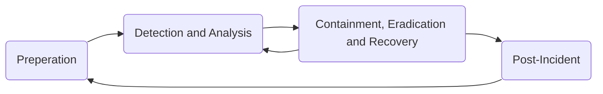
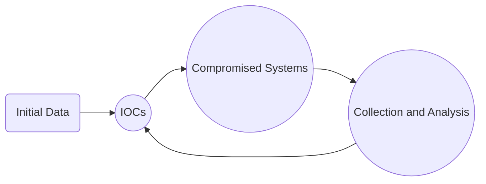
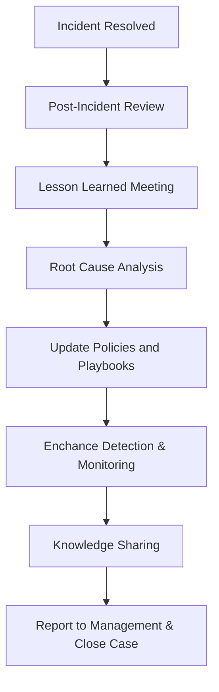

# Incident Handling Process Module

## <u>*Scope*</u>

There are two main types of incident report:

### Incident-specific report

These focus on one particular event. The report may walk through what happened in one attack or chain of attacks. The aim of such a report is to provide detailed forensic analysis of the incident and to suggest appropriate changes/guidance to minimise such an attack.

### Global incident report

These reports may be an aggregation of several incident-specific reports or a meta-report detailing trends in attacks in industry as a whole. These reports can identify large scale trends/patterns and emerging threats as well as provide statistical insight and high-level advice for blue teams.

## <u>*Incident Frameworks*</u>

### Cyber Kill Chain

It is important that we understand the attack life cycle, which is also known as the cyber kill chain. This life cycle describes how attacks manifest and progress. The cyber kill chain consists of seven different stages:

**Recon $\rightarrow$ Weaponize $\rightarrow$ Deliver $\rightarrow$ Exploit $\rightarrow$ Install $\rightarrow$ C2 $\rightarrow$ Action**

The **recon** stage is the initial stage and involves the attacker choosing their target. This will probably be followed by reconnaissance (either active, passive or hybrid). Passive recon involves finding data through OSINT methods such as web-sources and technical documentation. Active recon could involve port scanning, service fingerprinting or network mapping. Most attackers will perform a combination of active and passive recon.

In the **weaponize** stage, any malware for initial access is developed. Usually this malware is designed to be extremely lightweight and difficult to detect in generic anti-virus programs. The goal of the attacker at this stage is to provide access to a computer system or network.

In the **delivery** stage, the exploit or payload is delivered to the victim. This can be done through advanced technical exploits with specially crafted payloads, or more traditionally through social engineering methods (such as phishing). However, another delivery method to be aware of is physical delivery such as via USB being plugged into an internal device.

The **exploitation** stage is where the exploit or payload is triggered/detonated. Its in this stage that the attacker is usually trying to get RCE on a computer system.

In the **installation** stage, the initial payload has been detonated but is likely very unstable so the attacker needs to develop or gather the tools they need to form a persistent connection. This could be through using a dropper to put more advanced malware on the system, backdoors to persist access through restarts or rootkits to aid in AV avoidance.

In the **C2** stage, the attacker is focusing on command and control and this is when they would use their malware from the installation stage. The aim of this would be to provide a stable (potentially undetectable) connection for them to launch further attacks.

Finally, the **action** stage represents the objective of the attack - this will change for every incident. Some attackers may want to exfiltrate data, some may want to escalate privileges as much as possible to attack another target, some may want to launch ransomware to try and manipulate the company.

It is important to note that the stages of the kill chain cycle don't have to happen linearly or independently and in most cases they wont. For example, it is very common for attackers to perform lots of rounds of recon at various stages to uncover more weak points. Our objective as blue team is the stop an attacker from progressing up the kill chain.

### MITRE ATT&CK

Another framework for understanding adversary behaviour is the MITRE ATT&CK framework. This is a granular matrix based knowledge base of tactics and techniques used to achieve specific goals.

### Pyramid of Pain

The pyramid of pain represents how much effort it takes an adversary to change their tactics. At the base of the pyramid are simple indicators such as hash values or IP addresses which are easily changed by attackers without much effort. At the Top of the pyramid are Tools, Tactics, Techniques and Procedures (TTPs). Detecting and disrupting these causes significant issues for an attacker as it requires them to fundamentally change how they are operating. Analysts can map observed events and indicators to the MITRE framework to understand intent and predict next steps - this means that techniques against high-value assets can be prioritised. 

## <u>*Incident Handling Process*</u>

Just like the cyber kill chain, there are different stages in responding to an incident. These stages together are known as the incident handling process and it defines the capability for organisations to prepare, detect and response to malicious events. NIST define the incident handling process to consist of 4 distinct stages:

Incident handlers will spend most of their time in the first two stages. This is where you would develop the skills and programs that you need to respond better to the next malicious event. We always want to have resources available in the first two stages even when there is an ongoing incident so that there is no disruption of detection capabilities.

Incident handling has two main activities, **investigating** and **recovery**. The investigation aims to:

- Discover the initial victim machine and create an incident timeline.

- Determine which tools were used.

- Document the compromised systems and actions taken by the adversary.

Following the investigation, recovery aims to create and implement a recovery plan. Once the incident is fully handled, a report should be issued detailing the cause and cost of the incident. Remediation action is taken to understand what the organisation needs to do differently in the future.

### Preparation Stage

In the preparation stage we have two objectives: We wish to establish incident handling capability within the organisation and we need to implement appropriate protective measures to prevent IT security incidents. We need to ensure that we have:

- Skilled incident handling team members (some companies may outsource this).

- A trained workforce.

- Clear policies and documentation:
  
  - Contact information and roles of the incident handling team members.
  
  - Contact information for the legal and compliance department, management team, IT support, communications and media relations, law enforcement, ISP, any other authorities for data incidents.
  
  - Incident response policy, plans and procedures.
  
  - Incident information sharing policies.
  
  - System baselines, a golden image and clean state environment.
  
  - Network diagrams.
  
  - Organisation asset management DB.
  
  - Elevated users for responding to incidents, that have appropriate measures to prevent malicious takeover.
  
  - Ability to acquire hardware, software or an external resource without a procurement process during an active incident.
  
  - Forensic cheat sheets.

- Tools (software and hardware):
  
  - An additional device for each incident handling team member to preserve disk images and log files. These devices can be setup to investigate without restrictions since we know what activities they will need to perform. Measures must be taken such that these devices do not present an additional risk to the organisation.
  
  - Digital forensic tools.
  
  - Memory capture tools.
  
  - Live response capture tools.
  
  - Log analysis tools.
  
  - Network capture tools.
  
  - Network cables and switches.
  
  - Write blockers.
  
  - Hard drives for imaging.
  
  - Power cables.
  
  - Tools to disassemble hardware devices if needed.
  
  - Indicator of Compromise (IOC) creator and the ability to search for IOCs across the organisation.
  
  - Chain of custody forms.
  
  - Encryption software.
  
  - Ticket tracking system.
  
  - Secure facility for storage and investigation.
  
  - Incident handling system that is independent of the organisations infrastructure.

Note that lots of the tools mentioned will form a part of what is known as a jump bag, that is always ready to go to respond to incidents. The documentation system must be completely independent of the organisations infrastructure and completely secured - it is always best to assume that the entire domain is compromised and that all systems can go down without notice.

A key part of the preparation stage is to protect against incidents. We do this through the use of some highly recommended protective measures.

#### *DMARC*

DMARC is an email protection mechanism built on top of the already existing SPF and DKIM. The idea is to reject emails that 'pretend' to originate from our organisation. This methods is highly effective at preventing phishing attacks since the emails never even reach their intended recipient, however this comes with the risk that we block legitimate emails. Under some configurations DMARC can be performed against other domains as well since they send a header stating whether DMARC passed or not - however this needs to be extensively tested before introduced into a production environment since it becomes much more likely to flag legitimate emails.

#### *Endpoint Hardening and EDR*

Endpoint devices are the entry points for attacks onto our network. A significant percentage of attacks will originate from endpoint devices so we should aim to protect them as best as possible. There are already widely recognised endpoint hardening standards so we should use these to build from. Some important actions we should take note of are:

- Disable LLMNR/NetBIOS.

- Implement LAPS.

- Enable Attack Surface Reduction (ASR) rules in Microsoft defender.

- Implement whitelisting to the best of our ability.

- Utilise host-based firewalls and block workstation-to-workstation communication if possible.

- Deploy an EDR product. It is highly recommended that we choose products that integrate with AMSI. 

#### *Network Protection*

Network segmentation is a powerful technique to prevent breaches from spreading across the organisation. Critical systems must always be isolated with connections only allowed as required by the business. Internal resources should never face the internet directly unless placed in a DMZ.

We should consider IDS/IPS systems to identify malicious traffic based on content as opposed to reputation of IP addresses.

Finally we should ensure only organisation approved devices can access the network. This can be managed either through the physical network settings or if operating in a cloud-only company then through conditional access policies that area available to set on most/all cloud providers.

#### *Privilege Identity Management / MFA*

Stealing privileged users credentials is one of the most common escalation paths in AD environments. Make sure users are educated on proper password practices and avoid using complex but weak passwords that could be attacked by dictionary attacks. MFA should be implemented on all administrative access applications and devices at the very least.

#### *Vulnerability Scanning*

We should perform vulnerability scans regularly and work to remediate any issues found.

#### *User Awareness Training*

Training users to recognise suspicious behaviour and report it aids blue team massively. We will never reach 100% success in this task we should try our best to educate the users to be wary of potential attacks. If you are going to do surprise user testing, make sure it is well thought-out and sensible so as to not penalise users unnecessarily (a good example of this would be not sending out a fake phishing email from an official company email address).

#### *AD Security Assessments*

Performing security assessments (or hiring a team to do this for us if we do not have the talent in -house) is a vital part of knowing what needs to be secured. We should not assume that the incident response team knows of every single bug, configuration setting or exploit for their environment so approaching it as an attacker will help us find and patch up these problems.

#### *Purple Team Exercises*

In the same tune as the previous suggestion, we should conduct purple team exercises to train the incident handling team and keep them up to date with internal procedures/policies.

### Detection & Analysis Stage

The detection and analysis stage involves all aspects of discovering an incident. This could include utilising sensors, logs, trained personnel, information sharing and context-based threat intelligence. Threats can be introduced to the organisation via an infinite number of attack vectors and so it is highly recommended to create levels of detection by logically categorising our network. For example:

- Detection at network perimeter

- Detection at internal network

- Detection at endpoint level

- Detection at application level

#### *Initial Investigation*

When a security incident is detected we need to conduct an initial investigation and establish context. We need to collect as much information as possible at this stage:

- Date/time when the incident was reported. Who detected/reported the incident?

- How was the incident detected?

- What was the incident?

- Assemble a list of impacted systems.

- Document who has accessed the systems and what actions have been taken. Note whether it is an ongoing incident or the activity has stopped.

- Physical location, operating systems, IP addresses etc.

- If malware is involved, time and date of detection, type of malware, systems impacted, hashes/copies of the malware in question.

With this information we can start to make decisions and build an incident timeline. The timeline is to keep us organised throughout the event and provide the high-level view of what has happened. At a minimum the timeline should contain the following information:

| Date | Time | Hostname | Description | Source |
| ---- | ---- | -------- | ----------- | ------ |

The timeline primarily focuses on attacker behaviour so the recorded activities depict when the attack occurred. We can use a case management software to view an incident alert, create a case, assign it to ourselves and then once the investigation is complete we can close it along with all of our documented findings.

#### *Incident Severity*

When handling an incident we can try to answer the following questions to get a scale of the incident's severity and extent as well as the level of sophistication of the adversary:

- What is the exploitation impact?

- What are the exploitation requirements?

- Can any critical systems be affected?

- Are there any immediate remediation steps?

- How many system have been impacted?

- Is the exploit being used in the wild?

- Does the exploit have any worm capabilities?

#### *Incident Confidentiality*

Incidents are very confidential topics and all information gathered should be kept on a need-to-know basis unless there are applicable laws or higher management decisions. When an investigation is launched we set some expectations and goals. These will provide a very general overview of what we are trying to achieve with our investigation.

#### *Incident Investigation*

The investigation starts based on the initially gathered information. With this data we begin a 3-step cyclic process. The process involves: Creation and usage of indicators of compromise (IOCs); Identification of new leads and impacted systems; Data collection and analysis from new leads.

Because IOCs are so important to an investigation, there are special languages that have been developed to document them and share them in a standard manner such as OpenIOC and YARA. There are some free tools that can be used such as Mandiant's IOC Editor, to create or edit IOCs. We can even obtain IOCs from third parties, for example, CISA publishes IOCs in a format called STIX (Structured Threat Information eXpression). STIX is an open-source, machine readable language used to exchange cyber threat intelligence (CTI) in a standard way.

To leverage IOCs, we will have to deploy an IOC-obtaining/IOC-searching tool. A common approach is to use WMI or powershell.

#### *Identification and Data Collection/Analysis of New Leads*

After searching for IOCs, we should expect to have some hits from other systems with the same signs of compromise. These may or may not be directly involved with the incident we are investigating and it is our job to rule our false positives. Once we have identified systems with our IOCs we want to preserve that state of those systems for further analysis. Here we have to think very carefully if we want to do a 'live response' in which we analyse the system whilst it is running or shutting down the system and potentially losing critical information. We need to make sure we are interacting with the machine minimally and we should keep track of the chain of custody to ensure the collected data is court admissible if it needs to be.

### Containment, Eradication, and Recovery Stage

When the investigation is complete and we have understood the incident and impact on the business we need to enter the containment stage to prevent the incident causing more damage.

In this stage we take action to prevent the spread of the incident. We divide the actions into short-term containment and long-term containment. It is important that all of our containment actions are coordinated and occur at the same time to prevent notifying attackers of our strategies. In short-term containment, the actions that we take should leave a minimal footprint of the systems on which they occur. Examples could be:

- Placing the device on a isolated VLAN

- Disconnecting the device from the network.

- Changing DNS servers

The purpose of these actions is to contain the damage and provide us time to develop a more complete strategy. Additionally, keeping the systems as unaltered as possible lets us have a nice state to work from when we need to do further analysis. In long-term containment, we are focusing on persistent actions and changes. These may include:

- Changing passwords

- Applying firewall rules

- Patching a system

- Implementing an IDS

- User education

Once the incident is contained, we need to eradicate the cause of the intrusion which may involve rebuilding systems or restoring from backup. We can then bring systems back to normal operation. Once everything is verified to be working as expected they can be brought back into the production environment with additional logging and monitoring. For large incidents the recovery stage can take months so it is often approached in phases.

### Post-Incident Activity

This is the final stage of the NIST framework and during it our objective is to document the incident and improve our defensive capabilities based on lessons learned. This stage gives us an opportunity to reflect. During this stage information is best gathered and analysed in a meeting with all stakeholders who were involved. This will generally take place a few days after the incident, after the report has been finalised.

The final report is a crucial part of the process. The report needs to contain answers to questions such as:

- What happened and when?

- How did the team perform in dealing with the incident (regarding plans, policies and procedures)?

- Did the business provide the necessary information and respond promptly? What could be improved?

- What actions have been taken?

- What preventative measures should be put in place?

- What tools and resources are needed to detect similar incidents in the future?

Reports like this provide us with measurable results. They can tell us how many incidents have been handled, how much time the team spends per incident and how well the team responds to each stage of the handling process. The report is also useful to train new team members with but showing them how a prior incident has been dealt with.

## <u>*Useful Resources*</u>

- [NIST Security Guide](https://nvlpubs.nist.gov/nistpubs/SpecialPublications/NIST.SP.800-61r3.pdf)

- [Example Incident-specific report](https://thedfirreport.com/2025/02/24/confluence-exploit-leads-to-lockbit-ransomware/)

- [Example Global incident report](https://www.paloaltonetworks.com/engage/unit42-2025-global-incident-response-report)

- [MITRE ATT&CK](https://attack.mitre.org/)

- [CIS benchmarks](https://www.cisecurity.org/cis-benchmarks)

- [AMSI](https://learn.microsoft.com/en-us/windows/win32/amsi/how-amsi-helps)

- [IOC Editor](https://fireeye.market/apps/S7cWpi9W)
