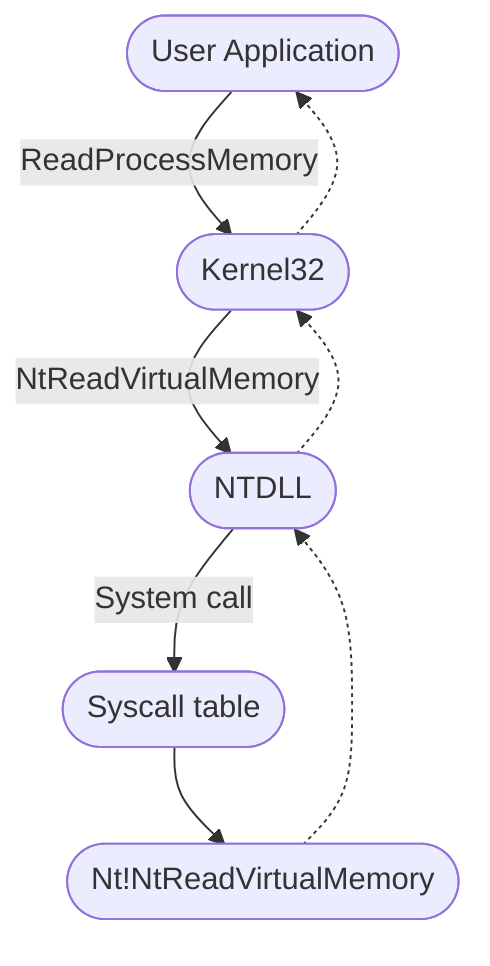
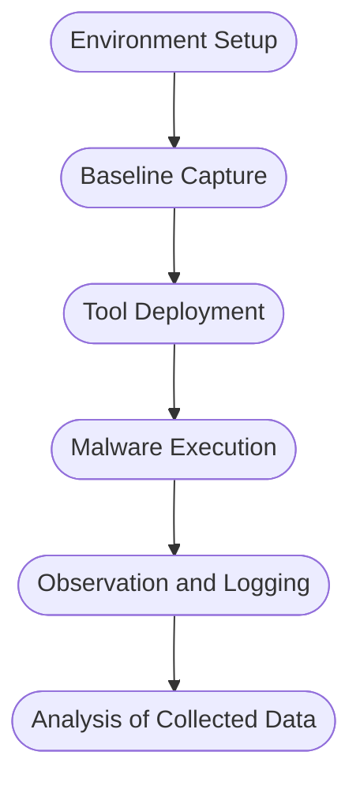

# Introduction To Malware Analysis

## <u>*Introduction and Definitions*</u>

This module aims to provide a robust foundation for SOC analysts to tackle malware analysis tasks. The primary focus of the module will be the analysis of windows malware. Malware is a term encompassing various types of software designed to infiltrate, exploit or damage computer systems, networks and data. Although all malware is used for malicious intents, the specific objectives of malware vary among different threat actors. There are several commonly seen types of malware:

- **Viruses**: Designed to infiltrate and multiply within host files, transitioning from one system to another. Viruses latch onto credible programs and action when infected files are triggered.

- **Worms**: Autonomous malware capable of multiplying across networks without needing human intervention. They exploit network weaknesses to infiltrate systems without permission.

- **Trojans**: Disguised as genuine software to trick users into running them. After triggering they can craft backdoors or be weaponized to steal sensitive data.

- **Ransomware**: Encrypts files on the target system making them unreachable. Attackers can then demand a ransom in exchange for a decryption key. The aim of these attacks is to extort money from the victim, usually organisations.

- **Spyware**: Stealthily gathers sensitive data and user activities without their consent. This data is often sent to remote servers for further harmful processes.

- **Adware**: Shows uninvited and invasive advertisements on infected systems. Adware can also track user behaviour and collect data for targeted advertising.

- **Botnets**: Networks of compromised devices, often referred to as bots or zombies, controlled by a C2 server.

- **Rootkits**: Stealthy forms of malware designed to gain unauthorised access and control over the root of the operating system. They can alter system functions to conceal their presence which makes them challenging to spot and eliminate.

- **Backdoors/RATs**: Crafted to offer unauthorised access and control over compromised systems from remote locations. Attackers can leverage them to retain prolonged control, extract data or instigate further attacks.

- **Droppers**: These are designed to transport and install extra malicious payloads onto infected systems. They can ensure the covert installation and execution of more sophisticated threats.

- **Information Stealers**: Tailored to target and extract sensitive data.

When it comes to enhancing our cybersecurity defences and understanding the threats that exists we may need to get our hands on actual malware samples. It is important that when we deal with malware samples we do so in a safe and controlled environment to prevent accidental infections and potential harm. We can find such samples at a variety of locations across the internet:

| Resource                                | Description                                                                                                                                                                                                |
| --------------------------------------- | ---------------------------------------------------------------------------------------------------------------------------------------------------------------------------------------------------------- |
| <https://virusshare.com/>               | Houses a vast collection of malware samples all available to the public.                                                                                                                                   |
| <https://www.hybrid-analysis.com/>      | Allows users to submit files for malware analysis.                                                                                                                                                         |
| <https://github.com/ytisf/theZoo>       | A collection of live malware for analysis and education.                                                                                                                                                   |
| <https://malware-traffic-analysis.net/> | Traffic analysis exercises beneficial for users learning about malware traffic patterns.                                                                                                                   |
| <https://www.virustotal.com/>           | Can inspect antivirus samples against known malware signatures and URL blacklisting services.                                                                                                              |
| <https://app.any.run/>                  | An interactive online sandbox for malware analysis. Offers both free and premium tiers.                                                                                                                    |
| <https://contagiodump.blogspot.com/>    | A collection of malware samples, threat reports and related resources. Provides direct access to an extensive range of malware samples that are frequently used by researchers to study malware behaviour. |
| <https://www.vx-underground.org/>       | One of the largest collections of malware source code, articles and papers on the internet.                                                                                                                |

When it comes to gathering evidence during a digital forensics investigation or incident response, having the right tools to perform disk imaging and memory acquisition is crucial.

#### *Disk Imaging Tools*

- [FTK Imager](https://www.exterro.com/ftk-imager): One of the most widely used disk imaging tools in the cybersecurity field. It allows us to create perfect copies of computer disks for analysis. It lets us view and analyse the contents of data storage devices without altering the data.

- [OSFClone](https://www.osforensics.com/tools/create-disk-images.html): A free and open source utility designed for the task of creating and cloning forensic disk images.

- `DD` and `DCFLDD`: Command-line utilities available in Unix system. 

#### *Memory Acquisition Tools*

- [DumpIt](https://www.magnetforensics.com/resources/magnet-dumpit-for-windows/): Generates a physical memory dump of Windows and Linux machines. On windows, it concatenates 32-bit and 64-bit system physical memory into a single output file.

- [MemDump](http://www.nirsoft.net/utils/nircmd.html): A free command-line utility that enables us to capture the contents of a system's RAM. Beneficial in forensics investigations or analysing a system for malicious activity.

- [Belkasoft RAM Capturer](https://belkasoft.com/ram-capturer): Another powerful tool that can capture the RAM of a running windows computer even if there is active anti-debugging or anti-dumping protection.

- [Magnet RAM Capture](https://www.magnetforensics.com/resources/magnet-ram-capture/): Free and simple tool for capturing live memory.

- [LiME](https://github.com/504ensicsLabs/LiME): A Loadable Kernel Module (LKM) which allows the acquisition of RAM. This tool is unique in that it has been designed to be transparent to the target system which can evade many common anti-forensic measures.

#### *Other Evidence Acquisition Tools*

- [KAPE](https://www.kroll.com/en/services/cyber-risk/incident-response-litigation-support/kroll-artifact-parser-extractor-kape): A triage program designed to help in collecting a parsing artefacts in a quick and effective manner. It focuses on targeted collection which can reduce the volume of collected data.

- [Velociraptor](https://github.com/Velocidex/velociraptor): A versatile tools designed for host-based incident response and digital forensics. Allows for quick, targeted data collection across a wide number of machines. Velociraptor employs Velocidex Query Language (VQL).

The process of comprehending the behaviour and inner workings of malware is known as Malware Analysis. During malware analysis we will look at the malware's code, structure and functionality to gain profound insights into its purpose, propagation methods and potential impact. Malware analysis serves several purposes such as:

- Detection and classification

- Reverse engineering

- Behavioural analysis

- Threat intelligence

The techniques in malware analysis encompass a wide array of methods and tools.

| Technique         | Description                                                                                                                                                                                                                                           |
| ----------------- | ----------------------------------------------------------------------------------------------------------------------------------------------------------------------------------------------------------------------------------------------------- |
| Static Analysis   | This approach involves scrutinising the malware's code without executing it, examining the file structure, identifying strings, searching for known signatures and studying metadata to gain preliminary insights into the malware's characteristics. |
| Dynamic Analysis  | Involves executing the malware within a controlled environment to observer its behaviour and capture its runtime activities. This can include monitoring network traffic, system calls and file system modifications.                                 |
| Code Analysis     | Involves disassembling or decompiling the malware's code to understand its logic, functions and algorithms. This can help identify concealed functions, encryption methods and details of C2 infrastructure.                                          |
| Memory Analysis   | This can help us identify injected code, hooks or other runtime manipulations. These can be instrumental in detecting rootkits.                                                                                                                       |
| Malware Unpacking | This technique refers to the process of extracting and isolating the hidden malicious code within a piece of malware that using packing techniques to evade detection.                                                                                |


## <u>*Windows Internals*</u>

Windows operating systems function in two main modes: User mode, where most applications and processes operate; And Kernel mode, which is the highly privileged mode where the windows kernel runs. Applications in user mode have limited access to system resources and must interact with the system through the use of APIs. The processes are isolated and cannot directly access hardware or critical system functions. In kernel mode however, core system services, resource management and security features can be run with unrestricted access to hardware and critical functions. Device drivers run in kernel mode. If malware were to operate in kernel mode it would have elevated control and could manipulate system behaviour, conceal its presence or intercept system calls.


User mode components are those parts of the operating system that do not have direct access to hardware or kernel data structures. Examples of these components are:

- System support processes, which are essential components that provide crucial functionalities to services such as logon processes, session management and service control management. These are not windows services but are necessary for the proper functioning of the system.

-  Service processes that host windows services such as the windows update service, Task scheduler and print spooler. They usually run in the background.

- User applications that are processes created by user programs. They interact with the operating system through APIs provided by windows. The API calls get redirected to NTDLL.DLL which triggers a transition from user mode to kernel mode where the system call is executed. The result is returned to the user-mode application.

- Environment subsystems are responsible for providing execution environments for specific applications or processes.

- Subsystem DLLs are used to translate documented functions into appropriate internal native system calls. Examples include `kernelbase.dll`, `user32.dll`, `wininet.dll`, `advapi32.dll`.

Kernel mode components are the parts of the operating system that has direct access to hardware and kernel data structures. These include:

- The executive layer that gets accessed through functions from `NTDLL.DLL`. It consists of components like the I/O manager, object manager, security reference monitor, process manager and more. It manages the core aspects of the operating system. It runs some checks and then passes the call to the kernel or calls the appropriate device driver.

- The kernel manages system resources and provides low-level services such as thread scheduling, interrupt and exception dispatching ad multiprocessor synchronisation.

- Device drivers enable the OS to interact with hardware devices.

- The hardware abstraction layer (HAL) allows software developers to interact with hardware in a consistent and platform independent manner.

Malware often uses windows API calls to interact with the system and carry out malicious activities. We should understand the internal details of API functions, their parameters and expected behaviour such that we can identify suspicious or unauthorised API use. Consider an examples of a windows API call flow, where a user-mode application tries to access privileged operations and system resources using the ReadProcessMemory function.



When this function is called, some required parameters are also passed to it - such as the handle to the target process, the source address to read from, a buffer in memory space to store the data, and the number of bytes to read. The Microsoft documentation gives the syntax of the ReadProcessMemory WINAPI function as follows:

```cpp
BOOL ReadProcessMemory(
    [in]  HANDLE  hprocess,
    [in]  LPCVOIF lpBaseAddress,
    [out] LPVOID  lpBuffer,
    [in]  SIZE_T  nSize,
    [out] SIZE_T  *lpNumbreOfBytesRead
);
```

ReadProcessMemory belongs to the kernel32.dll library so this call is invoked via this module which serves as the user mode interface to the windows API. Internally, the kernel32.dll module interacts with the NTDLL.DLL module to provide a lower-level interface to the windows kernel. This function request is translated to the corresponding native API call, which is NtReadVirtualMemory. The NTDLL.DLL module uses syscalls which transfer control from user mode to kernel mode, where the kernel can perform the requested operation after validating the parameters and privileges of the calling process.

If the request is authorised, the thread is transitioned from user mode into kernel mode. The kernel maintains a table known as the System Service Descriptor Table (SSDT) or the syscall table, which is a data structure that contains pointers to the various system service routines. These routines handle system calls made by user-mode applications. Each entry in the syscall table corresponds to a specific system call number and the associated pointer points to the corresponding kernel function.

### Portable Executable

Windows operating systems employ the Portable Executable (PE) format to encapsulate executable programs, DLLs and other integral system components. In the realm of malware analysis, we need to have an intricate understanding on the PE file format. The PE file format is fundamentally a data structure containing the vital information required for the windows OS loader to manage the executable code.

The PE structure houses a section table comprising of several sections dedicated to distinct purposes. The sections are essentially the repositories where the actual content of the file is stored. The `.text` section is often scrutinised for potential artefacts related to injection attacks. Common PE sections include:

- Text section (`.text`) where all the executable code of the program resides.

- Data section (`.data`) which lists all initialised global and statics data variables.

- Read-only initialised data (`.rdata`) which houses read-only data such as constant values and string literals.

- Exception information (`.pdata`) where function table entries are used or exception handling.

- BSS section (`.bss`) which hold uninitialised global and static variables.

- Resource section (`.rsrc`) which safeguards resources such as images, icons, strings and version information.

- Import section (`.idata`) that contains data about function imported from other DLLs.

- Export section (`.edata`) that contains information about functions exported by the executable.

- Relocation section (`.reloc`) which has details for relocating the executable's code and data when loaded at a different memory address.

We can visualise the sections of a portable executable using a tool like pestudio. 

### Processes

A process is an instance of an executing program. It represents a slice of a program's execution in memory and consists of various resources that includes memory, file handles, threads and security contexts. Each process is uniquely characterised by:

- A PID that is assigned to it that facilitates the tracking and management of the process by the operating system.

- Virtual address space (VAS) which allows the process to have isolated memory access.

- Executable code stored on the disk.

- A table of handles to system objects that can span objects from files and devices to registry keys and synchronisation objects.

- A security context or access token that encapsulates information about the process's security privileges. This includes information about the user account under which the process is operating.

- One or more threads running in its context. Each thread embodies a unit of execution within the process.

### Dynamic-link library (DLL)

A DLL is a type of PE which represents Microsoft's implementation of the shared library concept in the windows OS. DLLs expose an array of functions that can be exploited by malware. Import functions are functionalities that a binary dynamically links to from external libraries or modules during runtime. During malware analysis, examining import functions can shed light on the external libraries that the malware is dependant on. By ascertaining which functions are called we may be able to work out the possible actions that malware can perform (such as file operations, network communication, or registry manipulation). We can view the DLL imports of an executable by using the CFF Explorer program. Export functions are functions that a binary exposes to be used by other modules which can provide an interface for other software to interact with the binary. We can also use the symbols tab in the x64dbg program to view imported or exported functions.


## <u>*Static Analysis on Linux*</u>

We will often exercise a method of malware analysis known as static analysis to scrutinise malware without executing it. This involves the investigation of the malware's code, data and structural components which serves as a vital precursor for further analysis. Through static analysis we can extract pivotal information which includes:

- File types

- File hashes

- Strings

- Embedded elements

- Packer information

- Imports

- Exports

- Assembly code

Our first objective is to identify some rudimentary information about the malware specimen. Given that file extensions can be manipulated and changed we want to be able to identify the actual file type we are encountering. The command in Linux for checking the file type of a sample is:

```bash
file <sample> 
```

We can also manually check he header with the help of the hexdump command:

```bash
hexdump -C <sample> | more
```

On a windows system, the ASCII string "MZ" at the start of a file denotes an executable file. Next we need to create a unique identifier for the malware sample. This is typically done in the form of a cryptographic hash, that can help us track the malware sample and search other systems for its presence. It also helps us confirm previous encounters with the same malware and can be shared with other intelligence groups. To check some common hashes of a malware sample in Linux we can use the following commands:

```bash
md5sum <sample>
```

```bash
sha256sum <sample>
```

We can search these hashes on online malware scanners and sandboxes. For example we could upload the sample's has to VirusTotal and view its report. However, hashes are of no help at all to us to identify similar or modified malware samples - they can only detect the presence of that exact code. Techniques do exist for classifying similar malware samples though and one of these is Import hashing (IMPHASH). IMPHASH is a cryptographic hash calculated from the import functions of a PE file. It works by first converting all imported function names to lowercase which are then fused to the DLL names and arranged alphabetically. An MD5 hash is generated from the resulting string. The IMPHASH is listed in the details tab of a VirusTotal scan. We can also use the `pefile` Python module to compute IMPHASHes of samples.

```python
import sys
import pefile
import peutils

pe_file = sys.argv[1]
pe = pefile.PE(pe_file)
imphash = pe.get_imphash()

print(imphash)
```

We can also use fuzzy hashing (SSDEEP) which is sometimes referred to as context-triggered piecewise hashing (CTPH). This is a hashing technique designed to compute a hash indicative of content similarity between two files. The technique dissects a file into smaller, fixed-size blocks and calculates hashes for each block and then combines them to generate the final fuzzy hash. The SSDEEP algorithm allocates more weight to loner sequences of common blocks, which makes it effective identifying files that have undergone minor modifications or are similar but not identical. The SSDEEP hash of a malware sample can be located in the details tab of VirusTotal. Alternatively we can use the the command-line tool:

```bash
ssdeep <sample>
```

Command line arguments `-pb` can be used to initiate matching mode on the directory where malware samples are stored.

```bash
ssdeep -pb *
```

`-p` denotes pretty matching mode and `-b` is used to display only the file names. Section hashing is a powerful technique that allows analysts to identify sections of a PE file that have been modified. This is particularly useful when looking for minor variations in malware samples. By applying section hashing, security analysts can identify parts of a PE file that have been tampered with or altered which can help correlate similar malware samples. `pefile` in Python can perform section hashing:

```python
import sys
import pefile
pe_file = sys.argv[1]
pe = pefile.PE(pe_file)
for section in pe.sections:
    print (section.Name, "MD5 hash:", section.get_hash_md5())
    print (section.Name, "SHA256 hash:", section.get_hash_sha256())
```

Section hashing is powerful but not foolproof. Malware authors can obfuscate section names of use dynamic generate to try and bypass this kind of analysis.

We can also attempt to extract strings from a binary. This can give us clues as to the purpose or functionality of the malware. Occasionally, we might find artefacts in a sample such as:

- Embedded filenames

- IP addresses or domain names

- Registry paths or keys

- WINAPI functions

- Command-line arguments

- Unique information linking to a particular threat actor

In Linux we can use the `strings` command to display the strings contained in a sample.

```bash
strings -n 15 <sample>
```

`-n` specifies to print sequences of at least the number specified. We could also use the FLOSS tool to automatically deobfuscate strings in malware.

```bash
floss <sample>
```

During our analysis, we might come across a sample that has been compressed or obfuscated using a technique referred to as packing. Packing can obfuscate the code, reduce the size of the executable and can hinder reverse engineering attempts. This can impair string analysis because the references to strings are obscured or eliminated. It also replaces/camouflages conventional PE sections with a compact loader stub which retrieves the original code from a compressed data section. A popular packer used by many malware variants is the Ultimate Packer for Executables (UPX). We can unpack a malware sample using the upx tool:

```bash
upx -d -o <new_filename> <sample>
```

We should now be able to perform string analysis.


## <u>*Static Analysis On Windows*</u>

In this section we are reproducing some of the same static analysis tasks we carried out on a Linux environment on a Windows machine. As before, we first wish to identify the actual file type of the sample. We can do this by using a tool such as CFF Explorer. Once again, if we see the magic number "4D 5A" or the ASCII string "MZ" to identify PE files. We can use PowerShell to generate hashes of a malware sample:

```powershell
Get-FileHash -Algorithm MD5 <sample>
```

```powershell
Get-FileHash -Algorithm SHA256 <sample>
```

We can take these hashes to VirusTotal to generate a report. On VirusTotal we can see the IMPHASH and SSDEEP of the sample under the details tab. Alternatively we could use the IMPHASH Python file and the SSDEEP executable. To view section hashes of a malware sample on windows we can use the footprints tab in pestudio. For string analysis we can use the strings binary from Sysinternals:

```powershell
strings <sample>
```

Alternatively we can use the FLOSS binary:

```powershell
floss <sample>
```

Regarding Packed malware (for example, with UPX). We may notice that when looking at section headers in CFF Explorer, we see their names include the string "UPX". We can also unpack the malware using the UPX tool:

```powershell
upx -d -o <new_filename> <sample>
```


## Dynamic Analysis

When it comes to the domain of malware analysis, dynamic or behavioural analysis represents an indispensable approach in our investigative arsenal. In dynamic analysis we observe and interpret the behaviour of the malware while it is running or in action. Our dynamic analysis procedure can be broke down into the following steps:



- Environment Setup: We first establish a secure and controlled environment (typically a VM) isolated from the rest of the network. The VM setup should mimic a real-world system.

- Baseline Capture: We capture a snapshot of the system's clean state. This includes system files, registry states, running processes, networks configurations and more. This baseline serves as a reference point to identify changes made by malware post-execution.

- Tool Deployment (Pre-Execution): To capture the activities of the malware effectively, we deploy various monitoring and logging tools. Tools such as Procmon are used to log system calls and file activities. Wireshark, tcpdump or Fiddler are used to capture network traffic and Regshot to take before-and-after snapshots of the system registry. Tools such as INetSim, FakeDNS, and FakeNet-NG can be used to simulate internet services.

- Malware Execution: With our tools running and ready we can execute the malware sample.

- Observation and Logging: The malware sample is allowed to execute for a sufficient period of time to capture all behaviour. The whole time the malware is running, our tools are recording actions taken against the system.

- Analysis of Collected Data: After the malware has finished running all tasks, we can halt execution and stop the monitoring tools. We can now go through and examine all of the logs generated and compare the systems new state against its clean state.

In some cases, we might employ sandboxed environments for dynamic analysis. These provide an automated, safe and highly controlled environment for malware execution. It is important to remember that  sandboxes are not foolproof, some malware can detect sandboxes and alter their behaviour accordingly.

### Noriben

Noriben is a powerful tool in our dynamic analysis toolkit, acting as a Python wrapper for Procmon. It orchestrates the operation of Procmon, refines the output and adds a layer of malware-specific intelligence to the process. Leveraging Noriben, we can capture malware behaviours more conveniently and understand them more precisely. The volume and breadth of information that Procmon collects can be overwhelming, sifting through this data can be a challenge. In our dynamic malware analysis process, we employ Noriben as follows:

- Setting up Noriben: We initiate Noriben by launching it from the command line. The tools supports numerous command-line arguments to customise its operation. For instance, we can define the duration of the data collection, specify a custom malware sample for execution, or select a personalised Procmon configuration file.

- Launching Procmon: Upon initiation, Noriben starts Procmon with a predefined configuration. This configuration contains a set of filters designed to exclude normal system activity and focus on potential indicators of malicious actions.

- Executing the Malware Sample: With Procmon running, Noriben executes the malware sample.

- Monitoring and Logging: Noriben controls the duration of monitoring, and once it concludes it commands Procmon to save the collected data to a CSV file and then terminates Procmon.

- Data Analysis and Reporting: Noriben processes the CSV file, applies additional filters and performs contextual analysis. Noriben identifies potentially suspicious activity and organises them into different categories. This process results in a clear, readable report in HTML or TXT format, highlighting the behavioural traits of the analysed malware.

Noriben's integration with YARA is another notable feature. We can leverage YARA rules o enhance our data filtering capabilities, allowing us to identify patterns of interest. Noriben might filter out some potentially valuable information. For example, such as if a program recognises that it is operating within a sandbox.


## <u>*Code Analysis*</u>

Reverse engineering is a process that takes us beneath the surface of executable files or compiled machine code, enabling us to decode their functionality, behavioural traits, and structure. With the absence of source code, we turn to the analysis of disassembled code instructions. To untangle the complex web of machine code, we turn to a duo of powerful tools: Disassemblers and Debuggers. A disassembler is the tool of choice for conducting static analysis of the code. This analysis allows us to understanding the structure and logic of the code without having to execute it. Some examples include IDA, Cutter and Ghidra. A debugger, serves a dual purpose. It allows us to execute code in a controlled manner, instruction by instruction and halting at designated breakpoints. Debuggers can also be used in a similar way to a disassembler. Examples of debuggers include x32dbg, x64dbg, IDA and OllyDbg.

The compilation process from human-readable languages to machine code is one-way, so the challenge is understanding what that original code might have been. A disassembler turns machine code back to assembly language which we can hunt through to understand the operation of the code.


Take for example, a malware sample `shell.exe`. At this point, we know that it conducts sandbox detection by checking registry keys and includes a possible sleep mechanism by pinging localhost. We can import the sample into IDA by creating a new workspace and loading the sample file. IDA will automatically determine the appropriate processor type. IDA will load the executable file into memory and disassemble the machine code to render the output for us.


Once the executable is loaded, the disassembled code will be exhibited in the main IDA-View window. The disassembled code is presented in two modes, namely the Graph view and the Text view. The default view provides a graphic illustration of the function's basic blocks and their interconnections. To toggle between graph and text views, press the spacebar. In the text view, each line represents an instruction or a data element in the code - beginning with the `section name:virtual address` format. In the text view, IDA uses arrows to signify different control flow instructions. Solid arrows denotes a direct jump or branch instruction. A dashed arrow represents a conditional jump in our code.

The start function is the program's entry point ad is generally responsible for setting up the runtime environment before invoking the actual main function. We look through the function calls here for information as to where the main function might be.


The names `sub_xxx` and `loc_xxx` are placeholders given by IDA since it cannot retrieve the original names. These can be replaced with more appropriate names when we have an idea of what the subroutine does. To enter a function in IDA's view, we place the cursor on the instruction that represents the function call we want to follow. We right-click on the instruction and select "Jump to Operand". In the subroutine `sub_401650` in our example, we can see call instructions to the functions such as GetSystemTimeAsFileTime, GetCurrentProcessId, GetCurrentThreadId, GetTickCount and QueryPerformanceCounter. This pattern is frequently observed at the beginning of disassembled executable code and typically consists of setting up the initial stack frame and carrying out system related initialisation tasks.


The type of instructions detailed here are typically found in the executable code produced by compilers targeting the x86/x64 architecture. This section of code is part of the initial execution environment setup, carrying out necessary system related initialisation tasks. This is not our main code function so we should look elsewhere.


This function seems to be implicated in initialising the StartupInfo structure and performing certain checks relative to its value. It does not seem to be the main function, but there are further calls being made that could potentially lead us to the actual main function.


Working backwards from the program's exit, we come across a function that is making the registry checks to see if the program is being run in a sandbox. It seems probable that this is the main function.

```nasm
xor     r8d, r8d        ; ulOptions
mov     [rsp+148h+cbData], 100h
mov     [rsp+148h+phkResult], rax ; phkResult
mov     r9d, 20019h     ; samDesired
lea     rdx, aSoftwareVmware ; "SOFTWARE\\VMware, Inc.\\VMware Tools"
mov     rcx, 0FFFFFFFF80000002h ; hKey
call    cs:RegOpenKeyExA
```

We can see a call function to RegOpenKeyExA which is a part of the Windows Registry API and is used to open a handle to a specified registry key. The function enables access to the Windows registry. The "A" in the function name signifies that it is the ANSI version of the function, which operated on ANSI-encoded strings. In IDA, `cs` is a segment register that usually refers to the code segment. When we click on the function call we are taken to the `.idata` section which handles import related data. RegOpenKeyExA is imported from an external library (advapi32.dll), with the address stored in the `.idata` section for future use.


The address that is present is not the actual address of the RegOpenKeyExA function but rather is the address of the entry in the IAT (import address table). The IAT entry houses the address that will be dynamically resolved at runtime. Because of all this evidence, we will rename the section to something in line with "assumed_Main". Note that renaming functions in IDA do not modify the actual binary file, it only changes the analysis view.

```nasm
sub_401610 proc near

mov     eax, cs:dword_408030
test    eax, eax
jz      short loc_401620 

loc_401620:
mov     cs:dword_408030, 1
jmp     sub_4015A0
sub_401610 endp
```

If we enter the first subroutine call in the assumed main function. This appears to be an initialisation function so we can rename it `initCheck`. We can set this aside and look at one of the other calls made in the assumed main function. This seems much more fruitful:


The variables Parameters, File and Operation are string variables stowed in the `.rdata` section of the executable. The `lea` instructions are used to obtain the memory addresses of these strings which are then passed as arguments to the ShellExecuteA function. This block of code is responsible for a sleep duration of 5 seconds. Following this it revers to the preceding function. We can rename this file "pingSleep".

```cpp
LSTATUS RegOpenKeyExA(
  [in]           HKEY   hKey,
  [in, optional] LPCSTR lpSubKey,
  [in]           DWORD  ulOptions,
  [in]           REGSAM samDesired,
  [out]          PHKEY  phkResult
);
```

The windows API function RegOpenKeyExA is used to unlock a registry key.


At this point we know how the program checks to see if it is running in a sandbox and where it redirects to if that check passes and if it fails.


Examining the code for the new subroutine we can see that it performs another check with a nonsense domain and IP resolution. Using the Winsock API, the program sees if the domain gets resolved to an IP address and if it does then the program concludes that it is running in a sandbox and halts execution. If the domain resolution fails then the program directs to a new subroutine. We can check out this new subroutine too:


This code uses Winsock to generate a socket and connect to the IP address 45.33.32.156 via port 31337. It then checks the return value to see if the connection was successful. Here the code checks for the presence of an internet connection - if it cannot connect to the IP address it operates in sandbox mode and if it can then we proceed to the next subroutine. The next subroutine seems to get the TEMP environment variable's name. We then store the computer name and form a complete file path by appending "svchost.exe" to the TEMP variable. The program makes a custom user-agent string using the hostname and the uses the WINAPI function InternetOpenA to open a connection to <http://ms-windows-update.com/svchost.exe>. The program seems to pull data from the URL and save it as a file in the TEMP directory as "svchost.exe"


It appears that this new file is added to the registry for as "WindowsUpdater". This is a technique frequently employed by malware to maintain across reboots by ensuring automatic operation when the system initiates or a user logs in. We suspect the new file is a bitcoin miner and that our program is a dropper since the last thing we do seems to be executing the new program with some custom arguments. Working our way backwards we can see there is still a subroutine waiting for us to analyse it. We can see that it starts a notepad process.


This block of instructions hints at a commonplace type of process injection where shellcode is inserted intro the newly created process using WINAPI functions. We conclude that a fresh notepad process is created. Memory is allocated using VirtualAllocEx. The shell code is then inscribed into the allocated memory of the remote notepad process using the WINAPI WriteProcessMemory function. Lastly a remote thread is established in notepad.exe initiating the shellcode execution. 

IDA also offers a feature that visualises the execution flow between functions in an executable via a call flow graph. We can generate a call flow graph by:

1. Switching to the disassembly view

2. Locating the View menu

3. Hovering over the Graphs option

4. Choosing Function calls

IDA will then forge the function calls flow graph for all functions in the binary and present it in a new window.

### Debugging

Debugging adds a dynamic, interactive layer to code analysis which offers a real-time view of malware behaviour. It can allow researchers to confirm their discoveries. We can use a debugger like x64dbg for analysing 64-bit Windows executables. We run a sample within x64dbg by clicking on the file menu and then opening the sample. Optionally we can use command-line arguments.


We can use the tool InetSim to simulate typical internet services in our restricted testing environment. It offers support for a wide array of services such as DNS, HTTP, FTP, SMTP and more. In our malware analysis we will use InetSim to intercept any network requests made by a malware sample and provide it will controlled responses back. We can configure InetSim as follows:

```bash
sudo nano /etc/inetsim/inetsim.conf
```

```bash
service_bind_address <Our machine's/VM's TUN IP>
dns_default_ip <Our machine's/VM's TUN IP>
dns_default_hostname www
dns_default_domainname iuqerfsodp9ifjaposdfjhgosurijfaewrwergwea.com
```

We can then run InetSim by issuing the command:

```bash
sudo inetsim
```

Finally the target's DNS should be pointed to the device running InetSim. For the malware sample we have been analysing so far in this module, we know that the malware checks for a sandbox environment. We should patch those sandbox checks for proper analysis, which we can do in x64dbg. We need to copy the address of the detection check from IDA:

```qasm
.text:00000000004032C8    cmp    [rsp+148h+Type], 1
```

In x64dbg we can right click anywhere on the disassembly view and select Go to expression. 


We can then look for "Sandbox detected" in the string references and set a breakpoint so that when we hit run the program will stop execution at this point. To do this we can click the run button once and then right click anywhere and select "search for current module string references"


Next, we can add a breakpoint to mark the location and then study the instructions before this sandbox message to discern how the jump is made


We observe a `cmp` instruction checking against the value 1 after a registry path comparison is performed. To bypass this check, let's change the value from a 1 to a 0.


Upon clicking run in x64dbg it should not hit the breakpoint for the first sandbox detection message. This tells us that we were successful in patching this check. In a similar manner we can add a breakpoint at the next sandbox detection function. In this case we can see that there is a `je` instruction that will take us to the sandbox detected message if the domain can be reached. We can patch this simply by changing the `je` instruction to a `jne` instruction.


We now need to patch the internet connection check. In the same vein as before we just change a `jmp` instruction.


When we press Run, the patched sample should proceed and download the default binary from InetSim and execute it. Now with all sandbox checks patched we can see the actual functionality of the executable. We can save the patched file by pressing Ctrl+P. We do this so that the next time we run the file it executes without the sandbox checks and we can see all the events in ProcessMonitor. We can now use wireshark to view all generated network traffic, and in this case we can see the malware make a request for a file "svchost.exe" with a header containing the computer's hostname. Inspecting the HTTP response shows us that InetSim returned the default executable as expected. Additionally, DNS requests for a random domain and a custom address were sent by the malware and intercepted with InetSim which responded with fake results.

We already know that the malware performs process injection on notepad.exe and displays a message box. To examine this process injection in more detail, we can set breakpoints at the relevant WINAPI functions so that we can scrutinise the values held in the registers during the injection. To do this we navigate to the symbols tab, search for the desired function names and right click them to select Toggle breakpoint. After setting the breakpoints we can run the program and it will automatically stop at these function calls.

We know that the injection happens on notepad.exe so we can attach an instance of notepad to x64dbg. Using the Microsoft documentation we can see that the RDX register holds the address within the target process that data will be written into when using the WriteProcessMemory function. We can find and copy this address from our breakpoint-ed malware sample.


We can find this address in the attached notepad debug. We can also choose to Follow in Dump, selected address which will be populated with shellcode when the process injection occurs.


We can verify this injected shellcode in Process Hacker and save it for further examination.


## <u>*Creating Detection Rules*</u>

Having now uncovered the Tactics, Techniques and Procedures employed by the malware sample, we can proceed to design detection rules such as Yara and Sigma rules.

### Yara

Yara (Yet Another Recursive Acronym) is a widely used open-source pattern matching tool and rule-based malware detection and classification framework that lets us create custom rules. To draft a YARA rule for our sample we need to examine the behaviour, features or specific strings/patterns that are unique to it. Here is a sample YARA rule that matches the presence of the "Sandbox detected" string in a process:

```json5
rule Shell_Sandbox_Detection {
    strings:
        $sandbox_string = "Sandbox detected"
    condition:
        $sandbox_string
}
```

Now we can add more strings and patterns into the rule to make it better. We can also use the yarGen tool to automate the process of generating YARA rules with the objective of making the best possible rules for manual post-processing. To automatically make a YARA rule for a malware sample we can execute the following:

```bash
sudo python3 yarGen.py -m <sample_dir>
```

We will notice that a file named `yargen_rules.yar` is generated which incorporates unique strings that are automatically extracted.

```bash
cat yargen_rules.yar
```

We can then modify this rule as necessary. We can use this rule to scan a directory as follows:

```bash
yara <rule_file> <sample_dir>
```

More information about YARA can be found here:

- <https://yara.readthedocs.io/en/stable/writingrules.html>

- <https://github.com/InQuest/awesome-yara>

- <https://github.com/The-DFIR-Report/Yara-Rules>

### Sigma

Sigma is a comprehensive and standardised rule format extensively by security analysts. The objective is to again detect and identify specific patterns or behaviours. The standardised format enables security teams to define detection logic across diverse platforms. A sample Sigma rule is given below:

```json5
title: Suspicious File Drop in Users Temp Location
status: experimental
description: Detects suspicious activity where a file is dropped in the temp location

logsource:
    category: process_creation
detection:
    selection:
        TargetFilename:
            - '*\\AppData\\Local\\Temp\\svchost.exe'
    condition: selection
    level: high

falsepositives:
    - Legitimate exe file drops in temp location
```

In this instance, the rule identifies when the file svchost.exe is dropped into the Temp directory. During analysis it is advantageous to have a system monitoring agent operating continuously. For this we have chosen Sysmon to gather the logs. Sysmon can aid in the creation of Sigma rules. Some more resources for creating Sigma rules can be found here:

- <https://github.com/SigmaHQ/sigma-specification?tab=readme-ov-file#specification>

- <https://github.com/SigmaHQ/sigma/tree/master/rules>

- <https://github.com/The-DFIR-Report/Sigma-Rules/tree/main/rules>


