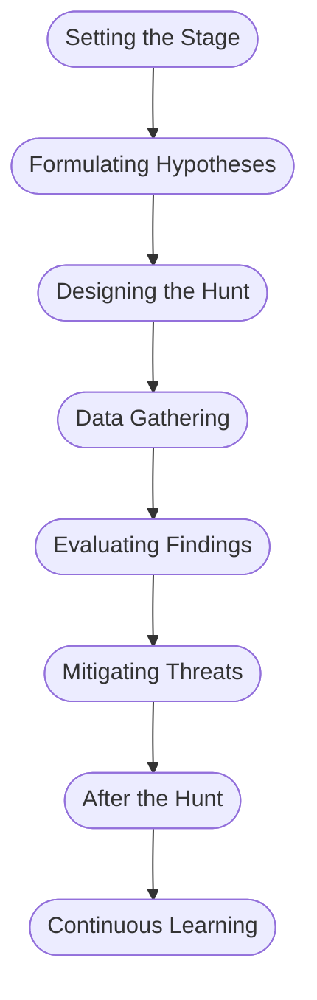
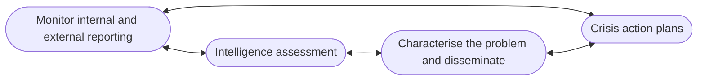

# Introduction To Threat Hunting With Elastic Module

## <u>*Definitions*</u>

The median duration between a security breach and its detection (known as "dwell time") is usually several weeks. This implies a potential adversarial presence within a network for a substantial amount of time which can be significantly impactful. This highlights a weakness of the defence-oriented cyber-security approach often employed and pushes us towards a more proactive, offensive strategy.

Threat hunting is an active practice that combs through network data to identify advanced threats. The active aspect of this solution allows us to uncover threats that might not be picked up by automatic systems. The main objective of threat hunting is to reduce dwell time and recognise attacks at the earliest stages of the cyber kill chain. During the hunting process we will regularly employ threat intelligence to formulate hunting hypotheses and develop counter-tactics.

### Incident Handling and Threat Hunting

- In the preparation phase of incident handling, a threat hunting team must set up robust, clear rules of engagement. Protocols must be established and many organisations will blend their threat hunting and incident handling teams to reduce the need for separate policies.

- During the detection and analysis phase, the threat hunters will aid in investigations, determine whether an IOC is truly significant, and help uncover further IOCs that may have been missed before.

- In the containment, eradication and recovery phase of incident handling the role of a threat hunter will vary depending on the organisations needs. 

- In the post-incident activity phase, hunters can contribute significantly due to their advanced knowledge spanning various fields in IT.

### Threat Hunting Team Structure

The construction of a threat hunting team will change depending on the organisation's needs, however it is always a strategic and planned process. Generally you need a unique set of skills in each team member that can all supplement each other. An ideal threat hunting team would typically include the following roles:

- Threat Hunter: Cybersecurity professional with a deep understanding of the threat landscape, attacker TTPs and sophisticated detection methods. Their job is primarily to proactively search for IOCs.

- Threat Intelligence Analyst: Responsible for gathering and analysing data. Their job is primarily to understand the threat landscape and predict trends which they report to the threat hunters.

- Incident Responders: Responsible for managing compromise situations and investigating IOCs.

- Forensics Experts: Team members who are used to provide detailed technical insights into an incident. The are responsible for DFIR operations and adding detail to incident reports.

- Data Analyst/Scientists: Responsible for examining large datasets to uncover patterns, correlations and trends that can aid the Threat Intelligence Analysts and Hunters understand their work.

- Security Engineers: Responsible for designing the organisations security infrastructure. They ensure all systems, applications and networks are designed with security in mind.

- Network Security Analyst: Specialising in network behaviour and traffic patterns. Primarily used to identify network IOCs quickly.

- SOC Manager: Oversees operations of the threat hunting team.

### Threat Hunting and Risk Assessment

Threat hunting should be a continuous part of an organisations security posture, but should focused on more in certain situations such as:

- When new information about an Adversary/Vulnerability comes to light

- When new indicators are associated with a known adversary

- When multiple network anomalies are detected

- During an incident response activity

- Periodic proactive actions

Risk assessment is an essential facet of cybersecurity, enabling a comprehensive understanding of potential vulnerabilities and threat vectors. Risk assessment entails a systematic process of identifying and evaluating risks based on potential threat sources and the potential impact these would have should the organisation be exploited. The information gleaned from a thorough risk assessment can guide threat hunting in several ways:

- Prioritising hunting efforts by recognising the most critical assets and their risks.

- Understanding the threat landscape better.

- Highlighting vulnerabilities in our systems, applications and processes.

- Informing the use of threat intelligence.

- Refining incident response plans.

- Enhancing cybersecurity controls.

## <u>*The Threat Hunting Process*</u>

### The Core Process

#### *Setting the Stage*

This initial phase is all about planning and preparation. It includes laying out clear targets based on our understanding of the threat landscape. This phase also encompasses making certain our environment is ready for effective threat hunting. For example we might conduct in-depth research about threat intelligence reports and analyse TTPs employed by threat actors. Threat hunting tools will also be configured.

#### *Formulating Hypotheses*

This phase involves making educated predictions to help our threat hunting journey. These hypotheses can come fro various sources and we aim to make the testable to guide us with what to search for. For example a hypothesis might be that an attacker has gained access to the network by exploiting a particular vulnerability.

#### *Designing the Hunt*

After crafting a hypothesis we need to develop a hunting strategy. This includes recognising which data sources need analysis and what methods/tools we will use. At this stage we may create custom scripts or queries. For example, the threat hunting team may decide to analyse web server logs, network logs and DNS logs. They will then define the search queries and filters they will need to extract relevant information.

#### *Data Gathering and Examination*

This phase is where the active threat hunt occurs. It involves collecting the data decided in the previous phase. We wish to examine the data using our  methods and tools. For example, teams might employ statistical techniques to find patterns in network traffic data. 

#### *Evaluating Findings and Testing Hypotheses*

After analysing the data we need to interpret the results. This will involves either proving or disproving the hypothesis, understanding the behaviour of any detected threats, identifying affected systems or determining the potential impact of a threat.

#### *Mitigating Threats*

If we confirm a threat, we mus undertake remediation activities. These could involve patching systems, isolating systems, removing malware or modifying configurations.

#### *After the Hunt*

Once the threat hunting cycle concludes it is crucial to document ad share the findings, methods and outcomes. It is also important to learn from each threat hunt to enhance future efforts. For example, after a threat hunting mission, the team might update threat intelligence platforms with newly discovered IOCs and share relevant data with other teams or external partners.

#### *Continuous Learning and Enhancement*

Threat hunting is a continuous process of learning and refinement  so each cycle should feed into the next. After a threat hunting cycle the team should review the effectiveness of their methodologies and tools.

### Example

During the planning phase, the threat hunting team extensively researches the Emotet malware's TTPs by studying previous attacks. They gain a deep understanding of the infection vectors and the critical assets and systems that are typically targeted.

They form a hypothesis based on Emotet IOCs. This hypothesis could also be formed from recent threat intelligence reports or based on triggered alerts. For example, the team might form the hypothesis: "Emotet is using compromised email accounts to send phishing emails with malicious Word documents containing macros."

The team determines the relevant data sources and collection methods. They may decide to analyse email server logs, network traffic logs, endpoint logs and sandboxed malware samples. They define search queries, filters and rules to extract information about Emotet (such as email subject lines).

The team then collects and analyses this data. They apply data analysis techniques to identify potential infections and use special tools to extract relevant information.

The team then compares their findings against their hypothesis to confirm or refute the existence of an Emotet compromise.

If infections are confirmed then the team will take immediate actions to isolated the affected systems and disrupt data exfiltration. They will deploy endpoint protection tools to detect and remove malware from systems. They will also examine the compromised email accounts.

Once the threat has been neutralised, the team documents their findings. They update platforms with any new IOCs they found and write new detection rules for their own security tools. Lessons learnt are incorporated into policies and procedures. Threat hunting is an ongoing process and the team will refine their future hypotheses, attend industry conferences/training sessions and collaborate with other teams stay ahead  on the latest Emotet TTPs. 

## <u>*The Diamond Model*</u>

The diamond model of intrusion analysis is a conceptual framework designed to illustrate the fundamental aspects of a cyber intrusion.

- Adversary represents the individual group or organisation responsible for the intrusion.

- Capability refers to the TTPs that the adversary uses to carry out the intrusion.

- Infrastructure refers to the physical and virtual resources that the adversary uses to facilitate the intrusion.

- Victim represents the target of the intrusion which can be an individual, organisation or system.

The model allows for the complex relationships and construction of threat detection to be captured. In comparison to the cyber kill chain model, we can see that the diamond model focuses more on the components involved in an incident and their relationships rather than the stages of the incident itself. Because of this, the diamond model should be used to complement the cyber kill chain model and an organisation should not solely use one or the other.

## <u>*Cyber Threat Intelligence*</u>

Cyber threat intelligence plays a vital part of our arsenal for defending against cyber attacks. The primary objective of the CTI team is to transition our reactive defence strategies into proactive measures. They contribute insights to our SOC. There are 4 fundamental principles that make CTI an integral part of an organisation's cyber strategy:

- Relevance:  The value in intelligence is in its relevance to our organisation. If there is a critical vulnerability that affects a service we do not use then the need for defensive measures is diminished.

- Timeliness: swift communication to the defence team is crucial for the implementation of mitigation measures. The value of information decreases over time.

- Actionability: Data analysed by CTI specialists can provide insights for our defence team but if the intelligence doesn't offer any clear directives for action then its value diminishes.

- Accuracy: Before reacting to intelligence we need to verify its accuracy. Incorrect information can come at a large cost to the organisation.

### The Difference Between Threat Intelligence and Hunting

Threat intelligence and hunting represent two distinct yet interconnected specialities. It is important to note that they are not substitutes for each other. Threat intelligence is primarily predictive, where we want to anticipate the adversaries moves, ascertain their targets and uncover TTPs they might be using. With threat intelligence we wish to predict information such as: The location of an attack, the timing of an attack, the operational goals of such an attack. 

On the other hand, threat hunting revolves around taking actions to determine if an adversary is or was present in the network. Threat hunting should bolster threat intelligence and help strengthen our defence posture. Both teams should communicate with other often to inform their operations.

### The Criteria of CTI

We have already discussed that for CTI to be effective it must be actionable, timely, relevant and accurate. These 4 elements form the foundation of CTI that provides visibility into adversary operations. Well constructed CTI can also have other benefits such as:

- Understanding threats to our organisation and partners\

- Insight into our organisations network

- Enhanced awareness of potential problems

Additionally, from a business perspective, high-quality CTI fulfils business objectives and industry regulations for minimising risk. 

As information is compiled it transforms to intelligence. This intelligence can then be classified into three different categories. The categories are:

- Strategic Intelligence

- Operational Intelligence

- Tactical Intelligence

The ideal intelligence is at the intersection of all these categories since this is the point at which the CTI analyst is best equipped to offer the most detailed portrait of the adversary.

#### *Strategic Intelligence*

Strategic intelligence is often consumed by C-suite executives, VPs and company leaders who align it to company risks to inform their business decisions. It provides an overview of an adversaries operations over time by answering the questions "who?" and "why?".

#### *Operational Intelligence*

Operational intelligence includes TTPs of an adversary, provides more information about adversary campaigns, often contains more technical detail than strategic intelligence and is usually prepared for mid-level management. Operational intelligence aims to provide insight towards the questions "how?" and "where?".

#### *Tactical Intelligence*

Tactical intelligence includes immediate actionable information and technical details on attacks that have occurred or could occur in the near future. These are usually prepared for technical staff and shared with management.

### Going Through a Tactical Threat Intelligence Report

Threat intelligence reports loaded with tactical intelligence and IOCs can be  quite dense and difficult to interpret so we need a structured methodology to optimise our responsiveness. Consider the following example report on an elaborate Emotet malware campaign

#### *Comprehending the Report's Scope*

The initial phase of interpreting the report requires looking at the broader context. Suppose our report refers to an ongoing Emotet campaign directed towards business in our sector. The report may offer macro-level insights into the attackers objectives. Using this we can assess the personal risk to our organisation.

#### *Spotting and Classifying the IOCs*

Tactical Intelligence typically encompasses a list of IOCs tied to the threat. In the case of our report that might include IP addresses, file hashes, email address or subject lines, URLs, or distinct registry alterations. We should partition these IOCs into categories for better comprehension.

#### *Comprehending the Attack's Lifecycle*

The report will likely depict the TTPs deployed by the attackers, mapped to the MITRE framework. For the Emotet campaign, it might commence with a spear-phishing email, proceed to execute a payload, establish persistence, execute defence evasion and ultimately exfiltrate data. For this it may be beneficial to look at the cyber kill chain.

#### *Analysis and Validation of IOCs*

Not all IOCs hold the same utility or accuracy. We need to cross-reference them with additional threat intelligence sources. We also need to consider the age of the IOCs as older ones may not be as relevant as adversaries change tactics over time. Some IOCs might be more relevant to our organisation than others - everything needs to be considered in context.

#### *Incorporating the IOCs into our Security Infrastructure*

Once authenticated, we need to integrate these IOCs into our security solutions. This could involve setting new firewall rules, creating new IDS/IPS signatures. For email based IOCs like in our example, we could look at using DMARC or similar anti-spam solutions. All changes need to be documented and approved.

#### *Proactive Threat Hunting*

Now that we have a good understanding of the threat, we can instruct our threat hunting team with how to effectively search for adversarial actions. The only thing to bear in mind is that the threat report does not contain an exhaustive list of IOCs or TTPs and we should still be on guard for slight variations or even different but related tactics.

#### *Continuous Monitoring and Learning*

After implementing all actions that we are going to take as response to the report we must continuously monitor our environments for alerts. Any detection should trigger a predefined incident response process. Furthermore we should take long-term changes and implement those into our system such as phishing training for staff.

### Example Threat Intelligence Report: Stuxbot

The present Threat Intelligence report underlines the immediate menace posed by the organised cybercrime collective known as "Stuxbot". The group initiated its phishing campaigns earlier this year and operates with a broad scope, seizing upon opportunities as they arise, without any specific targeting strategy – their motto seems to be anyone, anytime. The primary motivation behind their actions appears to be espionage, as there have been no indications of them exfiltrating sensitive blueprints, proprietary business information, or seeking financial gain through methods such as ransomware or blackmail.

- Platforms in the Crosshairs: `Microsoft Windows`
- Threatened Entities: `Windows Users`
- Potential Impact: `Complete takeover of the victim's computer / Domain escalation`
- Risk Level: `Critical`

The group primarily leverages opportunistic-phishing for initial access, exploiting data from social media, past breaches (e.g., databases of email addresses), and corporate websites. There is scant evidence suggesting spear-phishing against specific individuals. The document compiles all known Tactics Techniques and Procedures (TTPs)  and Indicators of Compromise (IOCs) linked to the group, which are  currently under continuous refinement. This preliminary sketch is confidential and meant exclusively for our partners, who are strongly advised to conduct scans of their infrastructures to spot potential successful breaches at the earliest possible stage.

In summary, the attack sequence for the initially compromised device can be laid out as follows:

#### *Initial Breach*

The phishing email is relatively rudimentary, with the malware posing as an invoice file. Here's an example of an actual phishing email that includes a link leading to a OneNote file:

Our forensic investigation into these attacks revealed that the link directs to a OneNote file, which has consistently been hosted on a file hosting service (e.g., Mega.io or similar platforms).

This OneNote file masquerades as an invoice featuring a 'HIDDEN' button that triggers an embedded batch file. This batch file, in turn, fetches PowerShell scripts, representing stage 0 of the malicious payload.

#### *RAT Characteristics*

The RAT deployed in these attacks is modular, implying that it can be  augmented with an infinite range of capabilities. While only a few features are accessible once the RAT is staged, we have noted the use of tools that capture screen dumps, execute [Mimikatz](https://attack.mitre.org/software/S0002/), provide an interactive `CMD shell` on compromised machines, and so forth.

All persistence mechanisms utilised to date have involved an EXE file deposited on the disk.

So far, we have identified two distinct methods for lateral movement:

- Leveraging the original, Microsoft-signed PsExec
- Using WinRM

The following provides a comprehensive inventory of all identified IOCs to this point.

**OneNote File**:

- https://transfer.sh/get/kNxU7/invoice.one
- https://mega.io/dl9o1Dz/invoice.one

**Staging Entity (PowerShell Script)**:

- https://pastebin.com/raw/AvHtdKb2
- https://pastebin.com/raw/gj58DKz

**Command and Control (C&C) Nodes**:

- 91.90.213.14:443
- 103.248.70.64:443
- 141.98.6.59:443

**Cryptographic Hashes of Involved Files (SHA256)**:

- 226A723FFB4A91D9950A8B266167C5B354AB0DB1DC225578494917FE5 867EF2
- C346077DAD0342592DB753FE2AB36D2F9F1C76E55CF8556FE5CDA92897E99C7E
- 018D37CBD3878258C29DB3BC3F2988B6AE688843801B9ABC28E6151141AB66D4
