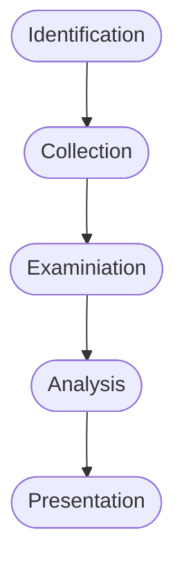

# Introduction to Digital Forensics Module

Digital Forensics (often referred to as computer forensics or cyber forensics) is a specialised branch of cybersecurity that involves the collection, preservation, analysis and presentation of digital evidence to investigate cyber incidents or criminal activities. It applies forensic evidence to digital artefacts. Digital forensics aims to reconstruct timelines, identify malicious activities, assess the impact of incidents and provide evidence for legal or regulatory proceedings. Some key concepts in digital forensics are:

- **Electronic evidence**: Can include files, emails, logs, databases, network traffic and more. This evidence is collected from digital sources.

- **Preservation of evidence**: We need to ensure the integrity and authenticity of digital evidence. Proper procedures should be followed to preserve evidence, establish a chain of custody and prevent any unintentional alterations.

- **Forensic process**:
  
  - Identification: Find potential sources of evidence.
  
  - Collection: Gather evidence using forensically sound methods.
  
  - Examination: Analysing the collected data for relevant information.
  
  - Analysis: Interpreting the data to draw conclusions about the incident.
  
  - Presentation: Present findings in a clear and comprehensible manner.



- **Types of cases**: Digital forensics is applied in a variety of cases including cybercrime investigations, intellectual property theft, Data breaches, litigation support.

The basic steps for performing a forensic investigation are as follows:

1. Create a forensic image

2. Document the system's state

3. Identify and preserve evidence

4. Analyse the evidence

5. Timeline analysis

6. Identify IOCs

7. Report and document

Digital forensics provides us with a detailed post-mortem of security incidents. Analysing digital evidence can let us trace back the steps of an attacker. During a security incident, time is of the essence - digital forensics tools can rapidly sift through vast amounts of data, pinpointing the exact moment of compromise. Additionally, after a security breach there is a high likelihood of legal repercussions, and digital forensics can help us provide legally admissible evidence that can be used in court. Understanding the full scope of an incident lets us better tailor our response and ensure that every compromised system is addressed.

## <u>*Windows Forensics Overview*</u>

### NTFS

NTFS is a proprietary file system developed by Microsoft as a part of its Windows NT operating system family. NTFS is used by all modern windows operating systems as far back as Windows XP. NTFS was designed to address several limitations with the FAT file system. Some key forensic artefacts that digital investigators often analyse when working with NTFS are:

- File metadata such as creation time, modification time, access time and attribute information.

- MFT entries such as file names, sizes, timestamps and storage locations.

- File slack and unallocated space which may contain remnants of deleted files or fragments of data. File slack is the unused portion of a cluster that may contain data from a previous file.

- File signatures for identifying when file extensions have been changed or obscured.

- USN (Update Sequence Number) journal which is a log maintained by NTFS to record changes made to files and directories.

- LNK files which can provide insights into recently accessed files or programs.

- Prefetch files which are generated by windows to improve the startup performance of applications.

- Registry hives contain important configuration and system information.

- Shellbags are registry entries that store folder view settings such as window positions and sorting preferences.

- Thumbnail cache that stores miniature previews of images and documents which can include deleted documents.

- Recycle bin that contains deleted files.

- Alternate data streams (ADS) are additional streams of data associated with a specific file. Malicious actors many use ADS to hide data.

- Volume shadow copies which are snapshots of the file system at different points in time.

- Security descriptors and ACLs that determine file and folder permissions.

### Windows Event Logs

Windows Event Logs are an intrinsic part of the windows operating system, storing logs from different components of the system. Windows event logging offers logging capabilities for application errors, security events, diagnostic information and more which we leverage as cybersecurity professionals. Adversarial behaviour will be captured in event logs which can then dissect to form timelines, realise the extent of compromise and help inform remediation action. To access logs for offline analysis we can find them at the default file path: `C:\Windows\System32\winevt\logs`.

### Execution Artefacts

Windows execution artefacts refer to the traces and evidence left behind on a windows system when programs and processes are executed. These artefacts can provide valuable insights into the execution of applications or scripts that can then inform our digital forensics investigations, incident response or analysis. We might aim to reconstruct timelines, identify malicious activities and establish patterns of behaviour. Some common types of windows execution artefacts are:

- Prefetch files: Can help us reveal a history of run programs and the order in which they were executed.

- Shimcache: A windows mechanism that logs information about program execution to assist with compatibility and performance optimisations. It can record details such as file paths, execution timestamps and flags.

- Amcache: Amcache is a database introduced in Windows 8 that stores information about installed applications and executables.

- UserAssist: A registry key that maintains information about programs executed by users.

- RunMRU lists: The RunMRU (Most recently used) lists in the registry, store information about recently executed programs from various locations.

- Jump lists: Store information about recently accessed files, folders and tasks.

- LNK files: Can contain information about the target executable.

- Recent Items: Maintains a list of recently opened files.

- Windows event logs: Various event logs will record events related to execution, creation, termination, crashes and more.

| Artefact           | Location/Registry Key                                                                | Data Stored                                         |
| ------------------ | ------------------------------------------------------------------------------------ | --------------------------------------------------- |
| Prefetch files     | `C:\Windows\Prefetch`                                                                | Metadata about executed files.                      |
| Shimcache          | `HKEY_LOCAL_MACHINE\SYSTEM\CurrentControlSet\Control\Session Manager\AppCompatCache` | Program execution details.                          |
| Amcache            | `C:\Windows\AppCompat\Programs\Amcache.hve`                                          | Application details.                                |
| UserAssist         | `HKEY_CURRENT_USER\Software\Microsoft\Windows\CurrentVersion\Explorer\UserAssist`    | Executed program details.                           |
| RunMRU lists       | `HKEY_CURRENT_USER\Software\Microsoft\Windows\CurrentVersion\Explorer\RunMRU`        | Recently executed programs and their command lines. |
| Jump lists         | User-specific folders (`%AppData%\Microsoft\Windows\Recent`)                         | Recently accessed files, folders and tasks.         |
| Shortcut files     | Various locations                                                                    | Target executable file paths.                       |
| Recent items       | User-specific folders (`%AppData%\Microsoft\Windows\Recent`)                         | Recently accessed files.                            |
| Windows event logs | `C:\Windows\System32\winevt\Logs`                                                    | Various event logs containing process information.  |

### Windows Persistence Artefacts

Windows persistence refers to the techniques and mechanisms used by attackers to ensure their presence and control over a compromised system. These persistence methods exploit various system components such as registry keys, startup processes, scheduled tasks, and services to enable actors to withstand reboots and security measures. The windows registry acts a crucial database storing information for the windows OS. Attackers will often target the windows registry for establishing persistence - example registry keys of note are:

- `HKEY_CURRENT_USER\Software\Microsoft\Windows\CurrentVersion\Run`

- `HKEY_CURRENT_USER\Software\Microsoft\Windows\CurrentVersion\RunOnce`

- `HKEY_LOCAL_MACHINE\SOFTWARE\Microsoft\Windows\CurrentVersion\Run`

- `HKEY_LOCAL_MACHINE\SOFTWARE\Microsoft\Windows\CurrentVersion\RunOnce`

- `HKEY_LOCAL_MACHINE\Software\Microsoft\Windows\CurrentVersion\Policies\`

- `HKEY_LOCAL_MACHINE\SOFTWARE\Microsoft\Windows NT\CurrentVersion\Winlogon`

- `HKEY_LOCAL_MACHINE\SOFTWARE\Microsoft\Windows NT\CurrentVersion\Winlogon\Shell`

- `HKEY_CURRENT_USER\Software\Microsoft\Windows\CurrentVersion\Explorer\User Shell Folders`

- `HKEY_CURRENT_USER\Software\Microsoft\Windows\CurrentVersion\Explorer\Shell Folders`

- `HKEY_LOCAL_MACHINE\SOFTWARE\Microsoft\Windows\CurrentVersion\Explorer\Shell Folders`

- `HKEY_LOCAL_MACHINE\SOFTWARE\Microsoft\Windows\CurrentVersion\Explorer\User`

Attackers may also try and exploit scheduled tasks to enable persistence. These tasks live in `C:\Windows\System32\Tasks` each saved as an XML file. The file details the creator, timing or trigger and the path to the command or program set to run. Attackers may even try to create their own services to enable persistence, in this case a key registry location to watch is: `HKEY_LOCAL_MACHINE\System\CurrentControlSet\Services`.

### Web Browser Forensics

Web browser forensics is a discipline centred on analysing remnants left by web browsers. These can provide insights on user actions, online engagements and potentially harmful behaviour. Some key browser artefacts for analysis are:

- Browsing history

- Cookies

- Cache

- Bookmarks/Favourites

- Download history

- Auto-fill data

- Search history

- Session data

- Typed URLs

- Form data

- Passwords

- Web storage

- Favicons

- Tab recovery data

- Extensions and add-ons

### SCRUM

SCRUM (System resource usage monitor) is a feature introduced in windows 8. SCRUM tracks resource utilisation and application usage patterns. The data is housed in a database file named `sru.db` found in `C:\Windows\System32\sru`. This SQLite formatted database allows for structured data storage and efficient data retrieval. SCRUM's records, organised by time intervals and help reconstruct application and resource usage over specific durations. Key facets of SCRUM forensics encompass:

- Application profiling

- Resource consumption

- Timeline reconstruction

- User and system context

- Malware analysis and detection

- Incident response

## <u>*Evidence Acquisition Techniques and Tools*</u>

Evidence acquisition is a critical phase in digital forensics, involving the collection of digital artefacts and data from various sources to preserve potential evidence for analysis. This process requires specialised tools and techniques to ensure the integrity, authenticity and admissibility of collected evidence. Some evidence acquisition techniques commonly used in digital forensics are:

- Forensic imaging

- Extracting host-based evidence and rapid triage

- Extracting network evidence

### Forensic Imaging

Forensic imaging is a fundamental process in digital forensics which involves creating an exact, bit-by-bit copy of digital storage media such as hard drives, SSDs, USBs and memory cards. This process is vital for preserving the original state of the data, ensuring its integrity. Forensic imaging is critical in digital forensics investigations by allowing analysts to examine evidence without altering or compromising the original data. Some tools we can use are:

- [FTK Imager](https://www.exterro.com/digital-forensics-software/ftk-imager): One of the most widely used disk imaging tools in the cyber field. Allows us to create perfect copies of computer disks for analysis.

- [AFF4 Imager](https://github.com/Velocidex/c-aff4): A free, open-source tool crafted for creating and duplicating forensic disk images. It is designed to be user-friendly and compatible with numerous file systems. AFF4 has be ability to extract file based on their creation time which can reduce the time taken for imaging through compression.

- `DD` and `DCFLDD`: Both command-line tools for copying file systems. `DCFLDD` is an enhanced version with features that are specifically useful for forensics.

- Virtualisation tools: Given the prevalent use of virtualisation in modern systems, we will often need to collect evidence from virtual environments. The way we do this will vary depending on the software we are using.

#### *Example 1: Imaging with FTK Imager*

In FTK Imager we can select the file menu and then "Create Disk Image"


Next we need to select the media source and the drive from which we want to create an image. We need to specify a destination for the image:


Select the desired image type (E01), input evidence details and choose the destination folder and filename:


Once all settings are confirmed we can click start. Once the image has been verified you will receive an imaging summary. Now we are ready to analyse the dump.

#### *Example 2: Mounting a Disk Image with Arsenal*

Arsenal Image Mounter is a disk image mounting tool. In this example we will mount a disk image from a compromised virtual machine running on VMWare. The virtual hard disk has been stored as `HTBVM01-000003.vmdk`. We first launch Arsenal with administrative rights and then in the main window we click on the mount disk image button. Next we can navigate to the location of our `.vmdk` and select it:


Arsenal will ask us if we want to mount the disk as read-only or read-write. We should ensure that we mount it as read-only so that do not accidentally change any data. Once mounted, the image will appear as a drive.

### Extracting Host-based Evidence & Rapid Triage

Modern operating systems generate a plethora of evidence artefacts. These can arise from application execution, file modifications or even the creation of user accounts. Evidence on a host system varies in nature, in particular the volatility of certain evidence sources. One crucial type of volatile evidence is the system's active memory. During investigations (particularly those that include malware infections), the live system memory becomes indispensable. To capture memory, tools like FTK Imager are commonly used, other tools include:

- [WinPmem](https://github.com/Velocidex/WinPmem): The default open-source memory acquisition driver for windows.

- [DumpIt](https://www.magnetforensics.com/resources/magnet-dumpit-for-windows/): A simple utility that generates physical memory dumps of Windows and Linux machines. On windows it concatenates 32-bit and 64-bit memory into a single file making it extremely easy to use.

- [MemDump](http://www.nirsoft.net/utils/nircmd.html): A free, straightforward command-line tool that enables us to capture the contents of a systems RAM.

- [Belkasoft RAM Capturer](https://belkasoft.com/ram-capturer): Captures the RAM of a running Windows computer even if there is anti-debugging or anti-dumping protection.

- [Magnet RAM Capture](https://www.magnetforensics.com/resources/magnet-ram-capture/): Free and simple tool for capturing memory.

- [LiME](https://github.com/jtsylve/LiME): A Loadable Kernel Module (LKM) which allows for the acquisition of volatile memory. LiME is transparent to the target system which helps it evade many common anti-forensic measures.

#### *Example 1: Acquiring Memory with WinPmem*

To generate a memory dump, simply execute the following command with Administrator privileges:

```batch
winpmem_mini_x64_rc2.exe memdump.raw
```

#### *Example 2: Acquiring VM memory*

The exact way to capture memory in a VM will differ depending on the software used but they will all follow the same general steps:

1. Open the running VM's options.

2. Suspend the VM.

3. Locate the `.vmem` file inside the VM's directory.

Rapid Triage emphasises collecting data from potentially compromised systems. The goal is to centralise high-value data, streamlining it indexing and analysis. By doing this, analysts can more effectively deploy tools and techniques. One of the best rapid artefact parsing and extracting solutions is KAPE (Kroll Artefact Parser and Extractor). Lets consider how we could use KAPE to retrieve valuable forensic data from the image we mounted with Arsenal.


KAPE operates based on the principles of Targets and Modules. These elements guide the tool in processing data and extracting forensic artefact. When we feed a source to KAPE, it duplicates specific forensic related files to a designated output folder, whilst maintaining the metadata of each file.


KAPE provides two modes, a CLI and a GUI version. We will run KAPE in the GUI form:


The crux of the process lies in selecting the appropriate target configurations. In KAPE's terminology, "targets" refer to specific artefacts we aim to extract from an image or system. KAPE's target files have a `.tkape` extension and live in the `KAPE\Targets` directory. Below is an example of a target file.


KAPE also offers compound targets which are amalgamations of multiple targets which can help accelerate the collection process. In this example lets say our source is `D:\` and we have a designated output folder. Then we can select our targets and hit execute to initiate data collection.


The output directory of KAPE houses the collected artefacts which will change depending on the selected targets. If we wanted to perform artefact collection remotely and en masse, we need to use EDR solutions and Velociraptor. EDR platforms offer a significant advantage to response analysts. They can enable remote acquisition and analysis of digital evidence. Velociraptor is a potent tool for gathering host-based information using VQL queries. Velociraptor can execute "Hunts" to amass various artefacts. A frequently used artefact is the `Windows.KapeFiles.Targets`. Whilst KAPE is not open-source, its file collection logic is. To use Velociraptor for KapeFiles artefacts we need to first initiate a new hunt:


We choose `Windows.KapeFiles.Targets` as the artefacts for collection.


We then specify the collection to use and click launch to start the hunt.


We can then download the hunt data. For remote memory dump collection using Velociraptor we use the `Windows.Memory.Acquisition` artefact.

### Extracting Network Evidence

We have already seen how to perform network traffic analysis in other modules. We have also looked at using IDS and IPS systems and looking for network traffic evidence with them. We could also look for traffic flow data from tools like `NetFlow` or `sFlow` to provide us with a broad view of the network's behaviour. Finally we can use firewalls to block or allow traffic based on predefined rules. We can then analyse firewall logs to uncover exploit attempts.

## <u>*Memory Forensics*</u>

Memory forensics, or volatile memory analysis, is a specialised branch of digital forensics that focuses on the examination and analysis of the volatile memory of a computer system. Some types of data found in RAM that are valuable for incident investigations are:

- Network connections

- File handles and open files

- Open registry keys

- Running processes on the system

- Loaded modules

- Loaded device drivers

- Command history and console sessions

- Kernel data structures

- User and credential information

- Malware artefacts

- System configuration

- Process memory regions

As discussed in the previous section and in the YARA & Sigma section, when malware operates, it often leaves traces or footprints in a system's active memory. It should be noted that in some cases, important data or encryption keys may reside in memory. The following outlines a systematic approach to memory forensics formulated to aid in in-memory investigations and drawing inspiration from SANS's six-step memory forensics methodology.

1. Process Identification and Verification: Begin by identifying all active processes. Malicious software often masquerades as legitimate processes, sometimes with subtle name variations to avoid detection. We need to enumerate all running processes, determine their origin within the operating system and cross reference with legitimate processes.

2. Deep Dive into Process Components: Once we have flagged potentially rogue processes, our next step is to scrutinise the associated DLLs and handles. Malware often exploits DLLs to conceal its activities. We need to examine DLLs to look for links to suspicious processes, check for unauthorised DLLs and investigate signs of DLL injection.

3. Network Activity Analysis: Many malware strains necessitate internet connectivity. They might beacon to C2 servers or exfiltrate data. To uncover these we need to review active and passive network connections and identify and document external IP addresses. We need to determine the nature and purpose of the communication.

4. Code Injection Detection: Advanced adversaries often employ techniques like process hollowing or using unmapped memory sections. To counter this we need to use memory analysis tools to detect anomalies and identify processes that seem to occupy unusual memory spaces.

5. Rootkit Discovery: Achieving stealth and persistence is a common goal for adversaries. Rootkits which embed deep within the OS, grant threat actors continuous elevated system access while evading detection. To tackle this we need to scan for signs of rootkit activity and identify and processes running at unusually high privileges.

6. Extraction of Suspicious Elements: After pinpointing suspicious processes, drivers or executables, we need to isolate them for in-depth analysis. This involves dumping the suspicious components from memory and storing them securely for future examination.

### The Volatility Framework

The preferred tool for conducting memory forensics is Volatility. Volatility is a leading open-source forensics framework. This script harnesses plugins, enabling it to dissect memory images with precision. Volatility modules or plugins are extensions or add-ons that enhance the functionality but extracting specific information or performing analysis tasks on memory images. Some commonly used modules are:

- `pslist`: Lists the running processes

- `cmdline`: Displays the process command-line arguments

- `netscan`: Scans for network communications and open ports

- `malfind`: Scans for potentially malicious code injected into processes

- `handles`: Scans for open handles

- `svcscan`: Lists Windows services

- `dlllist`: Lists loaded DLLs in a process

- `hivelist`: Lists registry hives in memory

Volatility offers extensive documentation and a cheatsheet can be found here: <https://blog.onfvp.com/post/volatility-cheatsheet/>, or <https://downloads.volatilityfoundation.org/releases/2.4/CheatSheet_v2.4.pdf>. We will now demonstrate using Volatility v2 to analyse a memory dump saved as `Win7-2515534d.vmem`.

```bash
vol.py -h
```

Profiles are essential for Volatility v2 to interpret the memory data correctly. To determine the profile that matches the operating system of the memory dump we can use that `imageinfo` plugin:

```bash
vol.py -f <memory_file> imageinfo
```

We can see if the suggested profile is correct by trying to list running process via the `pslist` plugin:

```bash
vol.py -f <memory_file> --profile=<profile> pslist
```

It should be noted that even if we specify another profile from the suggested list Volatility may still provide us with the correct output. We can use the `netscan` plugin to be used for network artefacts as follows:

```bash
vol.py -f <memory_file> --profle=<profile> netscan
```

To find `_TCPT_OBJECT` structures using pool tag scanning, we use the `connscan` command. This can find artefacts from previous connections that have been terminated. The `malfind` plugin can be used to identify an extract injected code and malicious payloads from the memory of a running process:

```bash
vol.p -f <memory_file> --profile=<profile> malfind --pid=<target_pid>
```

The handles plugin in Volatility is used for analysing the handles held by a specific process within a memory dump:

```bash
vol.py -f <memory_file> --profile=<profile> handles -p <target_pid> --object-type=Key
```

```bash
vol.py -f <memory_file> --profile=<profile> handles -p <target_pid> --object-type=File
```

```bash
vol.py -f <memory_file> --profile=<profile> handles -p <target_pid> --object-type=Process
```

The `svcscan` plugin in Volatility is used for listing and analysing Windows services running on a system within memory dump.

```bash
vol.py -f <memory_dump> --profile=<profile> svcscan | more
```

The `dlllist` plugin in Volatility is used for listing the DLLs loaded into the address space of a specific process within a memory dump.

```bash
vol.py -f <memory_file> --profile=<profile> dlllist -p <pid>
```

The `hivelist` plugin in Volatility is used for listing the registry files present in the memory dump of a Windows system.

```bash
vol.py -f <memory_file> --profile=<profile> hivelist
```

### Rootkit Analysis with Volatility v2

We can now demonstrate using Volatility v2 to analyse a memory dump saved as `rootkit.vmem`. EPROCESS is a data structure in the windows kernel that represents a process. Each process in the Windows operating system has a corresponding EPROCESS block in kernel memory. During memory analysis, the examination of EPROCESS structures is crucial for understanding the running processes on a system, identifying parent-child relationships, and determining which processes were active at the time of the memory capture.


A doubly-linked list is a fundamental data structure in computer science and programming. It is a type of linked list where each node contains two pointers:

- Next pointer: Points to the next node in the list, allowing us to traverse the list in a forward direction.

- Previous pointer: Points to the previous node in the list, allowing us to traverse the list in a backwards direction.

Within the EPROCESS structure, we have `ActiveProcessLinks` as the doubly-linked list which contains the `flink` field and the `blink` field. `flink` is a forward pointer that points to the `ActiveProcessLinks` list entry of the \_next_ EPROCESS structure in the list of active processes. `blink` is a backward pointer within the EPROCESS structure that points to the `ActiveProcessLinks` list entry of the \_previous_ EPROCESS structure.

These linked lists of EPROCESS structures are used by the Windows kernel to quickly iterate through all running processes on the system.


Direct Kernel Object Manipulation (DKOM) is a sophisticated technique used by rootkits and advanced malware to manipulate the Windows operating system's kernel data structures in order to hide malicious processes, drivers, files and other artefacts from detection by security tools running is user mode. If, for example, a monitoring tool is dependent on the EPROCESS structure for the enumeration of the running processes, and there's a rootkit running on the system which manipulates the EPROCESS structure directly in kernel memory by altering the EPROCESS structure or unlinking a process from lists then the monitoring tool will not be able to see this process.


The `psscan` plugin is used to enumerate running processes. It scans the memory pool tags associated with each process's EPROCESS structure. This technique can help identify processes that may have been hidden or unlinked by rootkits as well as processes that have been terminated but not removed from memory.

```bash
vol.py -f <memory_file> psscan
```

This different plugins might be able to identify different processes. Notice that sometimes `psscan` can find processes that `pslist` cannot.

### Memory Analysis Using Strings

Analysing strings in memory dumps is a valuable technique in memory forensics and incident response. Strings often contain human-readable information such as text messages, file paths, IP addresses or passwords. We can use the `strings` utility from the Sysinternals suite on a windows system our the builtin command on Linux. The following command identifies IPv4 addresses:

```bash
strings <memory_file> | grep -E "\b([0-9]{1,3}\.){3}[0-9]{1,3}\b"
```

We can also identify email addresses:

```bash
strings <memory_file> | grep -oE "\b[A-Za-z0-9._%+-]+@[A-Za-z0-9.-]+\.[A-Za-z]{2,4}\b"
```

Or command prompt artefacts:

```bash
strings <memory_files> | grep -E "(cmd|powershell|bash)[^\s]+"
```

## <u>*Disk Forensics*</u>

Adhering to the sequence of data volatility is crucial. It's imperative that we scrutinise each byte to detect the subtle traces left by cyber adversaries. Many disk forensic tools come packed with features and for incident response teams, certain functionalities stand out:

- File structure insight: Being able to navigate and see the disk's file hierarchy is crucial. The best forensic tools should display this structure.

- Hex viewer: Occasionally we need to examine the data in its raw form, for this a program to view files in hex is essential.

- Web artefact analysis: A forensic tool needs to efficiently sift through and present web activity data.

- Email carving: Sometimes our investigative trail leads to internal threats. A key tool that can extract and present email data can help us piece together our investigation.

- Image viewer: At times, the images on a file system can be critical to an investigation. Having a built-in image viewer is very helpful.

- Metadata analysis: Details like file creation timestamps, hashes and disk locations can be critical. These forensic tools can help us extract this critical information.

 is a user friendly platform built on top of the open-source Sleuth kit toolset. It mirrors many features that you would find in commercial counterparts: timeline assessments, keyword hunts, web and email artefact retrievals and the ability to sift results on known malicious file hashes.


We can examine Data Sources to explore files and directories:


We can also examine Web artefacts and check attached devices. We can attempt to recover deleted files, conduct searches or use keyword lists for targeted searches.


One of the most crucial elements of Autopsy is the Timeline analysis feature:


## <u>*Rapid Triage Examination & Analysis Tools*</u>

When it comes to rapid triage analysis, the right external tools are essential for thorough examination and analysis. A comprehensive list of tools can be found at <https://ericzimmerman.github.io/#!index.md>. We can either use a powershell script to download the tools or download them directly as a zip file.

```powershell
.\Get-ZimmrmanTools.ps1
```

We will use a subset of these tools to analyse the KAPE output data. Its vital for us to familiarise ourselves with the entire toolkit. In this module we will be working with certain tools and evidence:

- Evidence Location: `C:\Users\johndoe\Desktop\forensic_data\kape_output`

- Tools location: `C:\Users\johndoe\Desktop\Get-ZimmermanTools`

- Active@ Disk Editor's location: `C:\Program Files\LSoft Technologies\Active@ Disk Editor`

- EQL's location: `C:\Users\johndoe\Desktop\eqllib-master`

- RegRipper's location: `C:\Users\johndoe\Desktop\RegRipper3.0-master`

The term MAC(b) times denotes a series of timestamps linked to files or objects. These timestamps are pivotal as they shed light on the chronology of events or actions on a file system. MAC(b) stands for Modified, Accessed, Changed, and Birth times. The "b" is placed in brackets because the Birth timestamp is not universally present across all file systems.

| Operation     | Modified | Accessed | Birth (Created) |
| ------------- |:--------:|:--------:|:---------------:|
| File Create   | Y        | Y        | Y               |
| File Modify   | Y        | N        | N               |
| File Copy     | N        | Y        | Y               |
| File Accessed | N        | Y        | N               |

All of these timestamps live in the `$MFT` file, located at the root of the system drive. The timestamps are housed across two distinct attributes:

- `$STANDARD_INFORMATION`

- `$FILE_NAME`

The timestamps visible in Windows file explorer is derived from the standard information attribute. Identifying instances of timestamp manipulation (commonly referred to as timestomping T1070.006) presents a challenge in digital forensics. When adversaries manipulate file creation times or deploy tools for such purposes, the timestamp displayed undergoes modification and we can see this `MFT Explorer`. 


We can cross verify the timestamps from the standard information attribute with the timestamps from the file name attribute through `MFTEcmd`.

```powershell
.\MFTECmd.exe -f <MFT_table> --de <address>
```

If we notice a discrepancy between the two times then we have evidence of timestomping. Thankfully the file name property requires higher privileges than the standard information property which makes it harder for an attacker to change those times. First we need to look at file system based artefacts.

### MFT File

The `$MFT` file (commonly referred to as the Master File Table) is an integral part of the NTFS used by modern Windows operating systems. This file is instrumental in organising and cataloguing files and directories on an NTFS volume. Each file and directory on such a volume has a corresponding entry in the Master File Table. `$MFT` is a treasure trove of information in a digital forensics investigation and enables us to see timelines of file creation, modification, deletion and access. A standout feature of the MFT is its ability to retain metadata about files and directories. We can extract the MFT using KAPE. We can then inspect the MFT by loading it into MFT Explorer. Once files are deleted, their records in the MFT are flagged as "free" and ready for reuse.


A snapshot of the components stored in MFT records are:

- File Record Header: Contains metadata about the file record itself.

- Standard Information Attribute Header: Stores standard file metadata such as timestamps, file attributes and security identifiers.

- File Name Attribute Header: Contains information about the filename including its length, namespace and Unicode characters.

- Data Attribute Header: Describes the file data attribute which can either be resident (stored within the MFT record) or non-resident. The File data stores the actual data which can either be the raw content or references to data clusters on disk.

- Additional Attributes: NTFS supports additional attributes, such as security descriptors, object IDs, volume name, index information an more.

These attributes will vary depending on the file characteristics. 


The file header is a 4 byte signature which is usually "FILE" or "BAAD" indicating whether the record is in use or has been deallocated. To demystify the structure of an NTFS MFT file record, we're harnessing the capabilities of Active@ Disk Editor. This tool facilitates the viewing and modification of raw disk data, including the MFT file. In Disk editor we can see the raw data of MFT entries. The Zone.Identifier is a specialised file metadata attribute in the Windows OS which signifies the security zone from which a file was sourced. When a file is fetched from the internet, windows assigns it a ZoneId. This ZoneId is embedded in the file's metadata to signify the source or security zone of the file's origin. Internet-sourced files typically bear a ZoneId of 3. 

```powershell
Get-Item * -Steam Zone.Identifier -ErrorACtion SilentlyContinue
```

```powershell
Get-Content * -Stream Zone.Identifier -ErrorAction SilentlyContinue
```

One security mechanism known as the "mark of the web" (MotW), hinges on the zone identifier. The MotW differentiates files sourced from the internet or other potentially dubious sources from those originating from trusted or local contexts. It is frequently employed to bolster the security of applications like Microsoft Word.

### Timeline Explorer

Timeline Explorer is another digital forensic tool used to assist forensic analysts and investigators in creating and analysing timeline artefacts from various sources. We can filter timeline data based on specific criteria such as date and time ranges, event types, keywords and more. It is simple to convert a CSV file into timeline explorer, all we need to do is drag and drop it into the program.


### USN Journal

USN (Update sequence number) is a vital component of the NTFS file system in Windows. The USN journal is essentially a change journal feature that logs alterations to files. USN ca enable us to monitor operations such as file creation, renaming, deletion and data overwrite. In the Windows environment, the USN journal file is designated as `$J`. The KAPE output houses the collected journal in an `$Extend` folder. Whilst its primary focus is the MFT, MFTECmd can also be used to analyse the USN journal.

```powershell
.\MFTECmd.exe -f <USN_journal> --csv <out_dir> --csvf <out_file>
```

This output file can then be imported into Timeline Explorer. For example, we may notice a file with suspicious changes. On further inspection we can see that it has been downloaded from the internet so we then are interested in the Zone identifier to see if we can find the source IP/domain it was downloaded from. To do this we can:

1. Create a CSV file in the same way as before:

2. Import the CSV into Timeline Explorer

3. Apply a filter on the entry number of the suspicious program

```powershell
.\MFTECmd.exe -f <MFT_file> --csv <out_dir> --csvf <out_file>
```


### Windows Event Logs Investigation

Probing the windows event logs is paramount in digital forensics. These logs are repositories of data, chronicling system activities, user behaviours and security incidents. When KAPE is executed, it duplicates the original event logs to ensure their state is preserved. We need to sift through these event logs, looking for any anomalies, patterns or IOCs. There are lots of forensics utilities and scripts such as log parsing tools and SIEM systems which we can use to bolster our analysis. EvtxECmd is a tool we can use to analyse windows event log files. We can use this tool to extract specific event logs or a range of events from an EVTX file and convert them into more digestible formats such as JSON, XML or CSV.

```powershell
.\EvtxECmd.exe -h
```

Maps in EvtxECmd are pivotal. They transform customised data into standardised fields in CSV and JSON data. They are critical for digital forensics investigations. Some standard fields in maps are:

- `UserName`: Contains information about the user/domain found in various event logs.

- `ExecutableInfo`: Contains information about process command line and scheduled tasks.

- `PayloadData1,2,3,4,5,6`: Additional fields to extract and put contextual data from event logs.

- `RemoteHost`: Contains information about IP addresses.

EvtxECmd plays an important role through converting the unique part of an event (`EventData`) into a standardised and human-readable format. It can ensure that map files are tailored to specific event logs to handle differences in event structures and data. It can also assign maps a unique identifier know as the channel element, which specifies which event log a map is designed for.

```powershell
.\EvtxECmd.exe --sync
```

Now that we have integrated the latest maps, we can transmute logs into a format better for analysis. 

```powershell
.\EvtxECmd.exe -f <evtx_file> --csv <out_dir> --csvf <out_file>
```

We can then import this new CSV file into Timeline Explorer. We could also use Event Query Language (EQL) to sift through event logs:

```bash
pip install eql 
```

```bash
eql --version
```

Within EQL's repository, there is a PowerShell module that lets us parse Sysmon events from Windows Event Logs:

```powershell
import-module .\scrape-events.ps1
```

By importing the module we get access to the `Get-EventProps` function which can help us transform a log file into a better format for EQL queries.

```powershell
Get-WinEvent -Path <evtx> -Oldest | Get-EventProps | ConvertTo-Json | Out-File -Encoding ASCII -FilePath <out_dir>
```

As an example for how we could query this new JSON file we can see how we could identify users and groups:

```powershell
eql query -f <json> "EventId=1 and (Image='*net.exe' and (wildcard(CommandLine, '* user*', '*localgroup *', '*group *')))"
```

### Windows Registry

A deep dive into registry hives and can give us invaluable insights: such as the computer's name, windows version, owner's name and network configuration. Registry related files harvested from KAPE are typically stored in `<KAPE_DIR>\Windows\System32\config`. There may also be user-specific hives located within individual user directories. For a comprehensive analysis we can employ Registry Explorer, a GUI tool for dissecting registry hives. We can drag and drop hives into the GUI to explore them in more detail. Another potent tool we can use is RegRipper, which a command-line tool used to extract information from the registry.

```powershell
.\rip.exe -h
```

To familiarise ourselves with all of the plugins that RegRipper provides we can enumerate all of the available ones and catalog them into a CSV file:

```powershell
.\rip.exe -l -c > rip_plugins.csv
```

Say we wanted to find the computer's name. We could do this by pointing RegRipper to the SYSTEM hive and using the `compname` command:

```powershell
.\rip.exe -r <SYSTEM> -p compname
```

We can obviously do more complicated or useful things with the registry.

```powershell
.\rip.exe -r <SYSTEM> -p timezone
```

```powershell
.\rip.exe -r <SYSTEM> -p nic2
```

```powershell
.rip.exe -r <SOFTWARE> -p installer
```

```powershell
.\rip.exe -r "<USER_FOLDER>\NTUSER.DAT" -p recentdocs
```

```powershell
.\rip.exe -r "<USER_FOLDER>\NTUSER.DAT" -p run
```

### Program Execution Artefacts

When we talk about execution artefacts in digital forensics, we're referring to the traces and evidence left behind on a computer or system when a program runs. These little bits of information can clue us in on the activities and behaviours of software, users and even those with malicious intent. We might come across some well known execution artefacts in the following windows components:

- Prefetch

- Shimcache

- Amcache

- BAM (Background Activity Moderator)

Prefetch is a Windows OS feature that helps optimise the loading of applications by preloading certain components and data. Prefetch files are created for every program that is executed on a Windows system (including both installed applications and standalone executables). The naming convention for prefetch files is based on the original name of the file, followed by a hexadecimal value of the path where the file resides and ending with the `.pf` file extension. In general, prefetch files are stored in `C:\Windows\Prefetch\`. We can use PECmd to analyse prefetch files:

```powershell
.\PECmd.exe -h
```

PECmd will analyse the prefetch file and display various bits of information about the application execution which can include:

- First and last execution timestamps

- Number of times the application has been executed

- Volume and directory information

- Application name and path

- File information, such as file size and hash values

```powershell
.\PECmd.exe -f <pf_file>
```

We can look through the directories and files referenced by the executable to look for suspicious behaviour. Looking for suspicious file references can be helpful, or alternatively we can see if the program is being run from any unusual directories.

```powershell
.\PECmd.exe -d <pf_dir> --csv <out_dir>
```

We can now easily examine the output in Timeline Explorer. ShimCache is a windows mechanism used by the windows OS in order to identify application compatibility issues. This database records information about executed applications which is the stored in the windows registry. In the cache entries we can see information such as:

- Full file paths

- Timestamps including last modified time and last updated time

- Process execution flag

- Cache entry position

Forensic investigators will use this information to detect the execution of potentially malicious files. The key is located at: `HKEY_LOCAL_MACHINE\SYSTEM\ControlSet001\Control\Session Manager\AppCompatCache` so we can examine it by either loading the SYSTEM hive into Registry Explorer or reading the hive with RegRipper. Similarly AmCache is a windows registry file which stores evidence related to program execution. The information that it contains can include the execution path, first executed time, deleted time and first installation. On Windows the AmCache hive is located at: `C:\Windows\AppCompat\Programs\AmCache.hve`. Once again, we can either load this hive into Registry Explorer, or we also have a tool called AmcacheParser which can convert the file into a CSV which we can then analyse in Timeline Explorer:

```powershell
.\AmcacheParser.exe -f <amcache> --csv <out_dir>
```

The Background Activity Moderator (BAM) is a component of the Windows OS that tracks and logs the execution of certain types of background or scheduled tasks. BAM is actually a kernel device driver.

```batch
.\sc.exe qc bam
```

It is primarily responsible for controlling the activity of background applications but can also help us by providing evidence of program execution. The BAM registry key is located at: `HKEY_LOCAL_MACHINE\SYSTEM\ControlSet001\Services\bam\State\UserSettings\{USER-SID}`. Using registry explorer we can browse to this key to explore it in more details, alternatively we can use RegRipper with the `bam` plugin.

`.apmx64` files are generated by API Monitor which records API call data. These files can be opened and analysed inside the tool itself. The primary function of API Monitor is debugging ad monitoring but it can be incredibly useful for looking for forensic artefacts. After we load a file into the application we can click on a monitored process on the left to display the recorded API call data. Here we may notice some suspicious calls, we can even filter by time or functions.

A strategy that is often employed by adversaries to maintain persistence is by inserting an entry into the run keys within the windows registry. We ca investigate if a suspicious file has made any API calls to the RegOpenKeyExA function. We can also filter for `RegSet` to see if any programs have attempted to add themselves to the registry.

```cpp
LSTATUS RegSetValueExA(
  [in]           HKEY       hKey,
  [in, optional] LPCSTR     lpValueName,
                 DWORD      Reserved,
  [in]           DWORD      dwType,
  [in]           const BYTE *lpData,
  [in]           DWORD      cbData
);
```

The critical value to takeaway here is the `lpData` parameter which reveals the location of the file added to the registry. We can also hunt for process injection by searching for the `CreateProcessA` function.

```cpp
BOOL CreateProcessA(
  [in, optional]      LPCSTR                lpApplicationName,
  [in, out, optional] LPSTR                 lpCommandLine,
  [in, optional]      LPSECURITY_ATTRIBUTES lpProcessAttributes,
  [in, optional]      LPSECURITY_ATTRIBUTES lpThreadAttributes,
  [in]                BOOL                  bInheritHandles,
  [in]                DWORD                 dwCreationFlags,
  [in, optional]      LPVOID                lpEnvironment,
  [in, optional]      LPCSTR                lpCurrentDirectory,
  [in]                LPSTARTUPINFOA        lpStartupInfo,
  [out]               LPPROCESS_INFORMATION lpProcessInformation
);
```

An intriguing element within this API is the `lpCommandLine` parameter which discloses the executed command line. Another crucial parameter to note is `dwCreationFlags` as this can show us the state of the new process's primary thread.

### PowerShell Activity

PowerShell transcripts meticulously log both the commands issued and their respective outputs during a powershell session. Occasionally we might stumble upon PowerShell transcript files within a user's documents directory. Retrieving powershell activity can be critical in an investigation as it can help identify malicious action taken but also indicators of other machine's compromise. Some key things to look out or in transcripts are:

- Unusual commands

- Script execution

- Privilege escalation

- File operations

- Network activity

- Registry manipulation

- Use of uncommon modules

- User account activity

- Scheduled tasks

- Repeated or unusual patterns

- Execution of unsigned scripts

## <u>*Practical Digital Forensics Scenario*</u>

In this scenario we are working as part of a digital forensics team an are assigned to investigate an incident relating to a Windows system by using a memory dump, disk image, and rapid triage artefacts. For the sake of simplicity, in this case the analysis will occur directly on the affected system.

### Memory Analysis

The first step will be obtaining OS and kernel details from the memory sample. We can do this using Volatility:

```powershell
python vol.py -q -f ..\memdump\PhysicalMemory.raw windows.info
```

We can then use the `windows.malfind` plugin to look for process memory ranges that may contain injected code:

```powershell
python vol.py -q -f ..\memdump\PhysicalMemory.raw windows.malfind
```

Legitimate processes will typically segregate the tasks of code execution and data writing so if we see a memory page with `PAGE_EXECUTE_READWRITE` permissions it is a bit suspicious. Next we can identify running processes using `windows.pslist`:

```powershell
python vol.py -q -f ..\memdump\PhysicalMemory.raw windows.pslist
```

```powershell
python vol.py -q -f ..\memdump\PhysicalMemory.raw windows.pstree
```

Using `pstree` can be helpful to identify unexpected parent-child relationships. The `cmdline` plugin can provide us with a list of process command lin arguments:

```powershell
python vol.py -q -f ..\memdump\PhysicalMemory.raw windows.cmdline
```

By now in our scenario it should be clear that process 3648 looks suspicious. To extract all memory resident pages in aprocess into an individual file we can use the `windows.memmap` plugin:

```powershell
python vol.py -q -f ..\memdump\PhysicalMemory.raw windows.memmap --pid 3648 --dump
```

To glean some more details about this process we can use YARA. We can use a powershell loop to scan the dump against all avaiable rules on the system:

```powershell
$rules = Get-ChildItem C:\Users\johndoe\Desktop\yara-4.3.2-2150-win64\rules | Select-Object -Property Name
foreach ($rule in $rules) {C:\Users\johndoe\Desktop\yara-4.3.2-2150-win64\yara64.exe C:\Users\johndoe\Desktop\yara-4.3.2-2150-win64\rules\$($rule.Name) C:\Users\johndoe\Desktop\pid.3648.dmp}
```

We notice some hits related to the Cobalt Strike framework. We have also noticed that the process 3648 points to a dll called `payload.dll` so we can use the `windows.dlllist` plugin to get more information.

```powershell
python vol.py -q -f ..\memdump\PhysicalMemory.raw windows.dlllist --pid 3648
```

We can see the location of the dll listed as `E:\payload.dll` implying that it was potentially taken from an external USB or mounted ISO. We will put a pin in this train of thought for now and come back to it. Now we can identify the files and registry entries accessed by the suspicious process using the `windows.handles` plugin. 

```powershell
python vol.py -q -f ..\memdump\PhysicalMemory.raw windows.handles --pid 3648
```

It should be evident that the process has interacted with certain files on the desktop that we should explore more. We should also have a look at what network connections exist:

```powershell
python vol.py -q -f ..\memdump\PhysicalMemory.raw windows.netstat
```

```powershell
python vol.py -q -f ..\memdump\PhysicalMemory.raw windows.netscan
```

We can filter for the suspicious process and see that it has been communicating with `44.214.212.249`.

### Disk Image/Rapid Triage

First we should have a look around Autopsy and try to trace the `payload.dll` file. We can start a search and then filter by creation time. Of all the results, the `Finance08062023.iso` should pique our interest remebering that the dll came from the E drive. We can right click on this iso and extract it. Given that the iso exists in the Downloads folder and there is a corresponding chrome cache file, it seems plausibl thatthe iso was fetched via a browser.

To extract web download details we can use ADS. Within Autopsy we can acces the downloads directory to located the file - here we can also see the `.Zone.Identifier` which we can use to see if it has any IP/Domain source attributed to it. In this case we are in luck as the file has a HostURL for the source of the iso. We can also search through autopsys web artefacts list which may also contain this information. When we mount the extracted iso we see it houses both a DLL and a LNK shortcut file. The shortcut file uses rundll32.exe to launch the payload dll file.

Given our suspicion that the attacker is using the Cobalt Strike framework, we can attempt to extract the beacon configuration using the `CobaltStrikeParser` script.

```powershell
python parse_beacon_config.py E:\payload.dll
```

We are starting to build up a picture of how the exploit may have worked. We should now check to see if the malware attempted to maintain persistence via registry keys. We can do this using the Autoruns tool. We notice an odd executable and an out of place executable here. We can then extract the weird `photo433.exe` file. Assume we know nothing about this file, we can calculate a hash for the file and submit it to VirusTotal. We can also use the Autorun tools to look for scheduled tasks.

When we were looking for persistence, we came across the path `C:\ProgramData\svchost.exe` so we can use Autopsy to find this file. If we look closely we can see that this file has been timestomped.

Reflecting on what we have already seen, we will recall that the malicious executable had an open handle directed at the Desktop folder. Through Autopsy we can see a file `users.db`, given what we have already seen we migh presume that the attacker intended to take this data off the system. To validate this hypothesis we can sift through the data artefacts and access the run programs looking in particular for data on `SRUDB.dat`. We notice an unusual amount of bytes accessed by the `rundll.32.exe` which we already know to be watching for.

To try and get a better understanding of what events may have transpired we can turn to Chainsaw to analyse the windows event logs.

```batch
chainsaw_x86_64-pc-windows-msvc.exe hunt "..\kapefiles\auto\C%3A\Windows\System32\winevt\Logs" -s sigma/ --mapping mappings/sigma-event-logs-all.yml -r rules/ --csv --output output_csv
```

Upon examining `sigma.csv` we notice several alerts including:

- Cobalt Strike Load by rundll32

- Cobalt Strike Named Pipe

- UAC bypass using fodhelper.exe

- LSASS Access

- Windows PowerShell Execution

Upon examining `account_tampering.csv` we can see a new user has been created and added to the Administrators group. We can confirm this new user through Autopsy. Next we can look at the system's execution history by analysing the prefetch files using `PECmd.exe`:

```powershell
.\PECmd.exe -d "C:\Users\johndoe\Desktop\kapefiles\auto\C%3A\Windows\Prefetch" -q --csv C:\Users\johndoe\Desktop --csvf suspect_prefetch.csv
```

We can then import this into Timeline Explorer to view it better. We can also identify all created/deleted files during the incident times by examining the USN journal. This gives us more executable names that could be involved in the exploit, we can even see a `flag.txt` that has since been deleted. We could try to use MFT to attempt to recover `flag.txt`.

```powershell
.\MFTECmd.exe -f <mft_file> --csv <out_dir> --csvf <out_file>
```

 We can search this csv file for `flag.txt` in the hope that it has only been marked as deleted but the data has not yet been overridden. Filtering the csv gives us the original location of the file when it was deleted. We can then access the MFT file using MFT Explorer and navigate to the required directory. Inside, we see the file with the "Is Deleted" attribute set, however we can still access the file and view what was set for removal.

In some cases the file will have been overridden and will be irrecoverable. However in this case, there is still sometimes something we can do. `pagefile.sys` is a designated system file in Windows that supplements the computer's RAM. When RAM nears its capacity, th system offloads less critical data to the pagefie. Occasionally we can find partial content from the deleted file in the pagefile, which we can find through autopsy.

### Constructing the Timeline

Given that the incident occured between 09:13 and 09:30 we ca use Autopsy to map out the attacker's action chronologically. We can make the following selections:

- Limit event types to:
  
  - Web Activity: All
  
  - Other: All
- Set display times:
  - Start Aug 10, 2023 09:13:00 AM
  - End Aug 10, 2023 09:30:00 AM

This will allowus to generate a timeline detailing the actions undertaken by the malicious actor. We can remove the legitimate actions to get a detailed timeline that we can present to managers or shareholders.


