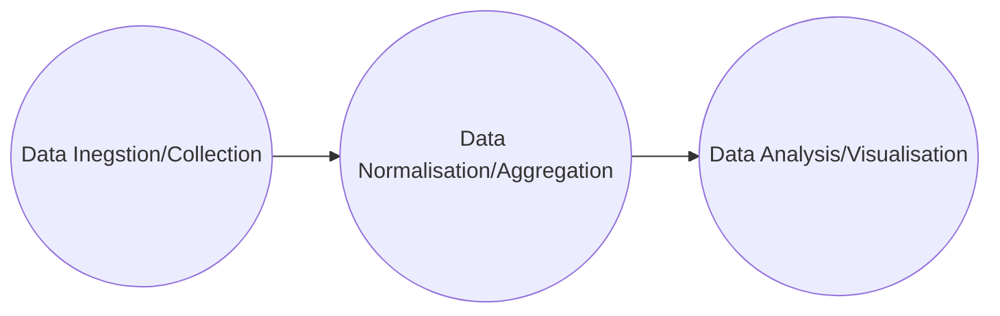

# Security Monitoring & SIEM Fundamentals Module

## <u>*SIEM Definitions and Fundamentals*</u>

SIEM stands for Security Information and Event Management and refers to the utilisation of software that merges security data with supervision of security events. These aid with real-time evaluations of security alerts, produced by network hardware and applications. SIEM tools can collect and manage log events as well as provide operational features such as documentation, summaries and incident handling tools. SIEM tools can help IT staff detect attacks when they occur, rapidly increasing the speed of the response.

First generation SIM technology used conventional log collection systems whereas second gen SEM technology looked at correlating security events between security tools such as antiviruses and firewalls. Since then vendors have combined the capabilities of SIM and SEM technology to devise SIEM. This technology is widely used across industry.

SIEM systems gather data from a variety of sources and then standardise the data for analysis. SIEM platforms also hire security staff to examine the data to try and identify potential threats. Threats get sent the the SOC personnel via alerts that can come in a variety of forms such as emails, notifications or phone calls. SIEM systems generate huge amounts of alerts so fine-tuning the SIEM for detecting and alerting high-risk events is crucial. SIEM differs from IDS/IPS systems due to its ability to pinpoint high-risk events - SIEM will take the logging data from your IDS system and use it to recognise events that may lead to system exploitation.

### SIEM Business Use Case

- Having a centralised system allows the SOC team to identify and scrutinise security incidents and events throughout the entire organisations IT infrastructure. This potentially allows the security team to spot patterns or irregularities that could suggest an attack.

- SIEM systems can identify and notify security teams about potential threats. This allows the team to conduct quicker and narrower investigations since they have a stronger idea of what is happening from the beginning. Quick alerting means less time at risk.

- SIEM systems can help contextualise events which can reduce the number of alerts sent to the team and mean that the alerts that do get send are more promptly looked at.

- SIEM systems play an important role in helping organisations meet regulatory requirements. These requirements will change depending on where you are in the world but could include PCI, DSS, HIPAA and GDPR. Some SIEM systems offer automated reporting and auditing capabilities which are vital for compliance.

- The ability to accurately detect attacks before they properly commence massively decreases the cost involved with an investigation or reparation after a large scale security-breach. It also protects the company from reputation harm.

#### *SIEM Use Case Development Lifecycle*

The following stages must be considered when developing a use case:


- **Requirements**: What is the purpose/necessity of the user case? When will we need an alert? These requirements may be proposed by customers, analysts or employees.

- **Data Points**: Gather information about the data sources that generate the logs or information that we will need to analyse to achieve our requirements.

- **Log Validation**: Verify that our requirements are met or can be met with the data that we have available to us.

- **Design and Implementation**: Define the exact conditions under our requirements to achieve our goal. Consider the condition, how we are aggregating data and what the priority of this alert will be.

- **Documentation**: Standard Operating Procedures (SOP) detail the processes analysts must follow when working on alerts.

- **Onboarding**: Use a development phase before moving the alert to production.

- **Periodic Updates/Fine-tuning**: Obtain feedback from analysts and maintain correlation rules.

### SIEM Data Flow

1. SIEM solutions take in logs from various data sources. Different SIEM systems will have different log collecting capabilities. This process is known as ingestion or data collection.

2. Gathered data is processed and normalised to be understand by the SIEM analytics system. The raw data must be written or read in an appropriate format and converted into a common format for various types of datasets. This process is known as data normalisation and data aggregation.

3. The SOC team use the normalised data to create various detection rules, dashboards, visualisations and alerts. This allows the SOC team to identify potential security risks.



### SIEM Visualisation

Dashboards in SIEM systems server as containers for visualisations, allowing us to organise and display data in a meaningful way.

## <u>*The Elastic Stack*</u>

The Elastic stack, by Elastic, is an open-source collection of applications - the main 3 being Elasticsearch, Logstash, and Kibana - that work together to offer users comprehensive search and visualisation capabilities for real-time analysis and exploration of log files. The architecture of the Elastic stack can be enhanced for resource-intensive environments with the addition of Kafka, RabbitMQ, and Redis for buffering and resiliency as well as nginx for security.


Elasticsearch is a distributed and JSON-based search engine, designed with RESTful APIs. It is the core component of the Elastic stack and handles indexing, storing and querying. Elasticsearch allows uses to perform analytics on the log files processed by Logstash.

Logstash is responsible for collecting, transforming and transporting log files. Logstash specialises in consolidating data from various sources and normalising it. Logstash can process log file inputs from remote sources and convert them into a standard format. it can then modify or transform a log record before sending it to Elasticsearch via output plugins.

Kibana is a visualisation tools for Elasticsearch documents. Users can view the data and execute queries through Kibana. Kibana also offers the ability to make custom dashboards to improve comprehension.

Beats is an additional component of the Elastic stack. They are lightweight, single-purpose data shippers designed to be installed on remote machines to forward logs on Logstash or Elasticsearch.

### The Elastic Stack as a SIEM System

If you look closely you should notice that the three main capabilities of the Elastic stack are also the 3 steps to the SIEM data flow. This means that the Elastic stack can be used as a SIEM system to collect, store, analyse and visualise security related data. As SOC analysts, we are likely to extensively use Kibana as our primary interface when using the Elastic stack - it is therefore important to become proficient with its functionalities and features. Kibana Query Language is the language used to search and analyse data in Kibana.

#### *KQL Introduction*

KQL queries are composed of `field:value` pairs, with the field representing the data's attribute and the value representing the data you are searching for. For example:

```KQL
event.code:4625
```

filters data in Kibana to show events that have Windows event code 4625. This windows event code is associated with failed login attempts. Kibana also supports free text search, which allows you to search a specific term across multiple fields.

```KQL
"svc-sql1"
```

This query returns all records containing the string "svc-sql1" in any indexed field. Like every query language, KQL supports logical and comparison operators. Logical operators are `AND`, `OR`, `NOT` and comparison operators are as in SQL. KQL supports wildcards and regex, for example:

```KQL
event.code:4625 AND user.name: admin*
```

It is a good idea to become familiar with Elastics's comprehensive documentation to find all the fields you may encounter.

### The Elastic Common Schema (ECS)

The ECS is a shared and extensible vocabulary for events and logs across the Elastic stack which ensures consistent formats across different data sources. When using KQL within the Elastic stack using ECS fields presents several advantages:

- Unified data view: Data from different sources can be searched and correlated using the same field names.

- Improved search efficiency: Standardising field names simplifies the process of writing KQL.

- Enhanced Correlation: ECS allows for easier correlation of data from multiple sources which is pivotal in investigations.

- Better visualisation: If all sources use the same field names, clearer and more intuitive dashboards can be made.

- Interoperability: Probably the main business reason to use the ECS is better integration with other technologies, allowing for easy expansion.

- Future-proofing: Adopting the ECS means that your system is not going to become incompatible with parts of the Elastic ecosystem after an update or new feature is released.

## <u>*SOC Definitions and Fundamentals*</u>

A Security Operations Centre (SOC) is an essential facility that houses a team of information security experts responsible for continuously monitoring and evaluating an organisations security status. The objective of the SOC team is to identify, examine and address cyber security incidents.

The SOC team will consist of analysts, engineers and managers - they work closely with the incident response team. The SOC team will employ SIEM systems, IDS/IPS and EDR tools to help them monitor and identify threats. They may also work with threat intelligence and threat hunting initiatives.

The primary function of a SOC team is to manage the operational aspect of enterprise IT security rather than developing strategies, designing architecture or implementing proactive measures. Some SOC teams may possess advanced capabilities such as forensic analysis and malware analysis. The SOC team will work closely with the incident response team to ensure proper handling or security incidents.

A SOC team consists of diverse roles responsible for handling the operations of IT security. The roles may include:

- SOC Director: Responsible for overall management and strategic planning of the SOC.

- SOC Manager: Oversees day-to-day operations, manages the team and coordinates incident response efforts.

- Tier 1 Analyst: Monitors security alerts and events, triage potential incidents and escalates when needed.

- Tier 2 Analyst: Performs in-depth analysis of escalated incidents, identifies patterns and develops mitigation strategies.

- Tier 3 Analyst: Provides advanced expertise in handling complex security incidents, conducts threat hunting and collaborate with other teams.

- Detection Engineer: Responsible for developing, implementing and maintaining detection rules and signatures. They work closely with analysts to identify gaps.

- Incident Responder:  Takes charge of active security incidents, carries out in-depth digital forensics and remediation efforts. Collaborates with other teams to restore systems and prevent future incidents.

- Threat Intelligence Analyst: Gathers, analyses and disseminates threat intelligence data to help SOC team members better understand the threat landscape to proactively defend against risks.

- Security Engineer: Develops, deploys and maintains security tools.

- Compliance and Governance Specialist: Ensures that the organisations security practices and processes adhere to relevant industry standards.

- Security Awareness and Training Coordinator: Develops and implements security training to educate employees.

Note that due to varying business needs, sizes and industry these roles may shift slightly. Additionally, the chain of command might shift or one employee might wear many hats. 

### SOC Stages

Security Operations Centres have evolved significantly over time. In the first generation, known as SOC 1.0, organisations invested in certain security layers but the lack of proper integration meant lots of uncorrelated alerts and buildup of tasks across multiple platforms. This phase mainly focuses on network and perimeter security. Some organisations will still take this outdated approach.

The transition to SOC 2.0 has been brought along by increase in sophisticated threats, with features such as multi-vector attacks, APTs, and concealed IOCs. Malware generally serves as the primary delivery method for these attacks. SOC 2.0 is built on intelligence and integration. 

Cognitive SOC (aka next-gen SOC), seeks to address the remaining shortcomings of SOC 2.0. The main issue being that SOC 2.0 lacks the operational experience and effective collaboration between businesses and security teams as well as the lack of standardised incident response plans and recovery procedures

### MITRE ATT&CK in Security Operations

The MITRE ATT&CK Framework exists to provide a structured methodology assisting cyber security experts in identifying and reacting to threats more proactively and knowledgeably. The MITE ATT&CK Framework plays a crucial role in several aspects of security operations, these include:

- Detection and Response: Helping SOC teams devise response plans to recognised TTPs.

- Security Evaluation and Gap Analysis: Helping the security engineers work out where there are weaknesses in the organisations security posture.

- SOC Maturity Assessment: The framework can be used to assess the maturity of the SOC team by testing their responses to various TTPs, which can help uncover areas for improvement.

- CTI Enrichment: The ATT&Ck framework can help provide context on TTPs and IOCs, helping the team make more informed decisions.

- Behavioural Analysis: TTPs can be mapped to suspicious behaviour, giving the SOC team a better understanding of an adversaries intentions or next moves.

- Red Teaming: The framework provides a systematic way to replicate genuine attacks.

- Training and Education: The framework is a great resource for educating security professionals on adversarial tactics and methods.

## <u>*Alert Triaging*</u>

Alert triaging, performed by a SOC analyst, is the process of evaluating and prioritising security alerts to determine their level of threat and potential impact on systems/data. It involves reviewing and categorising alerts to allocate resources. Escalation is the process of alerting other teams at the organisation such as the incident response team, who have the authority to make decisions about the response to a threat. The SOC analyst needs to provide detailed information about the alert including its severity and potential impact. Escalation ensures that critical alerts receive the attention that they need and helps coordinate efficient responses.

### The Triaging Process

- Inital alert review: Aim to understand the alerts context as best as possible.

- Alert classification: Classify based on severity, impact and urgency. Similar to a CVSS score but more general.

- Alert correlation: Cross-reference with related alerts or events to identify patterns. Query the SIEM to gather relevant data. Check for known attack patterns or signatures.

- Enrichment of alert data: Gather additional information. This could include network packets, memory dumps or file samples. Conduct reconnaissance of affected systems.

- Risk assessment: Evaluate the potential risk to critical assets or infrastructure.

- Contextual Analysis: Consider all of the context surrounding the alert and evaluate the security controls currently in place. Assess the relevant compliance requirements and industry regulations.

- Incident response planning: Initiate a response plan if the alert is significant. Document alert details and systems in line with standard incident handling procedures.

- Consult with IT Operations: Assess the need for additional context or missing information. Gain an understanding of any non-malicious activities that may have triggered the alert.

- Response Execution: Determine the appropriate response actions.

- Escalation: If required, escalate the alert.

- Continuous Monitoring

- De-escalation: Evaluate the need for de-escalation as the response progresses. Proceed with final stages of incident handling procedure.
