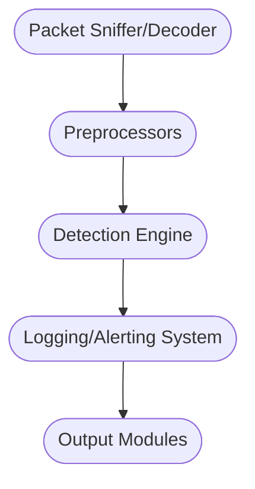

# Working With IDS/IPS Module

## <u>*Introduction*</u>

In network security monitoring operations (NSM), the use of intrusion detection and prevention systems is crucial. The purpose of these systems is to identify potential threats but also to mitigate their impact. An IDS is a device or application that monitors network or system activities for malicious activities or policy violations and can produce reports. Note that an IDS does not prevent an intrusion, it just alerts us when one occurs. An IDS can operate in two main modes:

- Signature-based detection, where the IDS recognises bad patterns such as malware signatures and previously identified attack patterns.

- Anomaly-based detection, where the IDS establishes a baseline of normal behaviour and sends an alert when it detects deviating behaviour. This operating mode is a more proactive approach but it is susceptible to false positives.

On the other hand, an IPS sits directly behind the firewall and provides an additional layer of protection. It does not passively monitor the network traffic but actively prevents any detected potential threats. An IPS can similarly work in both modes such as an IDS. An IPS can take actions such as dropping malicious packets, blocking network traffic and resetting connections. Both IDS/IPS are placed behind the firewall on the internal side of the network such as to examine as much relevant traffic as possible. Deployment may vary based on the network's specific requirements and the kind of traffic we need to monitor and IDS/IPS systems can also be installed directly on a host. We need to make sure that we consistently update our IDS/IPS systems to fine-tune their anomaly detection. SIEM systems will collect and aggregate logs from our IDS/IPS along with other devices in our network.

## <u>*Suricata*</u>

### Suricata Fundamentals

Suricata is an open-source IDS/IPS designed to dissect network traffic and look for signs of malicious activity. Its strength lies in the ability to conduct sweeping evaluations of our network and dive into the details of individual application-layer transaction. Suricata operates in 4 distinct modes:

- **The IDS mode**: Positions Suricata as a silent observer that examines traffic and flags potential attacks without any form of intervention. The aim for this is to increase network visibility.

- **The IPS mode**: All network traffic passes through Suricata's checks and is only granted access to the internal network upon approval. The aim of this mode is to proactively bolster security and prevent attacks before they can commence. Note that the increased examination can lead to increased latency.

- **IDPS mode**: Brings together both modes and has the ability to actively transmit RST packets in response to abnormal activities.

- **NSM mode**: Suricata transitions into a dedicated logging mechanism which can be very helpful for analysis in our SIEM system.

Suricata can take input from two main forms:

- **Offline input**: Involves reading PCAP files for processing previously captured packets. Useful for conducting post-mortem data examination.

- **Live input**: Facilitated via LibPCAP where packets are read directly from network interfaces. For inline operations, NFQ and AF_PACKET options are available. NFQ necessitates drop rules for Suricata to obstruct packets. AF_PACKET provides a performance improvement over LibPCAP and supports multi-threading but is not compatible with older Linux distributions.

Suricata outputs lots of data, including logs, alerts and DNS requests. One of the most critical outputs is EVE, which is a JSON formatted log that records a wide range of event types. Tools such as Logstash can easily consume this output for data analysis. We might also encounter Unified2 output which is a Snort binary alert format allowing for integration with other tools. Unified2 output can be read using Snort's u2spewfoo tool.

Once we are on the device with the Suricata instance, we can get an overview of all of the rules using bash:

```bash
ls -lah /etc/suricata/rules/
```

We can inspect these rules:

```bash
more /etc/suricata/rules/<rule>.rules
```

We can define variables used in Suricata rules through the configuration file:

```bash
more /etc/suricata/suricata.yaml
```

We can load custom rules through the configuration file section `rule-files:`. For offline input, we can execute the following commands, which will create various logs:

```bash
suricata -r <pcap_file>
```

We can also bypass checksums and log to a separate directory:

```bash
suricata -r <pcap_file> -k none -l .
```

We can also try Suricata's live mode:

```bash
sudo suricata --pcap=<interface> -vv
```

For the inline NFQ mode we first need to execute:

```bash
sudo iptables -I forward -j NFQUEUE
sudo suricata -q 0
```

To try Suricata in IDS mode with AF_PACKET input we can execute:

```bash
sudo suricata -i <interface>
```

```bash
sudo suricata --af-packet=<interface>
```

### Suricata Outputs

Suricata records a variety of data into logs that reside in the `/var/log/suricata` directory by default. We need root permissions to access these logs. Eve.json is Suricata's recommended output that contains JSON objects. If we wish to filter out only alert events, we can use the `jq` JSON processor command-line tool:

```bash
cat /var/log/suricata/<log_file>.json | jq -c 'select(.event_type == "alert")''
```

We can identify the earliest DNS event:

```bash
cat /var/log/suricata/<log>.json | jq -c 'select(.event_type == "dns")' | head -1 | jq .
```

In Suricata, a flow is a defined as a set of IP packets passing through a network interface in a specific direction or between a given pair of source and destination endpoints. Each of these flows gets given a unique flow_id to help track and correlate various events related to the same network flow. pcap_cnt is a counter that Suricata increments for each packet it processes from network traffic or a PCAP file. `fast.log` is a text-based log format that records alerts only. `stats.log` is a human readable statistics log which is useful for debugging purposes. It is also possible to disable the EVE output and enable individual log files. Suricata has a highly potent feature that allows us to capture and store files that have been transferred over a number of different protocols. We need t edit the configuration file to enable this feature:

```bash
file-store:
  version: 2
  enabled: yes
  force-filestore: yes
```

We can add a simple rule to a local rules file to experiment with file extraction:

```bash
alert http any any -> any any (msg:"FILE store all"; filestore; sid:2; rev:1;)
```

Also in this section we can set the directory for Suricata to store these extracted files. Suricata stores these files with the SHA256 hash of the contents as the filename, inside a directory under the first two characters of the filename. If we wish to access a particular file, we can use the `xxd` tool:

```bash
xxd ./<first_2_chars>/<sha256_hash> | head
```

Live rule reloading is a crucial feature in Suricata that allows us to update our ruleset without interrupting ongoing traffic inspection. To enable this feature we need to edit the Suricata configuration file:

```bash
detect-engine:
    - reload: true
```

We can then signal to Suricata to refresh its rule set:

```bash
sudo kill -usr2 $(pidof suricata)
```

We can update Suricata's ruleset using the `suricata-update` tool or list the available providers:

```bash
sudo suricata-update
```

```bash
sudo suricata-update list-sources
```

```bash
sudo suricata-update enable-source <source>
```

We may need to restart the service for the ruleset to be loaded.

```bash
sudo suricata-update
sudo systemctl restart suricata
```

### Suricata Rule Development

A rule in Suricata serves as a directive instructing the engine to actively watch for certain markers in network traffic. Suricata rules are not exclusively focused on the detection of nefarious activities: they can also be designed to provide additional insight or contextual data for blue teaming. It is worth noting that each rule we deploy consumes a portion of the host's CPU and memory resources, so Suricata provides specific guidelines for writing effective rules.

A sample Suricata rule is given below:

```
action protocol from_ip port -> to_ip port (msg:"Known malicious behavior, possible X malware infection"; content:"some thing"; content:"some other thing"; sid:10000001; rev:1;)
```

The header section of a rule encapsulates the intended action of the rule along with the protocol where the rule is expected to be applied. It includes IP addresses, port information and an arrow indicating traffic direction.

| Action | Description                        |
| ------ | ---------------------------------- |
| alert  | Generates an alert.                |
| log    | Logs the traffic without an alert. |
| pass   | Ignore the packet.                 |
| drop   | Drop the packet (in IPS mode).     |
| reject | Send back TCP RST packets.         |

The protocol can vary including:

- tcp

- udp

- icmp

- ip

- http

- tls

- smb

- dns

Traffic direction is declared using the rule host variables located in the configuration file. The arrows can inform Suricata about the traffic flow. For example, outbound traffic looks like this:

```bash
$HOME_NET any -> $EXTERNAL_NET 9090
```

Inbound traffic looks like:

```bash
$EXTERNAL_NET any -> $HOME_NET 8443
```

Bidirectional traffic might look like:

```bash
$EXTERNAL_NET any <> $HOME_NET any
```

`$UNCOMMON_PORTS`can be defined inside the Suricata configuration file. Alternatively we can list multiple ports:

```bash
alert tcp $HOME_NET any -> $EXTERNAL_NET [9443,8080,7001:7002,!8443]
```

The rule message and content section contains the message we wish to be displayed to the analysts when an activity is detected. The rule message (msg) is arbitrary text displayed when the rule is triggered. The flow identifies the originator and responder. For example:

```bash
alert tcp $EXTERNAL_NET any -> $HOME_NET 80 (msg:"Potential HTTP-based attack"; flow:established,to_server; sid:1003;)
```

dsize matches using the payload size of the packet, relying on the TCP segment length and not the total packet length. Rule content comprises of unique values to help identify specific network traffic or activities. By using rule buffers we do not have to search the entire packet for every content match. For example:

```bash
alert http any any -> any any (http.accept; content:"image/gif"; sid:1l)
```

`http.accept` matches on the HTTP accept header. Rule options act ad additional modified to aid detection. `nocase` ensures rules are not bypassed by case changes. `offset` informs Suricata about the start position inside the packet for matching. `distance` specifies where Suricata should begin searching for the next content pattern, measured from the end of the previous content match. `reference` provides us with a lead or trail that takes us back to the original source of information that inspired the creation of the rule. `sid` Is a unique identifier that allows the rule writer to manage and distinguish rules. `revision` offers insight into the version of the rule. It serves as an indicator of the evolution of the rule over time.

When writing rules we have a very powerful tool known as PCRE or Perl Compatible Regular Expression. To use PCRE we use the `pcre` statement which is followed by a regular expression. It is generally inadvised to use `pcre` as our only tag. For example:

```bash
alert http any any -> $HOME_NET any (msg: "ATTACK [PTsecurity] Apache Continuum <= v1.4.2 CMD Injection"; content: "POST"; http_method; content: "/continuum/saveInstallation.action"; offset: 0; depth: 34; http_uri; content: "installation.varValue="; nocase; http_client_body; pcre: !"/^\$?[\sa-z\\_0-9.-]*(\&|$)/iRP"; flow: to_server, established;sid: 10000048; rev: 1;)
```

More rule information can be found at <https://docs.suricata.io/en/latest/rules/index.html.>

### IDS/IPS Rule Development Approaches

When it comes to creating rules for IDS/IPS there is an art and a science to it. We require a comprehensive understanding of network protocols, malware behaviours, system vulnerabilities and the general threat landscape. Signature-based detection is highly effective when dealing with known threats but struggles to detect novel threats for which no signature exists yet. Anomaly based detection tends to have higher false-positive rates due to the dynamic nature of network behaviours however it is the only real way to detect novel attacks. A third approach when creating rules is stateful protocol analysis. This involves understanding and tracking the state of network protocols and comparing observed behaviours to the expected state transitions.

### Example 1: Detecting PowerShell Empire

```bash
alert http $HOME_NET any -> $EXTERNAL_NET any (msg:"ET MALWARE Possible PowerShell Empire Activity Outbound"; flow:established,to_server; content:"GET"; http_method; content:"/"; http_uri; depth:1; pcre:"/^(?:login\/process|admin\/get|news)\.php$/RU"; content:"session="; http_cookie; pcre:"/^(?:[A-Z0-9+/]{4})*(?:[A-Z0-9+/]{2}==|[A-Z0-9+/]{3}=|[A-Z0-9+/]{4})$/CRi"; content:"Mozilla|2f|5.0|20 28|Windows|20|NT|20|6.1"; http_user_agent; http_start; content:".php|20|HTTP|2f|1.1|0d 0a|Cookie|3a 20|session="; fast_pattern; http_header_names; content:!"Referer"; content:!"Cache"; content:!"Accept"; sid:2027512; rev:1;)
```

- **alert**: We wish to generate an alert for this rule.

- **http**: The rule applies to HTTP traffic.

- **\$HOME_NET any -> \$EXTERNAL_NET any**: The rule is triggered when traffic originates from any port on our internal network and is destined for any port outside our network.

- **msg:"ET MALWARE Possible PowerShell Empire Activity Outbound"**: The message that is included when the alert is generated gives specific information.

- **flow:established,to_server**: Specifies the direction of the traffic. The rule looks for established connections where data is flowing to the server.

- **content:"GET"; http_method;**: Matches the HTTP GET method in the HTTP request.

- **content:"/"; http_uri; depth:1;**: Matches the root directory in the URI.

- **pcre:"/^(?:login\/process|admin\/get|news)\.php$/RU";**: Looks for URIs that end with login/process.php, admin/get.php or news.php

- **content:"session="; http_cookie;**: Looks for the string "session=" in the HTTP cookies.

- **pcre:"/^(?:[A-Z0-9+/]{4})*(?:[A-Z0-9+/]{2}==|[A-Z0-9+/]{3}=|[A-Z0-9+/]{4})$/CRi";**: Looks for base64 encoded data in the cookie value.

- **content:"Mozilla|2f|5.0|20 28|Windows|20|NT|20|6.1"; http_user_agent; http_start;**: Matches the specific user-agent string.

- **content:".php|20|HTTP|2f|1.1|0d 0a|Cookie|3a 20|session="; fast_pattern; http_header_names;**: Looks for patterns in HTTP headers.

- **content:!"Referer"; content:!"Cache"; content:!"Accept";**: Negative content matches.

### Example 2: Detecting Covenant

```bash
alert tcp any any -> $HOME_NET any (msg:"detected by body"; content:"<title>Hello World!</title>"; detection_filter: track by_src, count 4 , seconds 10; priority:1; sid:3000011;)
```

- **alert**: Generate an alert

- **tcp**: Apply to TCP traffic

- **any any -> \$HOME_NET any**: Watch or traffic from any source ip and port destined for any port on an address on our internal network.

- **content:"<title>Hello World!</title>"**: Look for a specific string in the TCP payload.

- **detection_filter: track by_src, count 4, seconds 10;**: A post-detection filter. Specifies that the rule should track the source IP address and only alert if this same detection happens at least 4 times within a 10 second window.

### Example 3: Detecting Covenant Using Analytics

```bash
alert tcp $HOME_NET any -> any any (msg:"detected by size and counter"; dsize:312; detection_filter: track by_src, count 3 , seconds 10; priority:1; sid:3000001;)
```

- **dsize:312;**: Looks for traffic with a data payload of exactly 312 bytes.

- **detection_filter: track by_src, count 3, seconds 10;**: Track the source IP address and trigger an alert if the same rule is triggered 3 times in a 10 second window.

This rule will create a high priority alert.

### Example 4: Detecting Sliver

```bash
alert tcp any any -> any any (msg:"Sliver C2 Implant Detected"; content:"POST"; pcre:"/\/(php|api|upload|actions|rest|v1|oauth2callback|authenticate|oauth2|oauth|auth|database|db|namespaces)(.*?)((login|signin|api|samples|rpc|index|admin|register|sign-up)\.php)\?[a-z_]{1,2}=[a-z0-9]{1,10}/i"; sid:1000007; rev:1;)
```

- **content:"POST"**: Looks for TCP traffic with the string "POST".

- **pcre:"/\/(php|api|upload|actions|rest|v1|oauth2callback|authenticate|oauth2|oauth|auth|database|db|namespaces)(.*?)((login|signin|api|samples|rpc|index|admin|register|sign-up)\.php)\?[a-z_]{1,2}=[a-z0-9]{1,10}/i";**: Regex search to identify particular directory names followed by file names ending with a PHP extension.

### Suricata Rule Development (Encrypted Traffic)

We will often face encrypted traffic which can pose obstacles when it comes to analysing and developing reliable IDS and IPS rules. SSL/TLS certificates are exchanged during the initial handshake of a connection. Suspicious or malicious domains might use SSL/TLS certificates with unique characteristics. We can also use the JA3 hash which is a fingerprinting method that can provide a unique representation for each SSL/TLS client. The hash combines details from the client hello packet and creates a digest that could be unique for specific malware families or suspicious software.

### Example 5: Detecting Dridex (TLS Encrypted)

```bash
alert tls $EXTERNAL_NET any -> $HOME_NET any (msg:"ET MALWARE ABUSE.CH SSL Blacklist Malicious SSL certificate detected (Dridex)"; flow:established,from_server; content:"|16|"; content:"|0b|"; within:8; byte_test:3,<,1200,0,relative; content:"|03 02 01 02 02 09 00|"; fast_pattern; content:"|30 09 06 03 55 04 06 13 02|"; distance:0; pcre:"/^[A-Z]{2}/R"; content:"|55 04 07|"; distance:0; content:"|55 04 0a|"; distance:0; pcre:"/^.{2}[A-Z][a-z]{3,}\s(?:[A-Z][a-z]{3,}\s)?(?:[A-Z](?:[A-Za-z]{0,4}?[A-Z]|(?:\.[A-Za-z]){1,3})|[A-Z]?[a-z]+|[a-z](?:\.[A-Za-z]){1,3})\.?[01]/Rs"; content:"|55 04 03|"; distance:0; byte_test:1,>,13,1,relative; content:!"www."; distance:2; within:4; pcre:"/^.{2}(?P<CN>(?:(?:\d?[A-Z]?|[A-Z]?\d?)(?:[a-z]{3,20}|[a-z]{3,6}[0-9_][a-z]{3,6})\.){0,2}?(?:\d?[A-Z]?|[A-Z]?\d?)[a-z]{3,}(?:[0-9_-][a-z]{3,})?\.(?!com|org|net|tv)[a-z]{2,9})[01].*?(?P=CN)[01]/Rs"; content:!"|2a 86 48 86 f7 0d 01 09 01|"; content:!"GoDaddy"; sid:2023476; rev:5;)
```

The above rules triggers an alert on a TLS session from an external network to the home network, where the payload of the session contains specific byte patterns and meets several conditions. These patterns correspond to SSL certificates linked to the Dridex trojan, referenced by the SSL blacklist on <https://abuse.ch>. 

### Example 6: Detecting Sliver (TLS Encrypted)

```bash
alert tls any any -> any any (msg:"Sliver C2 SSL"; ja3.hash; content:"473cd7cb9faa642487833865d516e578"; sid:1002; rev:1;)
```

The rule above is designed to detect certain variations of Sliver whenever it identifies a TLS connection with a specific JA3 hash. The JA3 can be calculated as follows:

```bash
ja3 -a --json <pcap>
```

## <u>*Snort*</u>

### Fundamentals

Snort is an open-source IDS and IPS but can also function as a packet logger or sniffer. Snort has the capability to identify and log all activity within a network and provide detailed logs of all application layer transactions. Snort can operate in the following modes:

- Inline IDS/IPS

- Passive IDS

- Network-based IDS

- Host-based IDS (However snort is not really ideal for this purpose)

Snort will infer what mode of operation to use based on what options are used at the command line. For example. reading from a pcap file or listening to an interface will run Snort in passive mode by default. User's can specify the `-Q` flag to run Snort inline. Snort is made up of several components that combine to be a full IDS.



- The packet sniffer (which includes the packet decoder) extracts network traffic and forwards it to the Preprocessors.

- The preprocessors within Snort identify the type or behaviour of the forwarded packets. Snort has a wide array of preprocessor plugins such as the HTTP plugin or the port_scan preprocessor. After the preprocessors have run they pass information to the detection engine. The configuration of the preprocessors is found within the snort config file `snort.lua`.

- The detection engine compares each packet with a predefined set of Snort rules. If a match is found we forward the information to the Logging and Alerting System.

- The Logging and Alerting System and output modules are responsible for recording and triggering alerts from the detection engine. Logs are generally stored in the syslog or unified2 formats. The output modules are also configured within the `snort.lua` config file.

Snort offers a wide range of configuration options and pre-configured files to facilitate a quick start. The default configuration files are `snort.lua` ad `snort_defaults.lua` and these serve as the foundation for setting up Snort and getting it operational. `snort.lua` serves as the principal configuration file for Snort which contains the following sections:

- Network variables

- Decoder configuration

- Base detection engine configuration

- Dynamic library configuration

- Preprocessor configuration

- Output plugin configuration

- Rule set customisation

- Preprocessor and decoder rule set customisation

- Shared object rule set customisation

### Configuration

```bash
sudo more /root/snorty/etc/snort/snort.lua
```

A significant aspect of the configuration process is enabling and fine-tuning our snort modules:

```bash
snort --help-modules
```

The modules are enabled and configured within the Lua config file as Lua table literals. If a module is initialised as an empty table it is implied that it is using the predefined default settings. We can view these settings:

```bash
snort --help-config arp_spoof
```

Passing and validating configuration files to Snort can be done using the following command-line arguments:

```bash
snort -c <config_lua> --daq-dir /usr/local/lib/daq
```

Snort 3 needs to know where to find the appropriate LibDAQ, the data acquisition library. To observe snort in action, the easiest method is to execute it against a packet capture file. We can provide the pcap file name as an argument on the command line:

```bash
sudo snort -c <config> --daq-dir <daq> -r <pcap>
```

Snort also has the capability to listen on active network interfaces. To specify this behaviour you can use the `-i` option.

```bash
sudo snort -c <config> --daq-dir <daq> -i <iface>
```

### Snort Rules

Snort rules resemble Suricata rules and are composed of a rule header and rule options. Despite being similar, it is worth getting used to writing both Snort and Suricata rules separately. The most recent Snort rules can be obtained from the Snort website. In Snort deployments, we have flexibility in managing rules - for example, we could add a custom rule file `local.rules` to Snort by placing it directly within the `snort.lua` config file. The way we do this is by including them in the options for Snort's IPS module:

```
ips =
{
    -- use this to enable decoder and inspector alerts
    --enable_builtin_rules = true,

    -- use include for rules files; be sure to set your path
    -- note that rules files can include other rules files
    -- (see also related path vars at the top of snort_defaults.lua)

    { variables = default_variables, include = 'local.rules' }
}
```

These "included" rules are automatically loaded. Alternatively, we can incorporate rules directly from the command line. We can either pass Snort the `-R` flag and then the path to a rule file, or we can use `--rule-path` to provide Snort with a directory containing multiple rules files.

### Snort Outputs

In our Snort deployment we will probably encounter a significant amount of data. To provide a summary of the core output types we need to look at the key aspects:

- Basic Statistics: Upon shutdown, Snort generates various counts based on the configuration and processed traffic which can include.
  
  - Packet statistics that includes information from the DAQ and decoders such as the number of received packets.
  
  - Module statistics that keep track of activity through peg counts. An example might be the count of HTTP GET requests.
  
  - File statistics that breakdown file types, bytes and signatures.
  
  - Summary statistics that encompass the total runtime for packet processing, packets per second and profiling data.

- Alerts: When we configure rules we enable alerting (`-A`) to view the details of events. There are multiple types of alert outputs available including:
  
  - `-A cmg` (equivalent to `-A fast -d -e`) displays alert information along with packet headers and payloads.
  - `-A u2` (equivalent to `-A unified2`) logs events ad triggers packets in a binary file, useful for post-processing.
  - `-A csv` outputs fields in csv format, helpful for analysis.

To discover the available alert types we can run the following command:

```bash
snort --list-pluins | grep logger
```

- Performance Statistics: Beyond the standard outputs, additional data can be obtained. By configuring the `perf_monitor` module, we can capture a customisable set of peg counts during runtime. This data can be fed int an external program to monitor Snort's activity without interrupting its operation. The `profiler` module allows tracking of time and space usage by modules and rules. This information is useful for optimising system performance.

```bash
sudo snort -c <config> --daq-dir <daq> -r <pcap> -A cmg
```

```bash
sudo snort -c <config> --daq-dir <daq> -r <pcap> -R <rules> -A cmg
```

Some key features that bolster Snort's effectiveness include:

- Deep packet inspection, capture and logging

- Intrusion detection

- Network Security Monitoring

- Anomaly detection

- Support for multiple tenants

- Both IPv4 and IPv6 supported

### Example 1: Detecting Ursnif

A Snort rule is a tool that we use to identify and flag potential malicious activity in network traffic.

```bash
alert tcp any any -> any any (msg:"Possible Ursnif C2 Activity"; flow:established,to_server; content:"/images/", depth 12; content:"_2F"; content:"_2B"; content:"User-Agent|3a 20|Mozilla/4.0 (compatible|3b| MSIE 8.0|3b| Windows NT"; content:!"Accept"; content:!"Cookie|3a|"; content:!"Referer|3a|"; sid:1000002; rev:1;)
```

This rule is used to detect certain variations of Ursnif malware but is inefficient since it misses HTTP sticky buffers.

- **flow:established, to_server;**: Ensures that the rule only matches established TCP connections from client to server.

- **content:"/images/", depth 12;**: Instructs Snort to look for the string "/images/" within the first 12 bytes of the packet payload.

- **content:"_2F";** and **content:"_2B";**: Directs Snort to search for the strings "_2F" and "_2B" in the payload.

- **content:"User-Agent|3a 20|Mozilla/4.0 (compatible|3b| MSIE 8.0|3b| Windows NT";**: Looks for a specific user agent. The hex in pipes represents the characters ":" and ";".

- **content:!"Accept"; content:!"Cookie|3a|"; content:!"Referer|3a|";**: Looks for certain standard HTTP headers missing.

We can inspect some example pcap files in Wireshark to comprehend how the malware detection works.

```bash
scp <remote_user>@<remote_ip>:<remote_pcap> <target_dir>
```

### Example 2: Detecting Cerber

```bash
alert udp $HOME_NET any -> $EXTERNAL_NET any (msg:"Possible Cerber Check-in"; dsize:9; content:"hi", depth 2, fast_pattern; pcre:"/^[af0-9]{7}$/R"; detection_filter:track by_src, count 1, seconds 60; sid:2816763; rev:4;)
```

This rule checks for certain variations of Cerber malware.

- **dsize:9;**: Condition that restricts the rule to UDP datagrams with payload size of exactly 9 bytes.

- **content:"hi", depth 2, fast_pattern;**: Checks the payload's first 2 bytes for the string "hi". The fast_pattern modifier makes the pattern matcher search for this pattern first to optimise rule performance.

- **pcre:"/^[af0-9]{7}$/R";**: Regex expression looking for seven hex characters starting at the beginning of the payload and comprising of the entire payload.

- **detection_filter:track by_src, count 1, seconds 60;**: Tells Snort to only trigger the alert if it matches more than 1 request by IP address within 60 seconds

### Example 3: Detecting Patchwork

```bash
alert http $HOME_NET any -> $EXTERNAL_NET any (msg:"OISF TROJAN Targeted AutoIt FileStealer/Downloader CnC Beacon"; flow:established,to_server; http_method; content:"POST"; http_uri; content:".php?profile="; http_client_body; content:"ddager=", depth 7; http_client_body; content:"&r1=", distance 0; http_header; content:!"Accept"; http_header; content:!"Referer|3a|"; sid:10000006; rev:1;)
```

This Snort rule detects certain variations of malware used by the Patchwork APT. Notice the use of HTTP sticky buffers in this rule.

- **http_method; content:"POST";**: Looks for HTTP traffic where the method used is POST.

- **http_uri; content:".php?profile=";**: Specifies hat we are looking for HTTP URIs that contain the string ".php?profile=".

- **http_client_body; content:"ddager=", depth 7**: Examines the body of the HTTP request and looks for the string "ddager=" within the first 7 bytes.

- **http_header; content:!"Accept"; http_header; content:!"Referer|3a|";**: Look for the absence of the Accept and Referer HTTP headers.

### Example 4: Detecting Patchwork (SSL)

```bash
alert tcp $EXTERNAL_NET any -> $HOME_NET any (msg:"Patchwork SSL Cert Detected"; flow:established,from_server; content:"|55 04 03|"; content:"|08|toigetgf", distance 1, within 9; classtype:trojan-activity; sid:10000008; rev:1;)
```

- **content:"|55 04 03|";**: Looks specifically for the hex values "55 04 03" within the packet payload. These values represent the ASN.1 tag for the "common name" field in an X.509 certificate which is often used in SSL/TLS certificates to denote the domain name that the certificate applies to.

- **content:"|08|toigetgf", distance 1, within 9;**: Following the common name field, we look for the string "toigetgf".

## <u>*Zeek*</u>

### Fundamentals

Zeek is an open-source traffic analyser. It is typically employed to scrutinise every bit of traffic on a network and dig deep to find malicious activities. Zeek can be a handy tool for troubleshooting network issues and conducting a variety of measurements within a network. What sets Zeek apart is that it has a highly capable scripting languages which allows users to craft Zeek scripts functionally similar to Suricata rules. This feature enables Zeek to be fully customisable and extendable. Zeek can operate in the following modes:

- Fully passive traffic analysis

- libpcap interface for packet capture

- Real-time and offline analysis

- Cluster support for large scale deployments

Zeek's architecture comprises primarily of two components. The event engine (core) and the script interpreter. The event engine takes an incoming packet stream and transforms it into a series of high-level events. In Zeek's context, these events describe network activity in a policy-neural way, meaning that they inform us of what is happening but do not offer an interpretation of it. For example, a HTTP request will be transformed into an "http_request" event with all of its details but there will be no judgement or analysis given by Zeek. Interpretation and analysis is given by Zeek's script interpreter, which executes a set of event handlers written in Zeek's scripting language (Zeek scripts). These scripts express the site's security policy and define actions to be taken upon the detection of certain events. Events generated by Zeek are queued and processed on a FIFO basis. Most of Zeek's events are defined in `.bif` files located in the `/scripts/base/bif/plugins/`directory.

Key features of Zeek include:

- Comprehensive logging of network activities.

- Analysis of application-layer protocols.

- Ability to inspect file content exchanged over application-layer protocols.

- IPv6 support.

- Tunnel detection and analysis.

- Capability to conduct sanity checks during protocol analysis.

- IDS-like pattern matching.

- Powerful scripting language.

- Interfacing that outputs to well-structured ASCII logs - offers alternate backend for ElasticSearch.

- Real-time integration of external input.

- External C library for sharing Zeek events with other programs.

- Capability to trigger external processes from within the scripting language.

### Logs

When we use Zeek for offline analysis of a pcap file, the logs are stored in the current directory. Zeek produces lots of log files, including:

- `conn.log`: Details IP,TCP,UDP and ICMP connections.

- `dns.log`: Details DNS queries and responses.

- `http.log`: Details HTTP requests and responses.

- `ftp.log`: Details FTP requests and responses.

- `smtp.log`: Details SMTP transactions, such as sender and recipient details.

Were we to look inside one of these logs, for example `http.log` we would see fields such as: host, uri, referrer, user_agent and status_code. You can find full information about Zeek logs and their fields in the Zeek documentation at <https://docs.zeek.org/en/master/reference/logs/index.html>. Zeek also applies gzip compression to log files every hour, and the older logs are transferred into a directory named in the `YYYY-MM-DD` format. When using the compressed logs, we can use tools like `gzcat` or `zgrep`. Zeek provides a custom tool known as `zeek-cut` for handling log files.

### Example 1: Detecting Beaconing Malware

Beaconing is a process by which malware communicates with its C2 server to receive instructions or exfiltrate data. It is usually characterised by a consistent or patterned interval of outbound communications. By analysing connection logs, we can look for patterns in outbound traffic. Anomalies can be explored using Zeek scripts that are designed to spot beaconing behaviour.

```bash
zeek -C -r <pcap>
```

```bash
cat conn.log
```

### Example 2: Detecting DNS Exfiltration

Zeek is also useful when we suspect data exfiltration is occurring. Data exfil can be difficult to detect normally as it often mimics normal network traffic but we can use Zeek's `file.log` to identify large amounts of data being sent to unusual locations. The `http.log` and `dns.log` can also be used to identify covert exfiltration channels such as DNS tunnelling or HTTP POST requests to suspicious domains. Furthermore, Zeek can reassemble files transferred over the network which can assist in identifying the nature of the data being exfiltrated.

```bash
cat dns.log
```

We can focus on the requested domains by utilising zeek-cut:

```bash
cat dns.log | zeek-cut query | cut -d . -f1-7
```

Interactions with dozens or even hundreds of subdomains is generally not considered typical behaviour.

### Example 3: Detecting TLS Exfiltration

We can use zeek-cut to narrow down a large obscure output:

```bash
cat conn.log | zeek-cut id.orig_h id.resp_h orig_bytes | sort | grep -v -e '^$' | grep -v '-' | datamash -g 1,2 sum 3 | sort -k 3 -rn | head -10
```

We can break down the above command to see what it means:

- **cat conn.log**: Read the contents of the conn.log file.

- **zeek-cut id.orig_h id.resp_h orig_bytes**: Extract the originating host, responding host and number of bytes sent by the originating hosts.

- **sort**: Sort the output in ascending order based on the first field.

- **grep -v -e '^$'**: Filter out empty lines.

- **grep -v '-'**: Filter out lines containing a dash (missing values).

- **datamash -g 1,2 sum 3**: Datamash performs basic numeric, textual and statistical operations. The `-g 1,2` option groups the output by the first two fields and `sum 3` computes the sum of the third field for each group.

- **sort -k 3 -rn**: Sort the output in descending numerical order of the third field.

- **head -10**: Limit the output to the top 10 lines.

This can be useful to find addresses where large amounts of data have been sent between which can indicate TLS exfiltration.

### Example 4: Detecting PsExec

PsExec is a powerful remote administration tool within AD environments. A typical attack sequence may be an attacker transferring the binary file `PSEXESVC.exe` to a target machine using the `ADMIN$` share via the smb protocol. Following this, the attacker remotely launches the file as a temporary service by utilising the `IPC$` share. We could identify this type of behaviour in Zeek using the `smb_files.log`, `dce_rpc.log` and `smb_maping.log` log files.


