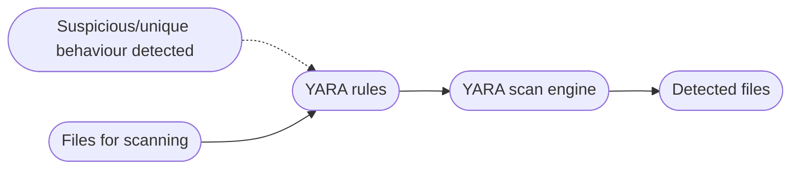

# YARA & Sigma for SOC Analysts Module

## <u>*Introduction*</u>

YARA and Sigma are two essential tools used by SOC analysts for enhancing threat detection capabilities. Both YARA and Sigma rules allow SOC analysts to detect and respond to security threats. YARA excels in file and memory analysis and pattern matching whereas Sigma is adept at log analysis and SIEM systems. Detection rules use conditional log applied to logs or files and aim to match suspicious behaviour. Both YARA and Sigma adhere to standard formats to help facilitate the creation and sharing of detection rules. YARA and Sigma allow analysts to develop custom detection rules tailored to their environment. Using Sigma rules is essential for modern log analysis in a SOC setting: Sigma rules enable analysts to filter and correlate log data from disparate sources, concentrating on important events. An opens-source tool called Chainsaw can be used to apply Sigma rules to event log files.

YARA and Sigma offer standardised formats and rule structures to foster collaboration between SOC analyst teams and all for a team to pull on the expertise of the wider community. For example, github repos exist of YARA and Sigma rules used in other organisations or investigations. YARA and Sigma rules can also be integrated into may other security tools including SIEM platforms, log analysis systems and incident response platforms. The integration allows automation, correlation and enrichment of security events - for example, <https://Uncoder.io> facilitates the conversion of Sigma rules into performance optimised queries for different SIEM systems.

YARA rules are also particularly useful for SOC analysts to help classify malware. Analysts can create specific patterns or signatures that correspond to known malware behaviour. Both YARA and Sigma rules can help analysts find IOCs which will help mitigate the consequences of security incidents.


## <u>*YARA*</u>

### Introduction to YARA and YARA Rules

YARA is a powerful pattern-matching tool and rule format used for identifying and classifying files based on specific patterns, characteristics or content. SOC analysts commonly use YARA rules to detect and classify malware, suspicious files or IOCs. YARA riles are written in a rule syntax that defines the conditions and patterns to be matched within files. These rules can include various elements, such as strings, regex and boolean operators allowing analysts create complex and precise rules. YARA rules can recognise both textual and binary patterns and can be applied to memory forensics activities.

YARA has several common uses in the cybersecurity industry:

- **Malware detection and classification**: YARA rules can be created to match against known malware signatures, behaviours or file properties. YARA can also identify suspicious or malicious patterns in captured memory images.

- **File analysis and classification**: Analysts can create YARA rules to categorise files by different file formats, version, metadata, packets or other characteristics. This is particularly useful in forensic analysis, malware research or identifying patterns in large datasets.

- **IOC detection**: YARA can be instructed to search for specific indicators of compromise within files and directories.

- **Community-driven rule sharing**: We can communicate with the wider security community who regularly share their detection rules. This helps us constantly refine our own rules.

- **Create custom security solutions**: Combing YARA rules with other techniques can create effective security solutions.

- **Custom rules**: YARA allows us to create custom rules tailored to our organisations specific needs and environment. Deploying these custom rules in our infrastructure can help enhance our defence capabilities. Custom YARA rules can also help us identify unique or targeted threats specific to our organisation or industry.

- **Incident response**: YARA aids in incident response by enabling analysts to quickly search large amounts of files or memory images for specific IOCs.

- **Proactive threat hunting**: We can leverage YARA to perform proactive searches across our environments to search for potential threats.

The YARA scan engine, using YARA modules, scans a set of files by comparing their content against the patterns defined in a rule set. When a file matches a YARA rule, it is considered a detected file.



First of all, we have one or more YARA rules, created by security analysts. These rule define specific patterns that need to be matched within files. These rules are typically stored in a YARA rule file format (`.yara` or `.yar`) for easy management.

We have a set of files provided as input to the YARA scan engine. The files can be stored on a local disk, within a directory, or within memory images or network traffic captures.

The YARA scan engine is the core component responsible for performing the actual scanning and matching of files against the defined YARA rules. It uses YARA modules (sets of algorithms and techniques) to efficiently compare the contents of the files against the rules. The YARA scan engine then iterates through each file in the set, analysing the content byte by byte.

When a file matches the patterns and conditions specified in a YARA rule, it is considered a detected file. The YARA scan engine records information about the match such as the matched rule, file path and offset in the file where the match occurred. YARA can also provide output indicating the detection which can be further processed, logged or used in subsequent actions.

YARA rules consist of several components that define the conditions and patterns to be matched within files:

```json5
rule my_rule {

    meta:
        author = "Author Name"
        description = "example rule"
        hash = ""
    
    strings: 
        $string1 = "test"
        $string2 = "rule"
        $string3 = "htb"

    condition: 
        all of them
}

```

Each rule starts with the keyword `rule` followed by a rule identifier. Some words are reserved and cannot be used as rule identifiers.

```bash
rule Ransomware_WannaCry {

    meta:
        author = "Madhukar Raina"
        version = "1.0"
        description = "Simple rule to detect strings from WannaCry ransomware"
        reference = "https://www.virustotal.com/gui/file/ed01ebfbc9eb5bbea545af4d01bf5f1071661840480439c6e5babe8e080e41aa/behavior" 
    
    strings:
        $wannacry_payload_str1 = "tasksche.exe" fullword ascii
        $wannacry_payload_str2 = "www.iuqerfsodp9ifjaposdfjhgosurijfaewrwergwea.com" ascii
        $wannacry_payload_str3 = "mssecsvc.exe" fullword ascii
    
    condition:
        all of them
}

```

The above rule detects strings specific to the WannaCry ransomware. You can see the basic structure of the YARA rule here. We start with a header containing metadata, followed by conditions that define the context of the files to be matched, and a body that specifies the patterns or indicators to be found. The use of metadata and tags helps in organising and documenting the rules effectively. In the WannaCry rule, the condition section states "all of them", meaning that all the string defined in the rules need to be present to trigger a match. We can also have more complicated conditions:

```json5
condition:
    filesize < 100KB and (uint16(0) == 0x5A4D or uint16(0) == 0x4D5A)
```

This condition requires the file size to be less than 100 kilobytes and that the first two bytes must match ASCII "MZ" or "ZM".

### Developing YARA Rules

In this section we will explore manual and automated YARA rule development. Throughout we will look at a series of malware samples. The first sample is called `svchost.exe`. First we need to conduct a string analysis on the sample using strings or FLOSS.

```bash
strings svchost.exe
```

```bash
floss svchost.exe
```

The first few strings makes it clear that this sample is UPX packed. Given this knowledge, we can add UPX-related strings to formulate a basic YARA rule that targets packed samples:

```json5
rule UPX_packed_executable
{
    meta:
    description = "Detects UPX-packed executables"
    
    strings:
    $string_1 = "UPX0"
    $string_2 = "UPX1"
    $string_3 = "UPX2"
    
    condition:
    all of them
}
```

Next we can look at the sample `dharma_sample.exe`. Once again, we conduct string analysis. We may notice some unique strings we can use to create a YARA rule. We can also use yarGen to speed up the process of creating a rule. yarGen is the go-to tool for automated YARA rule generation - yarGen comes equipped with a vast database of good strings and opcodes making it very efficient at picked out unique strings that indicate malicious behaviour whilst ignoring benign strings.

To get yarGen setup we need to:

- Download the latest release.

- Install all dependencies with `pip install -r requirements.txt`.

- Run `python yarGen.py --update` to download the built-in databases (saved in the `./dbs` subfolder).

- See the help menu by running `python yarGen.py --help`.

We can generate a rule automatically by running:

```bash
python3 yarGen.py -m <sample_dir> -o <output_rule>
```

We can then test the new rule by running:

```bash
yara <rule> <sample_dir>
```

#### *Example 1: Detecting ZoxPNG RAT (Manual)*

We want to develop a YARA rule to scan for a specific variation of the ZoxPNG RAT used by APT17 based on:

- A sample named `legit.exe`

- This online post: <https://intezer.com/blog/research/evidence-aurora-operation-still-active-part-2-more-ties-uncovered-between-ccleaner-hack-chinese-hackers-2/>

- String analysis

- IMPHASH

- Common sample file size

We can start with string analysis:

```bash
strings legit.exe
```

We can then use the hashes mentioned in the blog post to identify common sample sizes. It appears that there are no related samples with a size bigger than 200KB. Finally we can calculated the sample's IMPHASH either using VirusTotal or a custom python script. Finally we can construct a good YARA rule for the malware sample:

```json5
/*
   Yara Rule Set
   Author: Florian Roth
   Date: 2017-10-03
   Identifier: APT17 Oct 10
   Reference: https://goo.gl/puVc9q
*/

/* Rule Set ----------------------------------------------------------------- */

import "pe"

rule APT17_Malware_Oct17_Gen {
   meta:
      description = "Detects APT17 malware"
      license = "Detection Rule License 1.1 https://github.com/Neo23x0/signature-base/blob/master/LICENSE"
      author = "Florian Roth (Nextron Systems)"
      reference = "https://goo.gl/puVc9q"
      date = "2017-10-03"
      hash1 = "0375b4216334c85a4b29441a3d37e61d7797c2e1cb94b14cf6292449fb25c7b2"
      hash2 = "07f93e49c7015b68e2542fc591ad2b4a1bc01349f79d48db67c53938ad4b525d"
      hash3 = "ee362a8161bd442073775363bf5fa1305abac2ce39b903d63df0d7121ba60550"
   strings:
      $x1 = "Mozilla/4.0 (compatible; MSIE 8.0; Windows NT 6.1; WOW64; Trident/4.0; SLCC2; .NETCLR 2.0.50727)" fullword ascii
      $x2 = "http://%s/imgres?q=A380&hl=en-US&sa=X&biw=1440&bih=809&tbm=isus&tbnid=aLW4-J8Q1lmYBM" ascii

      $s1 = "hWritePipe2 Error:%d" fullword ascii
      $s2 = "Not Support This Function!" fullword ascii
      $s3 = "Cookie: SESSIONID=%s" fullword ascii
      $s4 = "http://0.0.0.0/1" fullword ascii
      $s5 = "Content-Type: image/x-png" fullword ascii
      $s6 = "Accept-Language: en-US" fullword ascii
      $s7 = "IISCMD Error:%d" fullword ascii
      $s8 = "[IISEND=0x%08X][Recv:] 0x%08X %s" fullword ascii
   condition:
      ( uint16(0) == 0x5a4d and filesize < 200KB and (
            pe.imphash() == "414bbd566b700ea021cfae3ad8f4d9b9" or
            1 of ($x*) or
            6 of them
         )
      )
}

```

Breaking down this rule, we have:

- **import "pe"**: Importing the PE module allows YARA to gain access to a set of specialised functions and structures that can inspect and analyse the details of PE files.

- **hash1/hash2/hash3**: Hash values of samples related to APT17, which the author has used as references or as foundational data to create the rule.

- **uint16(0) == 0x5a4d**: Checks if the first two bytes are "MZ" which is the magic number for windows executables.

- **pe.imphash() == "414bbd566b700ea021cfae3ad8f4d9b9"**: Checks the import hash of the PE file. Useful for characterising the malware sample based on the libraries that they import.

- <b>1 of ($x\*)</b>: At least one of the \"$x"" strings must be present.

- **6 of them**: At least six of the strings from any category must be present.

#### *Example 2: Detecting Neuron*

We want to develop a YARA rule to scan for instances of Neuron Service used by Turla based on:

- A sample called `Microsoft.Exchange.Service.exe`

- An analysis report from the NCSC: <https://web.archive.org/web/20250607083048/https://www.ncsc.gov.uk/static-assets/documents/Turla%20group%20using%20Neuron%20and%20Nautilus%20tools%20alongside%20Snake%20malware_1.pdf>

The report mentions both the Neuron client and Neuron service are written using the .NET framework so we will perform .NET reversing instead of string analysis. This can be done using the monodis tool:

```bash
monodis --output=code Microsoft.Exchange.Service.exe
```

```bash
cat code
```

Alternatively we can load the sample into dnSpy. A good YARA rule for detecting Neuron is:

```json5
rule neuron_functions_classes_and_vars {
 meta:
   description = "Rule for detection of Neuron based on .NET functions and class names"
   author = "NCSC UK"
   reference = "https://www.ncsc.gov.uk/file/2691/download?token=RzXWTuAB"
   reference2 = "https://www.ncsc.gov.uk/alerts/turla-group-malware"
   hash = "d1d7a96fcadc137e80ad866c838502713db9cdfe59939342b8e3beacf9c7fe29"
 strings:
   $class1 = "StorageUtils" ascii
   $class2 = "WebServer" ascii
   $class3 = "StorageFile" ascii
   $class4 = "StorageScript" ascii
   $class5 = "ServerConfig" ascii
   $class6 = "CommandScript" ascii
   $class7 = "MSExchangeService" ascii
   $class8 = "W3WPDIAG" ascii
   $func1 = "AddConfigAsString" ascii
   $func2 = "DelConfigAsString" ascii
   $func3 = "GetConfigAsString" ascii
   $func4 = "EncryptScript" ascii
   $func5 = "ExecCMD" ascii
   $func6 = "KillOldThread" ascii
   $func7 = "FindSPath" ascii
   $dotnetMagic = "BSJB" ascii
 condition:
   (uint16(0) == 0x5A4D and uint16(uint32(0x3c)) == 0x4550) and $dotnetMagic and 6 of them
}

```

We can breakdown the above rule as follows:

- <b>\$class1 = "StorageUtils" ascii</b> to **\$class8 = "W3WPDIAG" ascii**: These ASCII strings correspond to class names within the .NET assembly.

- <b>$func1 ...</b> to <b>$func7 ...</b>: Represent function names within the .NET assembly.

- **$dotnetMagic = "BSJB" ascii**: Signature that is present in the CLI header of .NET binaries.

- **unint16(unint32(0x3c)) == 0x4550**: Two-step check. First readers a pointer to the PE header and then checks if that is a valid PE header. This is done to see if the file is a legitimate PE format and not corrupted or obfuscated.

#### *Example 3: Detecting Stonedrill*

We wish to develop a YARA rule to scan for instances of Stonedrill used in Shamoon 2.0 attacks based on:

- A sample named `sham2.exe`

- An analysis report from Kaspersky: <https://kas.pr/9s5A>

Encrypted/Compressed/Obfuscated PE files usually means high entropy. We can use the `entropy_pe_section.py` script to check if any sample sections may be encrypted or compressed:

```bash
python3 entropy_pe_section.py -f <sample>
```

In this case we notice that the `.rsrc` section has unusually large entropy. A good YARA rule to identify instances of Stonedrill is:

```json5
import "pe"
import "math"

rule susp_file_enumerator_with_encrypted_resource_101 {
meta:
  copyright = "Kaspersky Lab"
  description = "Generic detection for samples that enumerate files with encrypted resource called 101"
  reference = "https://securelist.com/from-shamoon-to-stonedrill/77725/"
  hash = "2cd0a5f1e9bcce6807e57ec8477d222a"
  hash = "c843046e54b755ec63ccb09d0a689674"
  version = "1.4"
strings:
  $mz = "This program cannot be run in DOS mode."
  $a1 = "FindFirstFile" ascii wide nocase
  $a2 = "FindNextFile" ascii wide nocase
  $a3 = "FindResource" ascii wide nocase
  $a4 = "LoadResource" ascii wide nocase

condition:
uint16(0) == 0x5A4D and
all of them and
filesize < 700000 and
pe.number_of_sections > 4 and
pe.number_of_signatures == 0 and
pe.number_of_resources > 1 and pe.number_of_resources < 15 and for any i in (0..pe.number_of_resources - 1):
( (math.entropy(pe.resources[i].offset, pe.resources[i].length) > 7.8) and pe.resources[i].id == 101 and
pe.resources[i].length > 20000 and
pe.resources[i].language == 0 and
not ($mz in (pe.resources[i].offset..pe.resources[i].offset + pe.resources[i].length))
)
}
```

This rule uses the PE module lots to impose conditions on the rule detection. The best YARA rule development resource is the official documentation, followed by a guide from Kaspersky. yarGen is a great tool to develop YARA rules but we need to manually review each generated rule and add/remove some patterns to make it effective.

### Hunting Evil with YARA (Windows)

As we have already seen, YARA is a potent weapon in the arsenal of cybersecurity professionals for detecting and hunting malicious executables on disk. In this module we will be looking again at `dharma_sample.exe`. We start by examining the sample inside a hex editor to identify the previously discovered string "C:\crysis\Release\PDB\payload.pdb". Scrolling further down we notice another seemingly unique string "sssssbsss". Going forward, we will craft a rule grounded in these patterns and use YARA to hunt for similar executables.

```json5
rule ransomware_dharma {

    meta:
        author = "Madhukar Raina"
        version = "1.0"
        description = "Simple rule to detect strings from Dharma ransomware"
        reference = "https://www.virustotal.com/gui/file/bff6a1000a86f8edf3673d576786ec75b80bed0c458a8ca0bd52d12b74099071/behavior"

    strings:
        $string_pdb = {  433A5C6372797369735C52656C656173655C5044425C7061796C6F61642E706462 }
        $string_ssss = { 73 73 73 73 73 62 73 73 73 }

        condition: all of them
}
```

```powershell
yara64.exe -s <rule> <sample_dir> -r 2>null
```

We can also use YARA to scan running processes to look for malware. To demonstrate this we will use a YARA rule that targets Metasploit's meterpreter shellcode:

```json5
rule meterpreter_reverse_tcp_shellcode {
    meta:
        author = "FDD @ Cuckoo sandbox"
        description = "Rule for metasploit's  meterpreter reverse tcp raw shellcode"

    strings:
        $s1 = { fce8 8?00 0000 60 }     // shellcode prologe in metasploit
        $s2 = { 648b ??30 }             // mov edx, fs:[???+0x30]
        $s3 = { 4c77 2607 }             // kernel32 checksum
        $s4 = "ws2_"                    // ws2_32.dll
        $s5 = { 2980 6b00 }             // WSAStartUp checksum
        $s6 = { ea0f dfe0 }             // WSASocket checksum
        $s7 = { 99a5 7461 }             // connect checksum

    condition:
        5 of them
}

```

We can intentionally trigger an injection sample and then scan all active system process on the machine:

```powershell
Get-Process | ForEach-Object { "Scanning with YARA for shellcode on PID "+$_.id; & "yara64.exe" "C:\Rules\yara\meterpreter_shellcode.yar" $_.id }
```

We can also use YARA to hunt for malicious events in ETW data. ETW is made up of three main components:

- Controllers that possess functionalities to encompass initiating and terminating trace sessions.

- Providers that generate events and channel them to designated ETW sessions.

- Consumers that subscribe to specific events.

For hunting with YARA there are several useful providers:

| Provider Name                                          | Description                                                                                                                                                                              |
| ------------------------------------------------------ | ---------------------------------------------------------------------------------------------------------------------------------------------------------------------------------------- |
| Microsoft-Windows-Kernel-Process                       | Monitors process-related activity in the windows kernel. Can aid in detecting unusual process behaviour such as injection or hollowing.                                                  |
| Microsoft-Windows-Kernel-File                          | Focused on file-related operations. Employed for detection scenarios involving unauthorised file access or changes to critical system files.                                             |
| Microsoft-Windows-Kernel-Network                       | Offers visibility into network-related activity at the kernel level. Especially useful in detecting network-based attacks such as data exfiltration or unauthorised network connections. |
| Microsoft-Windows-SMBClient/SMBServer                  | Monitors SMB client and server activity. Can be used to detect unusual SMB traffic patterns.                                                                                             |
| Microsoft-Windows-DotNETRuntime                        | Focuses on .NET runtime events ideal for identifying anomalies in .NET application execution.                                                                                            |
| OpenSSH                                                | Provides insights into SSH connection attempts.                                                                                                                                          |
| Microsoft-Windows-VPN-Client                           | Enables tracking of VPN client events. Can be useful for identifying suspicious VPN connections.                                                                                         |
| Microsoft-Windows-PowerShell                           | Tracks powershell execution ad command activity. Very useful for detecting script based attacks.                                                                                         |
| Microsoft-Windows-Kernel-Registry                      | Monitors registry operations which can be leveraged to detect persistence actions.                                                                                                       |
| Microsoft-Windows-CodeIntegrity                        | Monitors code and driver integrity checks. Useful for BYODriver attacks.                                                                                                                 |
| Microsoft-Antimalware-Service                          | Detect potential issues with the antimalware service, including disabled services, configuration changes or evasion techniques.                                                          |
| WinRM                                                  | Monitoring the Windows remote management provider can reveal suspicious remote management activity that can indicate lateral movement.                                                   |
| Microsoft-Windows-TerminalServices-LocalSessionManager | Tracks local terminal sessions, useful for detecting suspicious remote desktop behaviour.                                                                                                |
| Microsoft-Windows-Security-Mitigations                 | Tracks the effectiveness and operations of security mitigations in place. Essential for identifying bypass attacks.                                                                      |
| Microsoft-Windows-DNS-Client                           | Visibility into DNS client activity, invaluable for detecting DNS tunnelling or C2 connection attempts.                                                                                  |
| Microsoft-Antimalware-Protection                       | Monitors the operations of antimalware protection mechanisms. Can be used to detect any issues such as disabled protection features.                                                     |

#### *Rule Scanning on ETW*

SilkETW is an open-source tool to work with ETW data. SilkETW provides enhanced visibility and analysis of windows events for security monitoring. SilkETW has an option to integrate YARA rules that can be used to tag or filter event data.

```powershell
.\SilkETW.exe -h
```

For example, we could launch the following command to perform event tracing on powershell related events in windows, using YARA rules:

```powershell
.\SilkETW.exe -t user -pn Microsoft-Windows-PowerShell -ot file -p ./etw_ps_logs.json -l verbose -y <yara_dir> -yo Matches
```

- **-t user**: Specifies event tracing mode set to user. Hence tracking user-mode events.

- **-ot file**: Specifies output format.

- **-p ./etw_ps_logs.json**: Specifies output filepath and name.

- **-l verbose**: Sets logging level to verbose to provide more detailed logging.

- **-y \<yara_dir>**: Enables YARA scanning using the given directory for rules.

- **-yo Matches**: Specifies the YARA output. In this case we only display YARA matches.

### Hunting Evil with YARA (Linux)

The reality of working in cybersecurity operations is that often we do not get the luxury of direct access to the compromised system. Even if we cant access the machine, in many cases a memory capture or memory dump can be used to analyse the system. We can use YARA to scan memory images and look at the state of the system. YARA's memory image scanning mirrors its disk-based counterpart:

- Create YARA rules

- Compile YARA rules into a binary format using the `yarac` tool. This step creates a file containing the compiled YARA rules with a `.yrc` extension. This step is optional as we can use the normal rules in text format as well. While it is possible to use YARA in its human-readable format but compiling the rules is a best practice for deploying YARA systems. Compiling rules also provides some level of protection by converting them into binary format making it harder for others to view the actual rule content.

-  We can then obtain a memory image using tools and use YARA to scan for possible matches.

Beyond standalone tools, diving deeper into memory forensics offers a plethora of avenues. Integrating YARA within memory forensics frameworks amplifies its potential. With the Volatility framework and YARA operating in tandem, WannaCry-specific IOCs can be detected seamlessly.

The Volatility framework is a powerful open-source memory forensics tool used to analyse memory images from various operating systems. YARA can be integrated into the Volatility framework as a plugin called `yarascan` allowing for the application of YARA rules to memory analysis.

#### *Single Pattern YARA Scanning Against a Memory Image*

In this case, we'll specify a YARA rule pattern directly in the command-line which is searched within the memory image by the `yarascan` plugin. The string should be enclosed in quotes after the `-U` option. This is useful when we have a specific YARA rule or pattern that we want to apply without creating a separate rules file. From previous analysis, we know that the WannaCry malware attempts to connect to a hard-coded URI.

```bash
vol.py -f <memory_file> yarascan -U <string>
```

This option allows us to directly specify a YARA rule string within the command-line itself.

#### *Multiple YARA Rule Scanning Against a Memory Image*

When we have multiple YARA rules or a set of complex rules that we want to apply to a memory image, we can use the `-y` option followed by the rule file path in the Volatility framework.

```bash
vol.py -f <memory_dump> yarascan -y <rule_file>
```

### Hunting Evil with YARA (Web)

<https://www.unpac.me/> is a tool tailored for malware unpacking. The great thing about this tool is it grants us the capability to run our YARA rules over their database of malware submissions. Suppose we wish to test the following YARA rule:

```json5
rule ransomware_dharma {

    meta:
        author = "Madhukar Raina"
        version = "1.0"
        description = "Simple rule to detect strings from Dharma ransomware"
        reference = "https://www.virustotal.com/gui/file/bff6a1000a86f8edf3673d576786ec75b80bed0c458a8ca0bd52d12b74099071/behavior" 
    
    strings:
        $string_pdb = {  433A5C6372797369735C52656C656173655C5044425C7061796C6F61642E706462 }
    $string_ssss = { 73 73 73 73 73 62 73 73 73 }

        condition: all of them
}

```

We can register for an account and login. Then we can head over to YARA Hunt and choose the New Hunt option, enter the YARA rule into the designated rule space, hit validate and then scan.


## <u>*Sigma*</u>

Sigma is a generic signature format used for describing detection rules for log analysis and SIEM systems. It allows SOC analysts to create and share rules that help identify specific patterns or behaviours indicative of security threats or malicious activities. Sigma rules are typically written in YAML format and can be used with various security tools and platforms. SOC analysts use Sigma rules to define and detect security events by analysing log data. The main advantage of Sigma rules is their portability and compatibility with multiple SIEM and log analysis systems. Sigma can be considered as standardised format for analysts to create and share detection rules. It helps in converting IOCs into queries and can be easily integrated with security tools. Sigma has many uses:

- Universal Log Analytics Tool: We can write detection rules once and then convert them into various SIEM formats.

- Community-driven Rule Sharing: With Sigma, we have the ability to tap into a community that regularly contributes and shares their detection rules.

- Incident Response: Sigma aids in incident response by enabling analysts to quickly search and analyse logs for specific indicators.

- Proactive Threat Hunting: We can use Sigma rules for threat hunting. By leveraging specific patterns, we can comb through our datasets to pinpoint anomalies.

- Seamless Integration with Automation Tools: We can convert Sigma rules into other formats to integrate them with our SOAR platforms and other tools.

- Customisation for Specific Environments: The flexibility of Sigma rules means we can tailor them according to the unique characteristics of our environment.

- Gap Identification: By aligning our rule set with broader community, we can perform gap analysis.

At its heart, Sigma is about expressing patterns found in log events in a structured manner. So instead of having a variety of rule descriptions scattered in various formats, with Sigma we have a unified open standard. Sigma rules are written in YAML. Each Sigma rule describes a particular pattern of log events which might correlate with malicious activity. The true power of Sigma lies in its convertibility. We can use `sigmac` to convert our rules into queries or configurations with a multitude of SIEMs. Note that pySigma is increasingly becoming the go-to option for rule translation.

We can find the structure of a Sigma rule on the github page: <https://github.com/SigmaHQ/sigma-specification/blob/main/specification/sigma-rules-specification.md>. We can understand the structure of a Sigma rule with an example:

```yaml
title: Potential LethalHTA Technique Execution 
id: ed5d72a6-f8f4-479d-ba79-02f6a80d7471 
status: test 
description: Detects potential LethalHTA technique where "mshta.exe" is spawned by an "svchost.exe" process
references:
    - https://codewhitesec.blogspot.com/2018/07/lethalhta.html
author: Markus Neis 
date: 2018/06/07 
tags: 
    - attack.defense_evasion 
    - attack.t1218.005 
logsource: 
    category: process_creation  
    product: windows
detection:
    selection: 
        ParentImage|endswith: '\svchost.exe'
        Image|endswith: '\mshta.exe'
    condition: selection
falsepositives: 
    - Unknown
level: high
```

We can see the following components that form the Sigma rule. We have a title, a UUID, state. The normal meta data we know from a YARA rule is still present but we also have a tags section and a logsource section. We also provide other information to aid in accurate detection.

### Developing Sigma Rules

#### *Example 1: LSASS Credential Dumping*

We can get started in the world of Sigma rules using a malware sample called `shell.exe` (renamed version of mimikatz). After executing the malware sample we have collected the most critical events and saved them as a log file. The process created by the malware sample will try to access the process memory of `lsass.exe`. The system monitoring tool Sysmon was running in the background and captured this activity in the event logs with Event ID 10. Sysmon event ID 10 is triggered when a process accesses another process and it logs the permission flags in the "GrantedAccess" field. In a typical LSASS memory dumping scenario the malicious process needs specific permissions to access the memory space of the LSASS process. These permissions often include read/write access among other things. The `0x1010` implies both reading and querying information from the process and is also frequently observed during credential dumping attacks. A Sigma rule that checks for these conditions would be as follows:

```yaml
title: LSASS Access with rare GrantedAccess flag 
status: experimental
description: This rule will detect when a process tries to access LSASS memory with suspicious access flag 0x1010
date: 2023/07/08
tags:
    - attack.credential_access
    - attack.t1003.001
logsource:
    category: process_access
    product: windows
detection:
    selection:
        TargetImage|endswith: '\lsass.exe'
        GrantedAccess|endswith: '0x1010'
    condition: selection
```

Suppose we wanted to convert our Sigma rule into a PowerShell query. This can be accomplished with the help of sigmac:

```bash
python sigmac -t powershell '<sigma_rule>'
```

```powershell
Get-WinEvent -Path <event_file> | where {($_.ID -eq "10" -and $_.message -match "TargetImage.*.*\\lsass.exe" -and $_.message -match "GrantedAccess.*.*0x1010") } | select TimeCreated,Id,RecordId,ProcessId,MachineName,Message
```

Remember that false positives are the enemy of effective security monitoring. We should improve this query by cross-referencing the `SourceImage` against a list of known safe processes. A more robust Sigma rule could be:

```yaml
title: LSASS Access From Program in Potentially Suspicious Folder
id: fa34b441-961a-42fa-a100-ecc28c886725
status: experimental
description: Detects process access to LSASS memory with suspicious access flags and from a potentially suspicious folder
references:
    - https://docs.microsoft.com/en-us/windows/win32/procthread/process-security-and-access-rights
    - https://onedrive.live.com/view.aspx?resid=D026B4699190F1E6!2843&ithint=file%2cpptx&app=PowerPoint&authkey=!AMvCRTKB_V1J5ow
    - https://web.archive.org/web/20230208123920/https://cyberwardog.blogspot.com/2017/03/chronicles-of-threat-hunter-hunting-for_22.html
    - https://www.slideshare.net/heirhabarov/hunting-for-credentials-dumping-in-windows-environment
    - http://security-research.dyndns.org/pub/slides/FIRST2017/FIRST-2017_Tom-Ueltschi_Sysmon_FINAL_notes.pdf
author: Florian Roth (Nextron Systems)
date: 2021/11/27
modified: 2023/05/05
tags:
    - attack.credential_access
    - attack.t1003.001
    - attack.s0002
logsource:
    category: process_access
    product: windows
detection:
    selection:
        TargetImage|endswith: '\lsass.exe'
        GrantedAccess|endswith:
            - '10'
            - '30'
            - '50'
            - '70'
            - '90'
            - 'B0'
            - 'D0'
            - 'F0'
            - '18'
            - '38'
            - '58'
            - '78'
            - '98'
            - 'B8'
            - 'D8'
            - 'F8'
            - '1A'
            - '3A'
            - '5A'
            - '7A'
            - '9A'
            - 'BA'
            - 'DA'
            - 'FA'
            - '0x14C2'  # https://github.com/b4rtik/ATPMiniDump/blob/76304f93b390af3bb66e4f451ca16562a479bdc9/ATPMiniDump/ATPMiniDump.c
            - 'FF'
        SourceImage|contains:
            - '\Temp\'
            - '\Users\Public\'
            - '\PerfLogs\'
            - '\AppData\'
            - '\htb\'
    filter_optional_generic_appdata:
        SourceImage|startswith: 'C:\Users\'
        SourceImage|contains: '\AppData\Local\'
        SourceImage|endswith:
            - '\Microsoft VS Code\Code.exe'
            - '\software_reporter_tool.exe'
            - '\DropboxUpdate.exe'
            - '\MBAMInstallerService.exe'
            - '\WebexMTA.exe'
            - '\WebEx\WebexHost.exe'
            - '\JetBrains\Toolbox\bin\jetbrains-toolbox.exe'
        GrantedAccess: '0x410'
    filter_optional_dropbox_1:
        SourceImage|startswith: 'C:\Windows\Temp\'
        SourceImage|endswith: '.tmp\DropboxUpdate.exe'
        GrantedAccess:
            - '0x410'
            - '0x1410'
    filter_optional_dropbox_2:
        SourceImage|startswith: 'C:\Users\'
        SourceImage|contains: '\AppData\Local\Temp\'
        SourceImage|endswith: '.tmp\DropboxUpdate.exe'
        GrantedAccess: '0x1410'
    filter_optional_dropbox_3:
        SourceImage|startswith:
            - 'C:\Program Files (x86)\Dropbox\'
            - 'C:\Program Files\Dropbox\'
        SourceImage|endswith: '\DropboxUpdate.exe'
        GrantedAccess: '0x1410'
    filter_optional_nextron:
        SourceImage|startswith:
            - 'C:\Windows\Temp\asgard2-agent\'
            - 'C:\Windows\Temp\asgard2-agent-sc\'
        SourceImage|endswith:
            - '\thor64.exe'
            - '\thor.exe'
            - '\aurora-agent-64.exe'
            - '\aurora-agent.exe'
        GrantedAccess:
            - '0x1fffff'
            - '0x1010'
            - '0x101010'
    filter_optional_ms_products:
        SourceImage|startswith: 'C:\Users\'
        SourceImage|contains|all:
            - '\AppData\Local\Temp\'
            - '\vs_bootstrapper_'
        GrantedAccess: '0x1410'
    filter_optional_chrome_update:
        SourceImage|startswith: 'C:\Program Files (x86)\Google\Temp\'
        SourceImage|endswith: '.tmp\GoogleUpdate.exe'
        GrantedAccess:
            - '0x410'
            - '0x1410'
    filter_optional_keybase:
        SourceImage|startswith: 'C:\Users\'
        SourceImage|endswith: \AppData\Local\Keybase\keybase.exe
        GrantedAccess: '0x1fffff'
    filter_optional_avira:
        SourceImage|contains: '\AppData\Local\Temp\is-'
        SourceImage|endswith: '.tmp\avira_system_speedup.tmp'
        GrantedAccess: '0x1410'
    filter_optional_viberpc_updater:
        SourceImage|startswith: 'C:\Users\'
        SourceImage|contains: '\AppData\Roaming\ViberPC\'
        SourceImage|endswith: '\updater.exe'
        TargetImage|endswith: '\winlogon.exe'
        GrantedAccess: '0x1fffff'
    filter_optional_adobe_arm_helper:
        SourceImage|startswith:  # Example path: 'C:\Program Files (x86)\Common Files\Adobe\ARM\1.0\Temp\2092867405\AdobeARMHelper.exe'
            - 'C:\Program Files\Common Files\Adobe\ARM\'
            - 'C:\Program Files (x86)\Common Files\Adobe\ARM\'
        SourceImage|endswith: '\AdobeARMHelper.exe'
        GrantedAccess: '0x1410'
    condition: selection and not 1 of filter_optional_*
fields:
    - User
    - SourceImage
    - GrantedAccess
falsepositives:
    - Updaters and installers are typical false positives. Apply custom filters depending on your environment
level: medium


```

Notice how we have conditions here to filter out false positives.

#### *Example 2: Multiple Failed Logins with Single Source*

According to Microsoft, event 4776 generates every time that a credential validation occurs using NTLM authentication. It shows only the computer name from which the authentication attempt was performed. A valid Sigma rule to detect multiple failed login attempts originating from the same source is given below:

```yaml
title: Failed NTLM Logins with Different Accounts from Single Source System
id: 6309ffc4-8fa2-47cf-96b8-a2f72e58e538
related:
    - id: e98374a6-e2d9-4076-9b5c-11bdb2569995
      type: derived
status: unsupported
description: Detects suspicious failed logins with different user accounts from a single source system
author: Florian Roth (Nextron Systems)
date: 2017/01/10
modified: 2023/02/24
tags:
    - attack.persistence
    - attack.privilege_escalation
    - attack.t1078
logsource:
    product: windows
    service: security
detection:
    selection2:
        EventID: 4776
        TargetUserName: '*'
        Workstation: '*'
    condition: selection2 | count(TargetUserName) by Workstation > 3
falsepositives:
    - Terminal servers
    - Jump servers
    - Other multiuser systems like Citrix server farms
    - Workstations with frequently changing users
level: medium

```

### Hunting Evil with Sigma (Chainsaw)

In cybersecurity, time is of the essence. Sigma rules combined with tools like Chainsaw and Zircolite are our best allies, both tools allow us to use Sigma rules to scan not just one but multiple evtx files. Chainsaw is a freely available tool designed to swiftly pinpoint security threats within Windows Event logs. The tool enables efficient keyword-based event log searches and is equipped with integrated support for Sigma detection rules as well as custom Chainsaw rules.

```bash
.\chainsaw_x86_64-pc-windows-msvc.exe -h
```

#### *Example 1: Hunting for Multiple Failed Logins from Single Source*

```bash
.\chainsaw_x86_64-pc-windows-msvc.exe hunt <event_file> -s <sigma_file> --mapping <sigma>
```

Using the `-s` parameter, we can specify a directory containing Sigma detection rules (or single rule) and chainsaw will automatically load, convert and run these rules against the provided event logs. The mapping file tells Chainsaw which fields in the event logs to use for rule matching.

#### *Example 2: Hunting for Abnormal PowerShell Command Line Size with Sigma*

Recognise that PowerShell is a highly attractive target for attackers. To conceal their actions, attackers use complex encoding layers or misuse cmdlets for purposes they weren't designed for. This can lead to abnormally long PowerShell commands that often incorporate base64 encoding. An example Sigma rule that can detect abnormally long PowerShell command lines would be:

```yaml
title: Unusually Long PowerShell CommandLine
id: d0d28567-4b9a-45e2-8bbc-fb1b66a1f7f6
status: test
description: Detects unusually long PowerShell command lines with a length of 1000 characters or more
references:
    - https://speakerdeck.com/heirhabarov/hunting-for-powershell-abuse
author: oscd.community, Natalia Shornikova / HTB Academy, Dimitrios Bougioukas
date: 2020/10/06
modified: 2023/04/14
tags:
    - attack.execution
    - attack.t1059.001
    - detection.threat_hunting
logsource:
    category: process_creation
    product: windows
detection:
    selection:
        EventID: 4688
        NewProcessName|endswith:
            - '\powershell.exe'
            - '\pwsh.exe'
            - '\cmd.exe'
    selection_powershell:
        CommandLine|contains:
            - 'powershell.exe'
            - 'pwsh.exe'
    selection_length:        
        CommandLine|re: '.{1000,}'
    condition: selection and selection_powershell and selection_length
falsepositives:
    - Unknown
level: low
```

### Hunting Evil with Sigma (Splunk)

As discussed when introducing Sigma, Sigma rules revolutionise our approach to log analysis and threat detection. Sigma is a universal translator that brings in a level of abstraction to event logs, taking away the painful element of SIEM-specific query languages.

#### *Example  1: Hunting for MiniDump Function Abuse to Dump LSASS's Memory*

We can generate a Sigma rule to detect adversaries leveraging the MiniDump export function of `comsvcs.dll` to perform a memory dump on LSASS. We can then translate this rule into a Splunk search using `sigmac`:

```bash
python sigmac -t splunk <sigma_rule> -c <splunk_config>
```

We can then feed the output query into Splunk for analysis.

#### *Example 2: Hunting for Notepad Spawning Child Processes*

```bash
python sigmac -t splunk <sigma_rule> -c .\config\splunk-windows.yml
```


